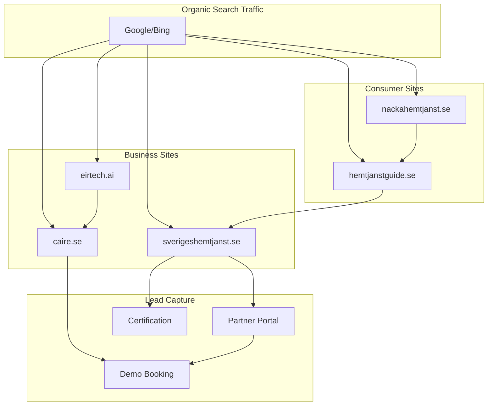

# Strategy: EirTech Ecosystem 2025

> **Last updated:** January 2025

## 1. Domain Architecture

### Overview

The EirTech ecosystem consists of 5 strategic domains that together build brand authority and drive leads throughout the customer journey.

```
┌─────────────────────────────────────────────────────────────┐
│                    EirTech Ecosystem                         │
├─────────────────────────────────────────────────────────────┤
│                                                              │
│   ┌──────────────┐   ┌──────────────┐   ┌──────────────┐   │
│   │  eirtech.ai  │   │  caire.se    │   │ sveriges-    │   │
│   │  (B2B Tech)  │   │  (B2B SaaS)  │   │ hemtjanst.se │   │
│   └──────────────┘   └──────────────┘   └──────────────┘   │
│          │                  │                  │            │
│          └──────────────────┼──────────────────┘            │
│                             │                               │
│                    ┌────────┴────────┐                      │
│                    │                 │                      │
│            ┌───────▼─────┐   ┌───────▼─────┐               │
│            │ hemtjanst-  │   │ nacka-      │               │
│            │ guide.se    │   │ hemtjanst.se│               │
│            │ (B2C)       │   │ (B2C Local) │               │
│            └─────────────┘   └─────────────┘               │
│                                                              │
└─────────────────────────────────────────────────────────────┘
```

---

## 2. Domain Roles

### A. eirtech.ai (B2B Tech Brand)

**Role:** AI technology brand and holding identity

**Purpose:**

- Establish EirTech as leading AI company in healthcare
- Portfolio presentation of products and technology
- PR and employer branding

**SEO Strategy:**

- Focus on "AI home care", "AI scheduling"
- Technical content, whitepapers
- English/Swedish

---

### B. www.caire.se (B2B SaaS Product)

**Role:** Main product and lead generation

**Purpose:**

- Caire scheduling platform
- Demo bookings and conversion
- Customer cases and testimonials

**SEO Strategy:**

- Focus on "scheduling home care", "staff planning"
- Product pages, pricing, integrations
- Primarily Swedish

**Migration:** Replaces current site from `CairePlatform/caire` repo with SSR version in monorepo.

---

### C. sverigeshemtjanst.se (B2B Authority Hub)

**Role:** The go-to portal for the industry

**Purpose:**

- Industry news and market data
- National statistics and municipality overviews
- Partner portal for home care providers
- Gamification and certification programs

**SEO Strategy:**

- Consolidated domain authority from regional sites
- Focus on "home care statistics", "home care market"
- Data-driven content

**Consolidation:** Previous regional sites (hemtjanstistockholm.se, etc.) are 301-redirected here.

---

### D. hemtjanstguide.se (B2C Marketplace)

**Role:** Consumer's guide to home care

**Purpose:**

- Help individuals find home care
- Comparison of providers per municipality
- Guides on applications, rights, fees

**SEO Strategy:**

- Focus on "find home care [city]", "home care [municipality]"
- Long-tail keywords for informational searches
- Caire-certified providers prioritized

---

### E. nackahemtjanst.se (B2C Local SEO Satellite)

**Role:** Local SEO "Cash Cow"

**Purpose:**

- Maintain for local ranking in Nacka
- Established domain authority
- Feeds traffic into the ecosystem

**SEO Strategy:**

- Hyperlocal SEO
- Modern UI, consistent design
- Cross-linking to hemtjanstguide.se

---

## 3. Traffic Flow & Lead Generation



---

## 4. Technical Architecture

### SSR for SEO

All sites implement **Vite SSR** for optimal SEO:

| Site                 | SSR Status   | Priority |
| -------------------- | ------------ | -------- |
| eirtech.ai           | ✅ Done      | -        |
| caire.se             | ⚠️ Migration | High     |
| sverigeshemtjanst.se | ⚠️ Partial   | High     |
| hemtjanstguide.se    | ❌ Missing   | High     |
| nackahemtjanst.se    | ❌ Missing   | Medium   |

### Shared Packages

All sites share:

- `@appcaire/ui` - Design system and components
- `@appcaire/shared` - Business logic and SEO components
- `@appcaire/graphql` - GraphQL schema and hooks

---

## 5. 301 Redirect Strategy

### Deprecated Domains

The following domains are no longer active as separate sites:

| Domain                 | Redirect                                | Status        |
| ---------------------- | --------------------------------------- | ------------- |
| hemtjanstistockholm.se | sverigeshemtjanst.se/regioner/stockholm | ✅ Configured |
| hemtjanstnacka.se      | sverigeshemtjanst.se/regioner/nacka     | ✅ Configured |
| stockholmhemtjanst.se  | sverigeshemtjanst.se/innovation         | ✅ Configured |

### Redirect Implementation

```javascript
// vercel.json example
{
  "redirects": [
    { "source": "/(.*)", "destination": "https://sverigeshemtjanst.se/regioner/stockholm/$1", "permanent": true }
  ]
}
```

---

## 6. SEO Monitoring

### Key Metrics per Domain

| Domain               | Primary Goal    | KPI                         |
| -------------------- | --------------- | --------------------------- |
| eirtech.ai           | Brand awareness | Impressions, branded search |
| caire.se             | Demo bookings   | Conversion rate             |
| sverigeshemtjanst.se | Partner signups | Registrations               |
| hemtjanstguide.se    | Organic traffic | Sessions, rankings          |
| nackahemtjanst.se    | Local rankings  | Position "hemtjänst nacka"  |

### Tools

- Google Search Console (per domain)
- Google Analytics 4 (cross-domain tracking)
- Ahrefs/SEMrush for keyword tracking

---

## 7. Next Steps

### Q1 2025

1. ✅ Consolidate documentation
2. ⬜ Implement SSR for all sites
3. ⬜ Migrate caire.se to monorepo
4. ⬜ Verify 301 redirects

### Q2 2025

1. ⬜ Launch partner portal on sverigeshemtjanst.se
2. ⬜ Implement gamification
3. ⬜ Cross-domain analytics

---

## Related Documents

- [APP_DOMAIN_MAPPING.md](./APP_DOMAIN_MAPPING.md) - Technical mapping
- [VITE_SSR_SETUP.md](../02-seo-teknisk-implementation/VITE_SSR_SETUP.md) - SSR guide
- [DESIGN_SYSTEM.md](../03-brand-design/DESIGN_SYSTEM.md) - Design guidelines
