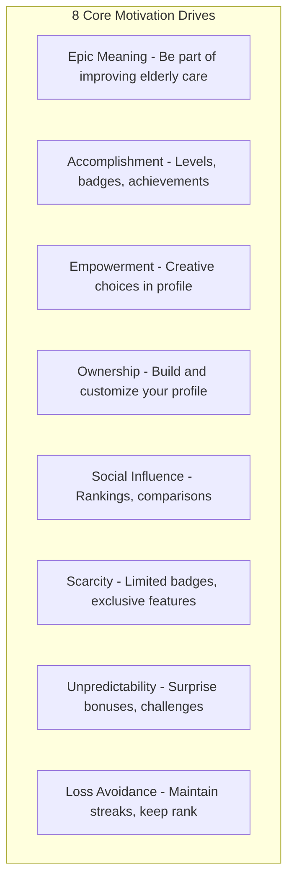
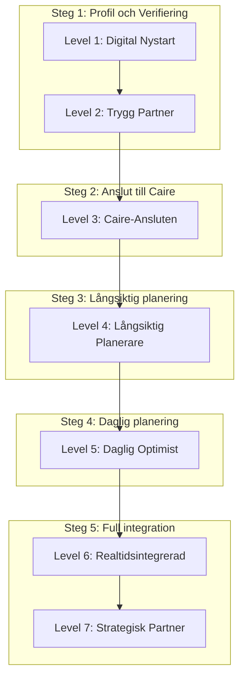
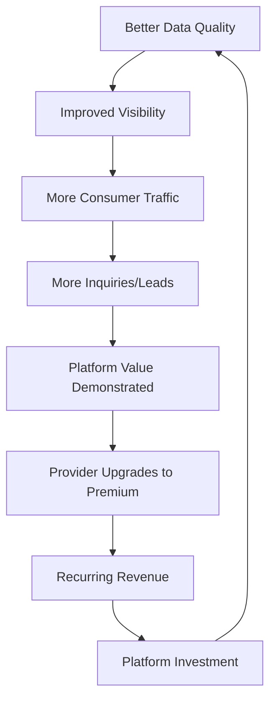

# Provider Gamification System - Full Implementation Plan

## Executive Summary

This plan outlines a comprehensive gamification system for home care providers on the Hemtjänstguiden/Caire platform. The system is designed to:

1. **Improve data quality** through verified provider profiles
2. **Increase platform engagement** via progression mechanics
3. **Drive Caire adoption** through meaningful rewards
4. **Enhance transparency** for consumers choosing providers
5. **Create monetization opportunities** through premium tiers

---

## 1. Gamification Framework

Based on the Octalysis framework and B2B best practices, we apply 8 core drives:



### Design Principles

| Principle              | Implementation                                  |
| ---------------------- | ----------------------------------------------- |
| **Autonomy**           | Providers choose which tasks to complete        |
| **Mastery**            | Clear progression with skill-based achievements |
| **Purpose**            | Connect actions to improved care quality        |
| **Immediate Feedback** | Real-time notifications and progress updates    |
| **Fair Competition**   | Segment leaderboards by size/region             |
| **Ethical Design**     | No exploitative mechanics, transparent rules    |

---

## 2. Player Types and Motivation

Based on Bartle's taxonomy, adapted for B2B:

| Player Type     | % of Users | Motivation                         | Features                                 |
| --------------- | ---------- | ---------------------------------- | ---------------------------------------- |
| **Achievers**   | 40%        | Complete all tasks, top rankings   | Badges, levels, completionist challenges |
| **Socializers** | 25%        | Recognition, community             | Leaderboards, public profiles, reviews   |
| **Explorers**   | 20%        | Discover features, understand data | Hidden badges, feature unlocks, insights |
| **Competitors** | 15%        | Beat others, win                   | Rankings, head-to-head comparisons       |

---

## 3. Level System: Caire World (7 Stages)

The user journey is visualized as "Caire World," an interactive neighborhood map showing the growth stages of a homecare provider aligned with the Caire platform integration pathway.

### Caire Integration Pathway

The level system follows the Caire platform integration journey:



**Viktigt om Caire-integration:**

- **Steg 1 (Anslut):** Anslut via API-integration eller ladda upp CSV med schemadata
- **Steg 2 (Långsiktig):** Pre-planning och slingor (återkommande mönster)
- **Steg 3 (Daglig):** Daglig optimering är en delmängd av långsiktig planering
- **Steg 4 (Realtid):** Realtidsuppdateringar kräver full API-integration

### Level Definitions (The "Why" and Requirements)

| Level | Name                     | XP     | Why                                                                                                                                 | Krav                                                            | Fördelar                                                                        |
| ----- | ------------------------ | ------ | ----------------------------------------------------------------------------------------------------------------------------------- | --------------------------------------------------------------- | ------------------------------------------------------------------------------- |
| 1     | **Digital Nystart**      | 0      | Alla anordnare visas automatiskt i vårt index. Skapa konto för att få verifierad-stämpel och möjlighet att redigera er information. | Skapa konto och claima er verksamhet.                           | Verifierad-badge synlig för alla användare, Redigera kontaktinfo, Sökbar profil |
| 2     | **Trygg Partner**        | 250    | Bygg förtroende genom komplett och verifierad profil som sticker ut i sökresultat.                                                  | Ladda upp logotyp, verifiera kontaktuppgifter, bekräfta adress. | Verifierad-stämpel, Prioriterad listning, +15% synlighet                        |
| 3     | **Caire-Ansluten**       | 1,000  | Anslut till Caire-plattformen för att få tillgång till schemaanalys och optimeringsverktyg.                                         | Anslut via API-integration eller ladda upp CSV med schemadata.  | Schemaanalys, Jämförelsedata, Grundläggande insikter                            |
| 4     | **Långsiktig Planerare** | 2,500  | Använd pre-planning och slingor för att optimera era återkommande mönster.                                                          | Skapa minst en slinga, genomför pre-planning.                   | Slingor-hantering, Pre-planning verktyg, Kontinuitetsrapporter                  |
| 5     | **Daglig Optimist**      | 5,000  | Maximera daglig effektivitet med AI-driven schemaoptimering.                                                                        | Använd daglig optimering regelbundet, jämför AI vs manuell.     | Daglig AI-optimering, Scenariojämförelser, Kvalitets-KPIer                      |
| 6     | **Realtidsintegrerad**   | 10,000 | Full integration möjliggör realtidsuppdateringar och automatisk optimering.                                                         | Full API-integration med realtidssynk.                          | Realtidsuppdateringar, Automatisk nattlig optimering, Störningshantering        |
| 7     | **Strategisk Partner**   | 25,000 | Maximalt affärsvärde genom fullständig Caire-integration och co-marketing.                                                          | Uppnå kvalitetsmål (80%+ kontinuitet), partneravtal.            | Partnerförmåner, Co-marketing, Premium support                                  |

### Level-Up Rewards

Each level-up triggers:

1. **Celebration animation** in portal
2. **Email notification** with new benefits
3. **Social share prompt** (optional)
4. **Unlock notification** for new features

---

## 4. Badge System

Badges follow the Caire integration pathway and incentivize platform adoption.

### Badge Categories by Caire Integration Step

#### Steg 1: Caire Connection (Grundläggande - krävs för alla andra)

| Badge              | Beskrivning                           | Rarity   | XP  |
| ------------------ | ------------------------------------- | -------- | --- |
| Caire-kopplad      | Ansluten till Caire via API eller CSV | Uncommon | 100 |
| Datastart          | Laddat upp första schemadata          | Common   | 50  |
| API-integrerad     | Direkt API-integration aktiv          | Rare     | 200 |
| Manuell Dataexpert | Regelbunden CSV-uppladdning           | Common   | 75  |

#### Steg 2: Långsiktig planering (Pre-planning + Slingor)

| Badge           | Beskrivning                                | Rarity   | XP  |
| --------------- | ------------------------------------------ | -------- | --- |
| Analysstart     | Caire analyserade ert schema första gången | Common   | 50  |
| Förplanerare    | Skapade första pre-planning session        | Uncommon | 100 |
| Slingbyggare    | Skapade första slinga                      | Uncommon | 100 |
| Slingmästare    | 10+ aktiva slingor                         | Rare     | 250 |
| Månadsplanerare | Pre-planning varje månad i 3 månader       | Rare     | 200 |

#### Steg 3: Daglig planering (Delmängd av långsiktig)

| Badge             | Beskrivning                                | Rarity   | XP  |
| ----------------- | ------------------------------------------ | -------- | --- |
| Daglig Optimerare | Använt daglig optimering första gången     | Uncommon | 100 |
| Veckostrateg      | Optimerat 4 veckor i rad                   | Rare     | 200 |
| Scenariotestare   | Testat 3+ optimeringsscenarier             | Uncommon | 150 |
| Jämförelsemästare | Jämfört AI vs manuell planering 10+ gånger | Rare     | 250 |

#### Steg 4: Realtidsuppdateringar (Kräver full integration)

| Badge             | Beskrivning                                          | Rarity    | XP   |
| ----------------- | ---------------------------------------------------- | --------- | ---- |
| Realtidsaktiverad | Full integration med realtidsuppdateringar           | Epic      | 500  |
| Krishanterare     | Hanterat 10+ realtidsstörningar                      | Epic      | 400  |
| Nattlig Synk      | Automatisk nattlig synkronisering aktiv              | Rare      | 300  |
| Autooptimist      | Full automatisk optimering utan manuell intervention | Legendary | 1000 |

#### Kvalitetsresultat (Uppnås genom Caire-användning)

| Badge               | Beskrivning                             | Rarity   | XP  |
| ------------------- | --------------------------------------- | -------- | --- |
| Kontinuitetsstart   | 75% personalkontinuitet uppnådd         | Uncommon | 150 |
| Kontinuitetshjälte  | 85% personalkontinuitet uppnådd         | Rare     | 300 |
| Kontinuitetsmästare | 90% personalkontinuitet uppnådd         | Epic     | 500 |
| Effektivitetsmål    | 75% personalutnyttjande                 | Uncommon | 150 |
| Effektivitetshjälte | 80% personalutnyttjande                 | Rare     | 300 |
| Resereducerare      | 10% restidsreduktion                    | Uncommon | 150 |
| Miljöhjälte         | 20% restidsreduktion                    | Rare     | 300 |
| Tidsbesparare       | 50%+ minskning av schemaläggningsarbete | Epic     | 500 |

#### Profil & Verifiering (Grundläggande)

| Badge           | Beskrivning                   | Rarity   | XP  |
| --------------- | ----------------------------- | -------- | --- |
| Första Steget   | Loggade in för första gången  | Common   | 25  |
| Komplett Profil | Fyllde i alla profiluppgifter | Common   | 50  |
| Verifierad      | Verifierade er organisation   | Uncommon | 100 |

#### Engagement (Platform-användning)

| Badge           | Beskrivning                 | Rarity   | XP  |
| --------------- | --------------------------- | -------- | --- |
| Veckostreak     | Inloggad 7 dagar i rad      | Uncommon | 75  |
| Månadsstreak    | Inloggad 30 dagar i rad     | Rare     | 150 |
| Månadsgranskare | Granskat schema varje månad | Uncommon | 100 |

#### Speciella & Konkurrens

| Badge              | Beskrivning                          | Rarity    | XP   |
| ------------------ | ------------------------------------ | --------- | ---- |
| Early Adopter      | Bland de första 100 Caire-användarna | Legendary | 500  |
| Topp 10            | Nådde topp 10 på leaderboard         | Epic      | 400  |
| Caire-Certifierad  | Klarade certifieringsprovet          | Legendary | 1000 |
| Strategisk Partner | Nådde partnernivå                    | Legendary | 1000 |

### Badge Rarity System

| Rarity    | Färg         | Effekt                  | Andel |
| --------- | ------------ | ----------------------- | ----- |
| Common    | Slate/grå    | Subtil skugga           | 25%   |
| Uncommon  | Emerald/grön | Mjukt grönt sken        | 30%   |
| Rare      | Blue/blå     | Medium blått sken       | 25%   |
| Epic      | Violet/lila  | Starkt lila sken        | 15%   |
| Legendary | Amber/guld   | Animerad shimmer-effekt | 5%    |

### Badge Display Rules

- **Max 5 badges** shown on public profile card
- **Provider chooses which to display** (Ownership drive)
- **Rare/Epic/Legendary badges** have special animations/effects
- **Glassmorphism styling** per design system
- **Expired certifications** grey out (Loss Avoidance)

---

## 5. Points System (XP)

### XP Earning Actions

| Action                     | XP    | Frequency    | Cap         |
| -------------------------- | ----- | ------------ | ----------- |
| Create account             | 100   | One-time     | -           |
| Verify contact info        | 50    | One-time     | -           |
| Upload logo                | 25    | One-time     | -           |
| Connect scheduling         | 500   | One-time     | -           |
| Each month >85% continuity | 50    | Monthly      | -           |
| Add language               | 10    | Per language | 50          |
| Add competency             | 15    | Per item     | 75          |
| Update profile             | 5     | Weekly       | 20/month    |
| Respond to review          | 10    | Per review   | 100/month   |
| Complete certification     | 1,000 | One-time     | -           |
| Refer another provider     | 200   | Per referral | 1,000/year  |
| Submit quality improvement | 25    | Per goal     | 100/quarter |

### XP Decay (Anti-Gaming)

- Inactive accounts lose 2% XP per month after 3 months
- Prevents gaming and encourages ongoing engagement
- Notifications at 30, 60, 90 days of inactivity

---

## 6. Tier System

Based on cumulative XP and current level:

| Tier         | XP Range     | Benefits                                       |
| ------------ | ------------ | ---------------------------------------------- |
| **Bronze**   | 0-500        | Basic listing, standard search placement       |
| **Silver**   | 501-2,000    | Enhanced profile, priority in filtered results |
| **Gold**     | 2,001-7,500  | Featured placement, advanced analytics         |
| **Platinum** | 7,501-20,000 | Premium badge, white-label reports, API        |
| **Diamond**  | 20,001+      | Partner status, co-marketing, custom features  |

### Tier Visualization

```
Diamond  ★★★★★  [====================] 20,001+ XP
Platinum ★★★★☆  [================    ] 7,501-20,000 XP
Gold     ★★★☆☆  [============        ] 2,001-7,500 XP
Silver   ★★☆☆☆  [========            ] 501-2,000 XP
Bronze   ★☆☆☆☆  [====                ] 0-500 XP
```

---

## 7. Task-Based Progression

### Onboarding Quest (Level 1 → 2)

**"Kom igång"** - 5 tasks, ~10 minutes

- [ ] Verify your email address (10 XP)
- [ ] Add your phone number (10 XP)
- [ ] Upload company logo (25 XP)
- [ ] Confirm business address (15 XP)
- [ ] Add short company description (15 XP)

**Completion Bonus:** 50 XP + "Verifierad" badge

### Data Connection Quest (Level 2 → 3)

**"Anslut din data"** - 3 tracks (choose one)

**Track A: Scheduling Integration**

- [ ] Select your scheduling system
- [ ] Complete OAuth connection
- [ ] Verify first data sync

**Track B: Manual Upload**

- [ ] Download continuity template
- [ ] Upload filled template
- [ ] Confirm data accuracy

**Track C: API Integration**

- [ ] Request API credentials
- [ ] Implement data push
- [ ] Validate data format

### Quality Focus Quest (Level 3 → 4)

**"Kvalitet i fokus"** - Ongoing

- [ ] Achieve staff continuity above 80%
- [ ] Document underskoterska percentage
- [ ] Set one quality improvement goal
- [ ] Maintain metrics for 30 days

### Transparency Quest (Level 4 → 5)

**"Visa vem ni är"** - Profile enrichment

- [ ] Add languages offered (min 1)
- [ ] Document staff skills/certifications
- [ ] Connect Personalhandbok (or equivalent)
- [ ] Add service area map
- [ ] Upload team photo (optional)

### Certification Quest (Level 5 → 6)

**"Bli certifierad"** - External validation

- [ ] Complete Eirtech/Caire training modules
- [ ] Pass certification exam
- [ ] Submit quality documentation
- [ ] Pass verification review

---

## 8. Leaderboards

### Leaderboard Types

| Leaderboard    | Scope               | Reset   | Visibility  |
| -------------- | ------------------- | ------- | ----------- |
| National       | All Sweden          | Never   | Public      |
| Regional       | Per län             | Never   | Public      |
| Municipal      | Per kommun          | Never   | Public      |
| Monthly Movers | Nationwide          | Monthly | Public      |
| Size Category  | Small/Medium/Large  | Never   | Public      |
| Newcomers      | Joined last 90 days | Rolling | Portal only |

### Fair Competition Rules

- Segment by organization size (employees)
- Small: 1-10, Medium: 11-50, Large: 51+
- Separate leaderboards prevent discouragement
- "Monthly Movers" highlights improvement, not absolute rank

### Leaderboard Display

- Top 10 publicly visible
- Provider sees own rank + 2 above/below
- Rank change indicator (↑↓→)
- Percentile shown ("Topp 15%")

---

## 9. Rewards and Monetization

### Intrinsic Rewards (Free)

- Badges and achievements
- Improved visibility in search
- Access to analytics/insights
- Recognition on public profiles

### Extrinsic Rewards (Earned)

| Tier     | Reward                               |
| -------- | ------------------------------------ |
| Silver   | Free Hemtjänstguiden report (1/year) |
| Gold     | Priority customer support            |
| Platinum | White-label quality reports          |
| Diamond  | Co-branded marketing materials       |

### Premium Subscriptions

| Plan       | Price       | Features                                      |
| ---------- | ----------- | --------------------------------------------- |
| Basic      | Free        | Standard listing, basic badge                 |
| Pro        | 499 kr/mo   | Enhanced profile, analytics, priority support |
| Premium    | 1,499 kr/mo | Featured placement, lead generation, API      |
| Enterprise | Custom      | Full integration, co-marketing, custom        |

### Monetization Flywheel



---

## 10. Technical Implementation

### Database Schema

The following Prisma models have been implemented in `apps/stats-server/schema.prisma`:

```prisma
model ProviderLevel {
  id          String   @id @default(cuid())
  providerId  String   @unique
  level       Int      @default(1)
  xp          Int      @default(0)
  tier        GamificationTier @default(BRONZE)
  levelUpAt   DateTime?
  createdAt   DateTime @default(now())
  updatedAt   DateTime @updatedAt
  provider    Provider @relation(fields: [providerId], references: [id])

  @@map("provider_levels")
}

model ProviderBadge {
  id          String   @id @default(cuid())
  providerId  String
  badgeType   String
  earnedAt    DateTime @default(now())
  expiresAt   DateTime?
  displayed   Boolean  @default(false)
  metadata    Json?
  provider    Provider @relation(fields: [providerId], references: [id])

  @@unique([providerId, badgeType])
  @@map("provider_badges")
}

model ProviderTask {
  id          String    @id @default(cuid())
  providerId  String
  questId     String
  taskType    String
  status      TaskStatus @default(PENDING)
  startedAt   DateTime?
  completedAt DateTime?
  xpAwarded   Int       @default(0)
  provider    Provider  @relation(fields: [providerId], references: [id])

  @@unique([providerId, taskType])
  @@map("provider_tasks")
}

model ProviderXPLog {
  id          String   @id @default(cuid())
  providerId  String
  action      String
  xp          Int
  metadata    Json?
  createdAt   DateTime @default(now())
  provider    Provider @relation(fields: [providerId], references: [id])

  @@map("provider_xp_logs")
}

model GamificationQuest {
  id           String   @id @default(cuid())
  slug         String   @unique
  name         String
  description  String?
  fromLevel    Int
  toLevel      Int
  taskTypes    String[]
  bonusXp      Int      @default(0)
  bonusBadge   String?
  isActive     Boolean  @default(true)
  sortOrder    Int      @default(0)
  createdAt    DateTime @default(now())
  updatedAt    DateTime @updatedAt

  @@map("gamification_quests")
}

model GamificationBadgeDefinition {
  id          String       @id @default(cuid())
  badgeType   String       @unique
  name        String
  description String?
  category    BadgeCategory
  xpValue     Int          @default(0)
  iconUrl     String?
  rarity      BadgeRarity  @default(COMMON)
  requirement String?
  isActive    Boolean      @default(true)
  sortOrder   Int          @default(0)
  createdAt   DateTime     @default(now())
  updatedAt   DateTime     @updatedAt

  @@map("gamification_badge_definitions")
}

model GamificationLeaderboard {
  id         String           @id @default(cuid())
  scope      LeaderboardScope
  scopeId    String?
  providerId String
  xp         Int
  rank       Int
  percentile Float?
  period     String?
  updatedAt  DateTime         @updatedAt
  provider   Provider         @relation(fields: [providerId], references: [id])

  @@unique([scope, scopeId, providerId, period])
  @@map("gamification_leaderboards")
}

enum TaskStatus {
  PENDING
  IN_PROGRESS
  COMPLETED
  SKIPPED
}

enum GamificationTier {
  BRONZE
  SILVER
  GOLD
  PLATINUM
  DIAMOND
}

enum BadgeCategory {
  VERIFICATION
  DATA_QUALITY
  CERTIFICATION
  ENGAGEMENT
  MILESTONE
}

enum BadgeRarity {
  COMMON
  UNCOMMON
  RARE
  EPIC
  LEGENDARY
}

enum LeaderboardScope {
  NATIONAL
  REGIONAL
  MUNICIPAL
  SIZE_CATEGORY
  NEWCOMERS
}
```

### Core Services

**Location:** `apps/stats-server/src/services/gamification/GamificationService.ts`

Key methods:

- `awardXP(providerId, action)` - Award XP for actions
- `awardBadge(providerId, badgeType)` - Award badges
- `completeTask(providerId, questId, taskType)` - Complete quest tasks
- `getProviderProgress(providerId)` - Get full progress
- `updateLeaderboard(providerId)` - Update leaderboard position
- `recalculateLeaderboardRanks()` - Batch recalculate all ranks

### API Endpoints

```
POST   /api/providers/:id/xp           - Award XP
GET    /api/providers/:id/progress     - Get level/badges/XP
POST   /api/providers/:id/tasks/:taskId/complete - Complete task
GET    /api/leaderboards/:scope        - Get leaderboard
POST   /api/providers/:id/badges/:badgeId/display - Toggle badge display
```

### UI Components

**Location:** `packages/shared/src/gamification/`

- `LevelBadge.tsx` - Display current level with progress
- `XPProgress.tsx` - Animated XP bar with level indicator
- `TaskChecklist.tsx` - Quest task list with completion
- `BadgeGrid.tsx` - Earned badges with rarity indicators
- `TierBadge.tsx` - Display tier (Bronze/Silver/Gold/Platinum/Diamond)
- `LeaderboardCard.tsx` - Compact leaderboard preview
- `AchievementToast.tsx` - Pop-up for new achievements
- `LevelUpModal.tsx` - Celebration modal on level up

### Provider Portal

**Route:** `/partner/framgang`
**Location:** `apps/sverigeshemtjanst/src/pages/partner/GamificationDashboard.tsx`

---

## 11. Analytics and Metrics

### Key Performance Indicators (KPIs)

| Metric                   | Target             | Measurement                   |
| ------------------------ | ------------------ | ----------------------------- |
| Profile completion rate  | 80%+               | % of Level 2+ providers       |
| Data connection rate     | 40%+               | % with scheduling integration |
| Monthly active providers | 60%+               | Login in last 30 days         |
| Average level            | 3.5+               | Mean level across providers   |
| Badge engagement         | 3+ badges/provider | Avg badges earned             |
| Tier distribution        | Normal curve       | Bronze→Diamond spread         |
| Premium conversion       | 15%+               | Free→Paid conversion          |
| NPS score                | 50+                | Quarterly survey              |

### A/B Testing Plan

- Test different XP values for actions
- Test badge designs and names
- Test notification frequency
- Test leaderboard visibility rules

---

## 12. Rollout Plan

### Phase 1: Foundation (Month 1-2)

- [x] Implement database schema
- [x] Build core XP/level engine
- [x] Create provider portal dashboard
- [ ] Launch Levels 1-3 tasks

### Phase 2: Engagement (Month 3-4)

- [ ] Add badge system
- [ ] Implement leaderboards
- [ ] Build notification system
- [ ] Launch Levels 4-5 tasks

### Phase 3: Monetization (Month 5-6)

- [ ] Integrate premium tiers
- [ ] Add subscription management
- [ ] Implement Level 6-7 features
- [ ] Launch partner program

### Phase 4: Optimization (Month 7+)

- [ ] A/B test mechanics
- [ ] Analyze engagement data
- [ ] Iterate on XP values
- [ ] Add seasonal events/challenges

---

## Success Criteria

After 6 months:

- 50%+ of providers reach Level 2
- 30%+ of providers connect data (Level 3)
- 20%+ quality improvement across metrics
- 10%+ premium subscription conversion
- Net Promoter Score > 40

---

---

## 13. Future: Caire 2.0 Real-Time Integration (Phase 5+)

> **Status: PLANNED - Not yet implemented**
>
> This is the "holy grail" integration that transforms gamification from yearly-stats-based to real-time operational improvement. Implementation will begin after core gamification phases are complete.

### Vision: Two Data Sources

```
┌─────────────────────────────────────────────────────────────────────────────┐
│                        GAMIFICATION DATA SOURCES                             │
├─────────────────────────────────────────────────────────────────────────────┤
│                                                                              │
│   ┌─────────────────────────────┐    ┌─────────────────────────────────┐    │
│   │   STATS DATA (Current)      │    │   CAIRE DATA (Future)           │    │
│   │   ─────────────────         │    │   ──────────────────            │    │
│   │   • SCB/Kolada/Socialstyrelse│   │   • Real-time from scheduling   │    │
│   │   • Updated yearly          │    │   • Updated daily/hourly        │    │
│   │   • All 290 municipalities  │    │   • Connected providers only    │    │
│   │   • Aggregated metrics      │    │   • Granular operational data   │    │
│   │   • Default for all         │    │   • Premium "verified" badge    │    │
│   └─────────────────────────────┘    └─────────────────────────────────┘    │
│                    │                               │                         │
│                    └───────────┬───────────────────┘                         │
│                                ▼                                             │
│                    ┌─────────────────────────────┐                          │
│                    │   GAMIFICATION ENGINE       │                          │
│                    │   Prefers real-time if      │                          │
│                    │   available, falls back     │                          │
│                    │   to yearly stats           │                          │
│                    └─────────────────────────────┘                          │
└─────────────────────────────────────────────────────────────────────────────┘
```

### Real-Time Metrics from Caire 2.0

When a provider connects Caire scheduling, these metrics become **real-time**:

| Metric                  | Caire Data Source                          | Update Frequency | Gamification Impact                                |
| ----------------------- | ------------------------------------------ | ---------------- | -------------------------------------------------- |
| **Continuity**          | `visits` table - same employee patterns    | After each visit | +50 XP/month for >85%, "Kontinuitetsmästare" badge |
| **Undersköterska %**    | `employees.skills`                         | On staff update  | Unlock Level 4, "Kompetent Team" badge             |
| **Efficiency**          | `schedules` - service/shift hours ratio    | Daily            | XP bonus, leaderboard ranking factor               |
| **Travel Time**         | Timefold optimization results              | Per optimization | "Miljövänlig" badge, XP bonus                      |
| **Language Match**      | `employees.skills` ↔ `clients.preferences` | Per schedule     | "Språkmångfald" badge                              |
| **Client Satisfaction** | Visit feedback (if implemented)            | Real-time        | Major XP, public star rating                       |
| **Visit Completion**    | `visits` actual vs planned                 | Daily            | "Pålitlig Partner" badge                           |
| **Staff Retention**     | `employees` tenure tracking                | Monthly          | "Stabilt Team" badge                               |

### Caire-Only Badges (Exclusive)

These badges can ONLY be earned with Caire connection:

| Badge                       | Requirement                                | XP  | Rarity |
| --------------------------- | ------------------------------------------ | --- | ------ |
| **Caire Connected**         | Complete scheduling integration            | 500 | RARE   |
| **Realtidsverifierad**      | 30 days of continuous data sync            | 300 | RARE   |
| **Optimeringsexpert**       | Use AI optimization 10+ times              | 400 | EPIC   |
| **Kontinuitetsmästare Pro** | Real-time continuity >90% for 3 months     | 750 | EPIC   |
| **Datadrivet Ledarskap**    | 100% profile from Caire data               | 500 | RARE   |
| **Miljömedveten**           | Reduce travel time by 15% via optimization | 350 | RARE   |

### Provider Journey: Stats → Caire

```
PHASE 1: Stats-Only (No Caire Connection)
─────────────────────────────────────────
• Yearly stats from SCB/Kolada (current system)
• Basic gamification (profile completion tasks)
• Displayed metrics: Yearly aggregates
• Update frequency: Once per year
• Max achievable level: 4

          │
          │ Provider connects Caire scheduling
          ▼

PHASE 2: Caire Connected (Real-Time Data)
─────────────────────────────────────────
• Real-time continuity, efficiency, usk%
• "Caire Connected" badge unlocked
• Displayed metrics: Live with "✓ Verifierad" badge
• Update frequency: Daily/hourly
• Unlocks Level 5+ content

          │
          │ Provider enables full integration
          ▼

PHASE 3: Full Integration (Premium)
─────────────────────────────────────────
• AI-powered improvement suggestions
• Predictive quality alerts
• Benchmarking vs similar providers
• "Realtidsverifierad" trust badge
• Priority placement on HemtjänstGuide
• Full Level 7 Partner features
```

### Data Model Preparation

The following schema extensions will be needed (NOT YET IMPLEMENTED):

```prisma
// Add to ProviderLevel model
model ProviderLevel {
  // ... existing fields ...

  // Future: Caire integration fields
  dataSource        DataSource @default(STATS)     // STATS | CAIRE | HYBRID
  caireConnectedAt  DateTime?                      // When Caire was connected
  lastCaireSyncAt   DateTime?                      // Last successful sync
  caireVerified     Boolean    @default(false)     // 30+ days continuous sync
}

// Future enum
enum DataSource {
  STATS   // Yearly stats from SCB/Kolada
  CAIRE   // Real-time from Caire scheduling
  HYBRID  // Both sources, prefer Caire
}

// Future: Real-time metrics cache
model ProviderRealtimeMetrics {
  id                 String   @id @default(cuid())
  providerId         String   @unique

  // Real-time from Caire
  continuityScore    Float?   // From visits pattern
  efficiencyScore    Float?   // From schedules
  underskoterskaPct  Float?   // From employees
  avgTravelMinutes   Float?   // From Timefold
  visitCompletionPct Float?   // Actual vs planned

  // Sync metadata
  lastCalculatedAt   DateTime
  dataPointsCount    Int      @default(0)

  provider Provider @relation(fields: [providerId], references: [id])

  @@map("provider_realtime_metrics")
}

// Future: Caire sync log
model CaireDataSyncLog {
  id          String   @id @default(cuid())
  providerId  String
  syncType    String   // "FULL" | "INCREMENTAL"
  status      String   // "SUCCESS" | "FAILED" | "PARTIAL"
  recordsSync Int      @default(0)
  errorMsg    String?
  startedAt   DateTime
  completedAt DateTime?

  provider Provider @relation(fields: [providerId], references: [id])

  @@map("caire_data_sync_logs")
}
```

### Integration Points with Caire 2.0

Based on [Caire Backend Architecture](../../caire-platform/docs_2.0/09-scheduling/BACKEND_ARCHITECTURE.md):

| Caire Table | Gamification Use                | Update Trigger            |
| ----------- | ------------------------------- | ------------------------- |
| `schedules` | Efficiency calculation          | After schedule completion |
| `visits`    | Continuity score                | After each visit          |
| `employees` | Undersköterska %, skills        | On employee update        |
| `solutions` | Travel time, optimization usage | After Timefold run        |
| `clients`   | Service quality, feedback       | On client feedback        |

### Implementation Phases (Future)

**Phase 5A: Data Bridge (Est. 2 weeks)**

- Create `CaireDataSyncService`
- Implement webhook/polling from Caire
- Build `ProviderRealtimeMetrics` table
- Add `dataSource` field to gamification

**Phase 5B: Badge Integration (Est. 1 week)**

- Add Caire-exclusive badges
- Update badge unlock logic
- Add "Caire Connected" quest

**Phase 5C: Public Display (Est. 1 week)**

- Update ProviderCard with "✓ Verifierad" indicator
- Show real-time vs yearly badge
- Add real-time metric displays

**Phase 5D: Premium Features (Est. 2 weeks)**

- AI improvement suggestions
- Predictive quality alerts
- Benchmarking dashboard

### Dependencies

Before implementing Caire integration:

1. ✅ Core gamification system (Phases 1-4)
2. ⏳ Caire 2.0 deployed to production
3. ⏳ GraphQL API between beta-appcaire and caire-platform
4. ⏳ Authentication/authorization between platforms
5. ⏳ Provider onboarding flow for Caire connection

### Business Value

| Stakeholder      | Benefit                                                  |
| ---------------- | -------------------------------------------------------- |
| **Providers**    | Real-time improvement tracking, verified quality display |
| **Consumers**    | Trust "verified" providers with live data                |
| **Platform**     | Higher Caire adoption, premium conversion                |
| **Care Quality** | Measurable, continuous improvement                       |

---

## Implementation Status

### ✅ Completed (Phase 1)

**Database Layer:**

- Schema: `apps/stats-server/schema.prisma` - All gamification models
- Models: ProviderLevel, ProviderBadge, ProviderTask, ProviderXPLog, GamificationQuest, GamificationBadgeDefinition, GamificationLeaderboard
- Enums: TaskStatus, GamificationTier, BadgeCategory, BadgeRarity, LeaderboardScope
- Migration applied and seed data populated

**Backend Services (`apps/stats-server/src/services/gamification/`):**

- `GamificationService.ts` - Core XP/level/badge engine
- `LeaderboardService.ts` - Leaderboard calculations with fair competition
- `NotificationService.ts` - Notification handling (in-memory queue)
- `SubscriptionService.ts` - Premium tier management
- `AnalyticsService.ts` - KPI tracking

**GraphQL Layer:**

- Schema: `packages/graphql/schema/gamification/*.graphql`
- Queries: providerProgress, providerBadges, providerQuests, leaderboard, badgeDefinitions
- Mutations: awardXP, completeTask, toggleBadgeDisplay
- Operations: `packages/graphql/operations/queries/gamification/`
- Resolvers: `apps/stats-server/src/graphql/resolvers/gamification/`

**UI Components (`apps/sverigeshemtjanst/src/components/gamification/`):**

| Component              | Purpose                       | Status   |
| ---------------------- | ----------------------------- | -------- |
| `LevelBadge.tsx`       | Display provider level (1-7)  | ✅ Ready |
| `XPProgress.tsx`       | Animated XP progress bar      | ✅ Ready |
| `TierBadge.tsx`        | Display tier (Bronze→Diamond) | ✅ Ready |
| `BadgeGrid.tsx`        | Grid of earned badges         | ✅ Ready |
| `TaskChecklist.tsx`    | Quest task list               | ✅ Ready |
| `LeaderboardCard.tsx`  | Compact leaderboard           | ✅ Ready |
| `AchievementToast.tsx` | Achievement notifications     | ✅ Ready |
| `LevelUpModal.tsx`     | Level-up celebration          | ✅ Ready |

**Note:** These components are currently in the sverigeshemtjanst app, not in the shared package. They can be moved to `packages/shared/seo/components/gamification/` when needed by other apps.

**Provider Portal Page:**

- Route: `/mittcaire` (formerly `/partner`)
- Component: `apps/sverigeshemtjanst/src/pages/mittcaire/Dashboard.tsx`
- Features: Full dashboard with level, XP, badges, quests, leaderboard

**Automatic XP Awarding:**

- `claimProvider` mutation: +100 XP (CREATE_ACCOUNT)
- Caire auto-verification: CAIRE_CONNECTED badge

### 🔄 In Progress

- Badge awarding automation for profile completeness checks
- Quest completion tracking via ProviderEditor actions

### ⏳ Pending (Phase 2-4)

- Scheduled leaderboard calculation job (cron)
- Premium tier Stripe integration
- Analytics dashboard UI for admins
- A/B testing framework for XP values
- Seasonal events/challenges

### 📋 Future (Phase 5+) - Caire Integration

- CaireDataSyncService for real-time data
- Real-time metrics calculation from scheduling data
- Caire-exclusive badges (CAIRE_CONNECTED, REALTIDSVERIFIERAD, etc.)
- "✓ Verifierad" public indicators on provider profiles
- AI improvement suggestions based on Caire data
- Cross-platform authentication between beta-appcaire and caire-platform

---

## Component Quick Reference

### UI Components Usage

```tsx
// Import from @appcaire/shared
import {
  LevelBadge,
  XPProgress,
  TierBadge,
  BadgeGrid,
  TaskChecklist,
  LeaderboardCard,
  AchievementToast,
  LevelUpModal,
} from "@appcaire/shared";

// Display provider level
<LevelBadge level={3} />

// Show XP progress
<XPProgress currentXp={1250} levelProgress={50} xpToNextLevel={1250} level={3} />

// Show tier status
<TierBadge tier="GOLD" />

// Display badges
<BadgeGrid badges={badges} maxDisplay={8} />
```

### GraphQL Query Examples

```graphql
# Get provider progress
query GetProviderProgress($providerId: ID!) {
  providerProgress(providerId: $providerId) {
    level
    xp
    tier
    xpToNextLevel
    levelProgress
  }
}

# Get leaderboard
query GetLeaderboard($scope: LeaderboardScope!) {
  leaderboard(scope: $scope, limit: 10) {
    entries {
      rank
      providerName
      xp
      tier
    }
  }
}
```

### Service Method Examples

```typescript
import { GamificationService } from "../../services/gamification";

// Award XP
await GamificationService.awardXP(providerId, "VERIFY_CONTACT_INFO");

// Award badge
await GamificationService.awardBadge(providerId, "CAIRE_CONNECTED");

// Complete task
await GamificationService.completeTask(
  providerId,
  "onboarding",
  "verify_email",
  10,
);

// Get progress
const progress = await GamificationService.getProviderProgress(providerId);
```
