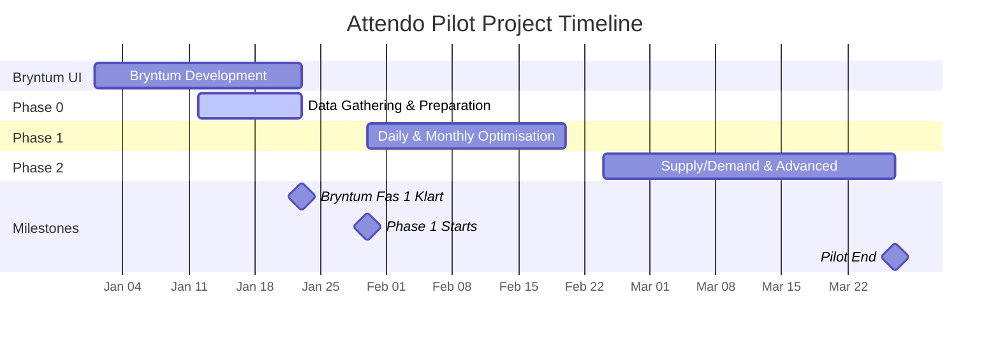

# CAIRE × ATTENDO

## Pilot Plan, Commercial Scope & Platform Add-Ons

**Status:** Draft for Attendo review
**Audience:** Attendo Business, Operations, IT, DPO, Steering Group
**Product:** CAIRE (EirTech AB)

**Note**: See [TIMEPLAN.md](./TIMEPLAN.md) for the complete timeplan with phases, dates, and budgets.

---

## 1. Executive Summary

The Attendo pilot aims to demonstrate CAIRE's full capability as an **AI-driven scheduling and planning platform for home care**, covering:

- Long-term pre-planning (weeks/months)
- Movable visits and slingor
- Daily optimization from unplanned or planned baselines
- Fine-tuning and revision handling
- Comparison of all schedule states (unplanned, planned, optimized, actual)
- Home-care-specific KPIs (efficiency, continuity, unused hours, etc.)

The pilot is designed to be:

- **Operationally realistic**
- **GDPR-compliant**
- **Scalable to enterprise rollout**

In addition to the core pilot, Attendo is offered **early access** to two **optional CAIRE platform add-ons**:

1. **CAIRE Analytics & BI** – enterprise-grade reporting and analysis
2. **CAIRE Speech-to-Text & Clinical AI (Corti)** – voice documentation, avvikelser, and care-plan intelligence

Both add-ons are designed as **platform capabilities**, not pilot-specific customizations.

---

## 2. System Overview

CAIRE is a hybrid scheduling system that balances **human planning** and **AI optimization**. The system uses recurring weekly patterns (slingor) as stable baselines, with AI optimization handling movable visits, disruptions, and fine-tuning.

### Key Principles

- **Manual vs AI balance** varies by scenario
  (from 0% manual for unplanned schedules to high manual control when fine-tuning slingor)
- **Longer planning windows** improve daily optimization quality
- **Multi-dimensional optimization** across:
  - Time
  - Location
  - Scope (template vs instance)

### Data Flow

- External data (CSV, JSON, PDF) is imported and mapped to normalized database tables
- Timefold AI optimization generates optimized schedules
- Results are stored in the database and displayed in the Bryntum SchedulerPro UI
- Planners can manually edit, compare revisions, and fine-tune schedules

### Schedule States

See Section 3 (Definitions) for detailed definitions of schedule states: Unplanned, Planned, Optimized, Actual, and Fine-tune. All states are **measurable and comparable** using consistent metrics.

---

## 3. Definitions

This section defines key terms used throughout the pilot plan.

### Schedule States

- **Unplanned**: Visits that need to be scheduled but have no assigned employee or time yet. The starting point for optimization.
- **Planned Baseline**: A schedule that has been created (manually or automatically) with assigned employees and times. Used as a baseline for comparison.
- **Optimized**: A schedule that has been improved by CAIRE's optimization engine, balancing efficiency, travel time, continuity, and other factors.
- **Actual**: The schedule that was actually executed, showing what really happened during service delivery. Used for comparison with planned/optimized schedules.

### Planning Concepts

- **Pre-Planning**: Long-term planning (weeks/months ahead) to optimize recurring visit patterns and movable visits before they become daily schedules.
- **Daily Optimization**: Optimizing schedules for a specific day, typically with real-time adjustments for cancellations, absences, and other changes.
- **Planning Window**: The time period for which optimization is performed. Can be daily (single day), weekly (7 days), monthly (30 days), or custom range. Longer windows provide more context for better optimization.
- **Fine-Tune**: Making adjustments to an existing planned or optimized schedule (e.g., unpinning some visits, making manual edits) and then re-optimizing. The input is an existing schedule with adjustments, and the output is a new optimization revision that preserves pinned assignments while optimizing unpinned visits.

### Visit Types

- **Movable Visits**: Visits that can be scheduled on different days within their time window. For example, a weekly visit that must happen once per week can be placed on any day Monday-Friday. Movable visits have multi-day time windows.
- **Recurring**: Visits that repeat on a regular pattern (daily, weekly, bi-weekly, monthly). Can be part of a slinga (fixed pattern) or movable (flexible placement).
- **Patterns**: Regular, repeating visit assignments (e.g., "Lisa visits Client A every Monday at 10:00"). Patterns form the basis of slingor.

### Templates and Slingor

- **Templates**: Reusable visit definitions that specify visit requirements (frequency, duration, time windows, skills) without assigning specific employees or times. Movable visit templates define recurring visit needs.
- **Slinga** (plural: **Slingor**): A weekly recurring pattern of assigned visits showing which employee does which visits on which day at which times. Slingor are stable baselines that generate daily schedules. Every visit in a slinga is linked to a movable visit template that defines its recurring requirements.

**Important Distinction**: Slingor and movable visits are two different things:

- **Slingor**: Weekly recurring patterns of assigned visits (employee + day + time)
- **Movable visits**: Recurring visit templates that define visit requirements (frequency, duration, time windows)
- **Relationship**: Every visit in a slinga has a movable visit/template that defines its recurring requirements

**Example 1: Slinga (Weekly Recurring Pattern)**

```
Slinga: "Lisa - Monday Day Shift"
- Monday 08:00 - Visit to Client A (30 min) - Lisa
- Monday 09:00 - Visit to Client B (45 min) - Lisa
- Monday 10:30 - Visit to Client C (60 min) - Lisa
- Monday 13:00 - Visit to Client D (30 min) - Lisa
```

**Example 2: Movable Visit Template (Recurring Requirements)**

```
Movable Visit Template: "Client A - Personal Care"
- Frequency: Weekly (once per week)
- Duration: 30 minutes
- Time window: Monday-Friday, 08:00-12:00
- Required skills: Personal care
- Priority: Mandatory
```

**Example 3: Relationship (Slinga Visit → Movable Visit Template)**

```
Slinga Visit: "Monday 08:00 - Client A (30 min) - Lisa"
    ↓ (has a template)
Movable Visit Template: "Client A - Personal Care"
    - Weekly, 30 min, Mon-Fri 08:00-12:00, Personal care skills
```

### Visit Assignment

- **Pinned**: A visit that is locked to a specific employee and time. Pinned visits cannot be moved by the optimizer. Used to preserve existing assignments (e.g., from slingor or manual planning).
- **Unpinned**: A visit that is not locked and can be reassigned by the optimizer. Note: Unpinned is not the same as movable - a visit can be unpinned but still have a single-day time window (non-movable).

### Location and Service Areas

- **Location**: The geographic dimension of optimization, including visit addresses, employee locations, and service area boundaries.
- **Service Area**: A geographic region or organizational unit that groups clients, employees, and visits. Optimization can work within a single service area or across multiple service areas (cross-area optimization).

### Optimization Metrics

- **Efficiency**: The primary optimization metric, calculated as service hours divided by shift hours. Measures how effectively employee time is used for actual service delivery (not travel or waiting).
- **Unused Hours Recapture**: Monthly allocated visit hours per client (derived from biståndsbeslut) that become unused when visits are cancelled (by client or organization if optional). This pool of unused hours can be used to balance supply and demand. The goal is to utilize all allocated visit hours per client per month, because hours reset each month and unused hours at month end represent lost revenue (>0 = lost revenue).

### Skills

- **Skills**: Employee qualifications and requirements needed for visits. Includes:
  - **Language**: Required languages (e.g., Swedish, English, Arabic)
  - **Gender**: Gender preference for certain visits
  - **Allergies**: Employee allergies that prevent assignment to certain clients
  - **Certificates**: Professional certifications (e.g., nursing license, medication administration)
  - **Role**: Job role/position (e.g., nurse, assistant, coordinator)
  - **Other qualifications**: Any other specific requirements for visit assignments

### Source Documents

- **Biståndsbeslut**: Swedish care decision document that authorizes home care services for a client. Contains visit requirements (frequency, duration, task type) but not specific scheduling details (which employee, exact time). CAIRE uses biståndsbeslut data to create movable visit templates.

### Other Terms

- **Continuity**: Maintaining consistent caregiver-client assignments over time. Measured as the number of different caregivers assigned to a client during a time period. Lower numbers are better: 1 caregiver is best (perfect continuity), but in practice Swedish home care typically has around 10 different caregivers per client per time period. 12+ is poor continuity. Percentage can be used when measuring change against a baseline (e.g., "continuity improved by 20%") or as an index (e.g., "continuity index of 85%"). Reference: [Socialstyrelsen's statistics on home care services](https://www.socialstyrelsen.se/statistik-och-data/oppna-jamforelser/socialtjanst/aldreomsorg/hemtjanst-och-sarskilt-boende/).
- **Contact Person** (scheduling context): The responsible caregiver for a specific client (client-caregiver contact person). This contact person should have a certain percentage of the assigned visits for that client. Not related to preferred caregivers, but the contact person is usually included in the preferred caregiver list. Contact person percentage measures how often visits are assigned to the designated contact person for each client.
- **Client Contact Persons** (standing data): Emergency contacts and other client-related contact information stored in the system. These are not used for scheduling optimization.
- **Preferred Caregivers**: Employees that clients or planners prefer for specific visits. Preferred caregivers assignment rate measures how often preferred assignments are achieved. The contact person (responsible caregiver) is usually included in the preferred caregiver list.

---

## 4. Pilot Objectives

1. **Prove optimization capability** across all planning scenarios
2. **Validate comparison framework** across all schedule states
3. **Gather and prepare data** (Phase 0)
4. **Achieve planner acceptance** in real workflows (Phase 1–2)
5. **Produce decision-grade results** for rollout evaluation

---

## 5. Key Capabilities to Prove

- **Multi-Dimensional Optimization**: Optimize across time, location, and scope (see below)
- **Pre-planning with long time horizon**: Optimize schedules across weeks/months
- **Movable visits pre-planning**: Insert new movable visits into existing slingor
- **Slingor import and fine-tuning**: Import existing planned baselines (slingor) from eCare and optimize them
- **New slinga generation**: Create optimal slingor from movable visit templates (recommended: biståndsbeslut data; workaround: CAIRE pattern module with manual confirmation)
- **Daily schedule optimization**: Optimize daily schedules from unplanned or from slingor
- **Cross-area optimization**: Optimize multiple service areas together, suggest client address moves to better-fitting areas
- **Comprehensive comparison**: Compare unplanned vs planned vs optimized vs actuals
- **Continuity**: Maintain and optimize continuity while balancing efficiency
- **Demand & Supply Management**: Use unused hours (client-specific allocated hours from biståndsbeslut that become available due to cancellations), priority, mandatory/optional visits to improve future employee schedule planning - adapt demand to supply by optimizing shift allocation, utilizing unused hours pool to balance supply/demand, and suggesting schedule adjustments based on demand patterns, unused hours recapture, and visit priorities

---

## 6. Multi-Dimensional Optimization

The pilot will demonstrate optimization across three key dimensions:

### 6.1 Time Dimension

- **Daily optimization**: Optimize for a specific date with real-time supply/demand changes
- **Weekly/Monthly domain**: Optimize movable visits that can be scheduled anywhere within their time window (e.g., a visit that must happen once per week can be placed on any day)
- **Template vs Instance**: Distinguish between optimizing a single occurrence vs updating the recurring template

### 6.2 Location Dimension

**Pre-Planning/Template Level** (Slinga/Template):

- **Route optimization**: Minimize travel time within service areas
- **Cross-area optimization**: Optimize multiple service areas together to identify if client addresses fit better in adjacent areas
- **Area boundary recommendations**: Suggest permanent reassignment of clients to different service areas based on geographic efficiency
- **Client placement**: Place clients/visits in the best-fitting service area for recurring patterns (template/slinga level)

**Real-Time/Instance Level** (Schedule Instance):

- **Demand/supply balancing**: Use location data to balance demand and supply across service areas in real-time
- **Real-time area adjustments**: Adapt to changes (cancellations, absences) by reassigning visits across areas
- **Capacity optimization**: Move visits between areas based on current capacity and demand

### 6.3 Temporary vs Template Scope

| Scope         | When to Use                                                   | What Changes                                                                                    |
| ------------- | ------------------------------------------------------------- | ----------------------------------------------------------------------------------------------- |
| **Temporary** | Real-time changes (sick employee, cancellation, urgent visit) | Only today's schedule - no template updates                                                     |
| **Template**  | Stable improvements discovered through optimization           | Update slinga/template (e.g., client moves to better area, movable visit gets new default time) |

**Examples**:

- _Temporary (Instance)_: Employee calls in sick → re-optimize today's visits only, may reassign across areas for capacity
- _Temporary (Instance)_: High demand in Area A, excess capacity in Area B → move some visits from Area A to Area B for today only
- _Template_: Route optimization shows Client A fits better in Area B → update client's service area permanently in template/slinga
- _Template_: Demand balancing shows movable visit works better Tuesday 10-11 instead of Thursday 14-15 → update movable visit default time in template

---

## 7. Pilot Structure & Phases

### Phase Overview

| Phase   | Period          | Duration | Participants                      | Focus                                        |
| ------- | --------------- | -------- | --------------------------------- | -------------------------------------------- |
| Phase 0 | Jan 12 – Jan 23 | 2 weeks  | CAIRE team + Attendo stakeholders | Data gathering & preparation                 |
| Phase 1 | Jan 30 – Feb 20 | 3 weeks  | CAIRE team + Attendo planners     | Daily & monthly optimisation & new slingor   |
| Phase 2 | Feb 24 – Mar 27 | 5 weeks  | CAIRE team + Attendo planners     | Supply/demand balancing & advanced scenarios |

**Pilot End:** March 27, 2026

**Bryntum UI Development:**
| Milestone | Date |
| --------- | ---- |
| Development starts | Jan 1, 2026 |
| Bryntum fas 1 klart | Jan 23, 2026 |
| Phase 1 begins | Jan 30, 2026 |

**Note:** See Section 17 (Pilot Pricing & Budget) for detailed budget information.

### Pilot Timeline (Gantt Chart)



---

## 8. Use Case 0 – Foundation

All phases include:

### 8.1 DPIA & Legal Alignment

- DPIA review and approval
- DPA signing
- Confirmation of GDPR roles:
  - Attendo = Data Controller
  - EirTech = Data Processor
- Explicit exclusion of **sensitive health data (Art. 9)** unless separately approved

### 8.2 Current State Analysis

- Employees, clients, visits
- Working hours, shifts, constraints
- Baseline KPIs and pain points

### 8.3 Data Collection & Validation

- Import from eCare (CSV/JSON)
- Mapping to CAIRE data model
- Quality checks and validation

### 8.4 Recommended Pilot Scope

- Final scope proposal based on data availability
- Agreed service areas, horizon, KPIs

---

## 9. Use Case 1 – Daily Scheduling & Optimization (Phase 1)

**Scope**

- **CSV import from eCare**: All schedule types (unplanned, planned, actual) for daily optimization (assumes data availability)
- Daily optimization within one service area
- **Optimization**: With fine-tuning and revisions based on general time-window settings; no individual rules
- **Bryntum UI in read-only mode**: No manual editing; schedule changes are made via Timefold optimization
- **Limitation**: No integration of time, location, or scope – system handles only one day's schedule and has no awareness of weeks, months, or multiple areas

**Comparison**

- Comparison of all schedule states (unplanned, planned, optimized, actual) at daily level for one service area

**KPIs**

- **Basic KPIs** (e.g., efficiency, total travel time) per schedule and revision
- Service hours
- Travel time
- Overall efficiency
- **Note**: Extended metrics (continuity, contact person, preferred caregivers, unused hours, etc.) are available in Phase 2

### 9.1 Detailed Use Cases

#### Use Case 1A: Daily Schedule Optimization (from Unplanned)

**Scenario**: Optimize a daily schedule starting from unplanned visits (no existing assignments).

**Steps**:

1. Import unplanned visits for a specific date (or weekly/monthly range if supported)
   - **Time dimension**: Planning window (daily, weekly/monthly) - to be assessed during Phase 0 data gathering whether eCare supports weekly/monthly exports
   - **Location dimension**: Service areas (single, multiple, or all) - to be assessed during Phase 0 data gathering whether eCare supports filtering
2. Import employee shifts and availability
3. Run full optimization (daily, or weekly/monthly if longer planning window specified)
4. Review optimized schedule
5. Compare with manual planning baseline

**Metrics to Track**:

- **Efficiency** (service hours / shift hours) - primary metric
- Travel time reduction vs manual
- Number of unassigned visits
- Cross-area optimization recommendations
- Optimization time

#### Use Case 1B: Daily Schedule Optimization (from Slingor)

**Scenario**: Optimize a daily schedule generated from slingor, with some manual adjustments.

**Steps**:

1. Generate daily schedule from slingor (all visits pinned)
2. Import additional unplanned visits or changes from eCare CSV (if needed)
   - **Time dimension**: Planning window (daily, weekly/monthly) - to be assessed during Phase 0 data gathering whether eCare supports weekly/monthly exports
   - **Location dimension**: Service areas (single, multiple, or all) - to be assessed during Phase 0 data gathering whether eCare supports filtering
3. Planner makes manual adjustments (unpins some visits)
4. Run optimization
5. Review proposed changes
6. Accept/reject changes

**Metrics to Track**:

- **Efficiency** (service hours / shift hours) - primary metric
- Changes from original slinga
- Travel time improvement
- Temporary vs template recommendations
- Constraint violations
- Planner acceptance rate

---

## 10. Use Case 2 – Weekly / Monthly Planning & Slingor (Phase 1)

**Extends Use Case 1 with**

- **Import of decisions**: From the municipality about movable visits
- **Scheduling over longer time periods** (week/month) – i.e., pre-planning
- **Note**: Daily optimization and pre-planning are evaluated but **not integrated at this step**
- **Optimization of movable visits**: In combination with existing slingor, employees, and visits
- **Import of slingor**: Support for editing existing slingor and creating/generating new slingor
- **Fine-tuning and optimization of slingor**: Either update the sling itself or just the schedule instance
- **Improved interface**: For manual editing in Bryntum UI

### 10.1 Detailed Pilot Scope

#### 10.1.1 Movable Visits Pre-Planning

**Objective**: Import and optimize new movable visits into existing schedules.

**Activities**:

- Import movable visit templates from available sources:
  - **Recommended**: Biståndsbeslut data (from eCare if available, or PDF originals via OCR) - to be assessed during Phase 0 data gathering
  - **Workaround**: CAIRE's visit pattern module (requires manual confirmation)
  - **Fallback**: Manual entry
- Run pre-planning optimization to insert movable visits around pinned slingor
- Review and accept/reject optimization recommendations
- Measure impact on travel time, continuity, and service hours/shift hours

**Success Criteria**:

- Movable visit templates imported/entered from available sources
- Movable visits successfully inserted into optimal slots
- Minimal disruption to existing pinned visits
- Clear recommendations with impact metrics
- Planner can accept/reject individual recommendations

#### 10.1.2 Slingor Import

**Objective**: Import existing planned baselines (slingor) from eCare system.

**Activities**:

- Import 30+ days of planned schedules from eCare (slingor data)
  - **Time dimension**: Planning window (daily, weekly, monthly, or custom range) - to be assessed during Phase 0 data gathering whether eCare supports this
  - **Location dimension**: Service areas (single, multiple, or all) - to be assessed during Phase 0 data gathering whether eCare supports filtering
- Import movable visit templates from available sources:
  - **Recommended**: Biståndsbeslut data (from eCare if available, or PDF originals) - to be assessed during Phase 0 data gathering
  - **Workaround**: CAIRE's visit pattern module (requires manual confirmation)
  - **Fallback**: Manual entry
- Create slinga templates with pinned visits from imported eCare data
- Link slinga visits to their corresponding movable visit templates
- Generate daily schedules from slingor
- Compare imported baseline with optimized versions

**Note**:

- **Slingor**: Imported as-is from eCare (no pattern analysis performed)
- **Movable visit templates**:
  - **Recommended**: Generate only from biståndsbeslut (or the same data in eCare) for quality purposes
  - **Workaround**: CAIRE's visit pattern module can be used as a fallback, but requires manual confirmation

**Success Criteria**:

- Successful import of eCare CSV data (slingor)
- Movable visit templates imported/entered from available sources
- Slingor correctly created with pinned visits
- Slinga visits linked to their movable visit templates
- Daily schedules generated correctly from slingor

#### 10.1.3 Fine-Tuning Slingor

**Objective**: Optimize existing slingor with constraints and user overrides.

**Activities**:

- Load existing slingor into CAIRE
- Apply constraints (continuity, skills, preferred employees)
- Run optimization with pinned visits fixed
- Compare original vs fine-tuned slingor
- Measure improvements in efficiency metrics

**Success Criteria**:

- Optimization respects pinned visits
- Constraints properly enforced
- Measurable improvements in travel time and utilization
- Clear comparison view showing changes

### 10.2 Detailed Use Cases

#### Use Case 2A: Pre-Planning with Long Time Horizon

**Scenario**: Plan schedules for the next 4-8 weeks, including new clients and recurring visits.

**Steps**:

1. Import existing slingor (pinned visits) from eCare
2. Import new movable visit templates (recommended: biståndsbeslut data; workaround: CAIRE pattern module with manual confirmation)
3. Run pre-planning optimization across the time horizon
4. Review recommendations for each week
5. Accept/reject recommendations
6. Generate final schedules

**Metrics to Track**:

- **Efficiency** (service hours / shift hours) - primary metric
- Total travel time across time horizon
- Continuity (number of different caregivers per client)
- Unused hours recapture
- Cross-area optimization opportunities identified
- Optimization time

#### Use Case 2B: Planning New Movable Visits into Existing Slingor

**Scenario**: Add new weekly grocery shopping visits for 5 new clients into existing Monday-Friday slingor.

**Steps**:

1. Load existing slingor (all visits pinned) from eCare
2. Import/create movable visit templates for new clients (recommended: biståndsbeslut data; workaround: CAIRE pattern module with manual confirmation)
3. Run optimization
4. Review recommendations showing best-fit slots
5. Accept recommendations
6. Update slingor with new pinned visits

**Metrics to Track**:

- **Efficiency** (service hours / shift hours) - primary metric
- Extra travel time added
- Continuity impact
- Workload balance across employees
- Time dimension: optimal day/time slot selection
- Time to generate recommendations

---

## 11. Use Case 3 – Scenarios & Supply/Demand Balancing (Phase 2)

### Added Capabilities

- **Scenario lab & what-if analysis**: Configuration of Attendo-specific scenarios based on current state analysis and data
- **Cross-service-area optimization**: System can optimize across multiple service areas simultaneously
- **Full integration of time, location, and scope**: Including handling the difference between template and instance
- **Integration of long-term planning and daily optimization**: With supply/demand balancing:
  - Unused hours
  - Reallocation of movable visits
  - Mandatory vs optional visits
  - Continuity
  - Priority
  - Preferred caregivers

### UI

- **Full UI support**: For manual editing and visualization of consequences in real-time
- Detailed comparisons between different schedules

### Extended KPIs

- Comparison of all schedule states (unplanned, planned, optimized, actual) with home-care-specific KPIs:
  - Continuity
  - Contact person %
  - Preferred caregiver fulfilment
  - Unused hours recapture
  - Skills coverage
  - Per-area and per-employee views

### Resource Requirements

- Requires comprehensive data from Phase 0
- **Extra team member** for custom analysis and scenario work

### 11.1 Detailed Pilot Scope

#### 11.1.1 Generation of New Slingor

**Objective**: Create new slingor from scratch using CAIRE optimization.

**Activities**:

- Import movable visit templates for new clients from available sources:
  - **Recommended**: Biståndsbeslut data (from eCare if available, or PDF originals via OCR) - to be assessed during Phase 0 data gathering
  - **Workaround**: CAIRE's visit pattern module (requires manual confirmation)
  - **Fallback**: Manual entry
- All visits start as unpinned (not yet assigned/pinned)
- Movable visit templates generate visits with multi-day time windows (making them movable)
- Run full optimization to create optimal route patterns
- Review generated slingor
- Pin approved patterns to create stable slingor
- Compare generated slingor with manual planning

**Success Criteria**:

- Movable visit templates imported/entered from available sources
- Optimal slingor generated from scratch
- All visits properly assigned
- Metrics show improvement over manual planning
- Slingor can be pinned and used for future schedules

### 11.2 Detailed Use Cases

#### Use Case 3A: Creating New Slinga from Movable Visit Templates

**Scenario**: Create optimal slingor for a new service area from movable visit templates (recommended: biståndsbeslut data; workaround: CAIRE pattern module with manual confirmation).

**Steps**:

1. Import movable visit templates (recommended: biståndsbeslut data; workaround: CAIRE pattern module with manual confirmation) - all visits start as unpinned (not yet assigned/pinned), with multi-day time windows (making them movable)
2. Define employee shifts and availability
3. Run full optimization to create initial patterns
4. Review generated slingor
5. Adjust and refine
6. Pin approved patterns
7. Compare with manual slinga creation

**Metrics to Track**:

- **Efficiency** (service hours / shift hours) - primary metric
- Travel time efficiency
- Cross-area boundary optimization
- Template recommendations (new slinga patterns)
- Planner satisfaction with generated patterns
- Total optimization time

#### Use Case 3B: Comparison of All Schedule States

**Scenario**: Compare unplanned, planned, optimized, and actual schedules for the same date.

**Steps**:

1. Import unplanned visits
   - **Time dimension**: Planning window (daily, weekly, monthly, or custom range) - to be assessed during Phase 0 data gathering whether eCare supports this
   - **Location dimension**: Service areas (single, multiple, or all) - to be assessed during Phase 0 data gathering whether eCare supports filtering
2. Import planned schedule (creates INPUT with pinned visits)
   - **Time dimension**: Must match unplanned planning window
   - **Location dimension**: Must match unplanned service areas
3. Run optimization (creates optimized schedule)
4. Import actual execution data (creates INPUT with pinned visits)
   - **Time dimension**: Must match planned schedule planning window
   - **Location dimension**: Must match planned schedule service areas
5. Generate metrics for all states:
   - **General schedule metrics**: Travel time, efficiency, assignment rate, etc.
   - **Home care-specific metrics**:
     - Continuity (caregiver-client consistency)
     - Contact person percentage
     - Preferred caregivers assignment rate
     - Unused hours recapture
     - Skills utilization
     - And other domain-specific metrics
6. Display comparison view

**Metrics to Track**:

- **Efficiency** (service hours / shift hours) - primary metric for all states
- Travel time: unplanned vs planned vs optimized vs actual
- Continuity: planned vs optimized vs actual
- Unused hours recapture: optimized vs actual
- Contact person %: planned vs optimized vs actual
- Preferred caregivers %: planned vs optimized vs actual
- Skills utilization: planned vs optimized vs actual
- Planning accuracy: planned vs actual
- Cross-area optimization impact across states

---

## 12. Detailed Phase Descriptions

### Phase 0 – Data Gathering & Preparation (January 12 – January 23)

- **Dates:** Jan 12 – Jan 23
- **Budget:** ~50 k SEK

**Goal**: Ensure CAIRE has the same information as manual planners. Gather one month of historical schedule data and define movable visit templates for each client and visit type. Prepare revision datasets to simulate real‑time changes.

**Tasks**:

- Collect historic schedules: Export one month of unplanned, planned and actual schedules from eCare. Each row should represent a single visit on a specific date. Approximately 3,000 rows for 30 days at 100 visits/day.
- Create movable visit templates: Define recurring visit templates for each client and visit type (frequency, duration, time windows, skills, priority, mandatory/optional) and assign a unique `movableVisitTemplateId` for linking to daily schedules.
- Generate revision schedules: Produce a set of daily schedule CSVs with real‑time changes (sickness, cancellations, extra visits, extended visits) to use as revision datasets for optimisation tests.

**Deliverables**:

- Validated daily schedule CSV (baseline) and revision CSVs.
- Movable visit template CSV with unique identifiers.

---

### Phase 1 – Daily & Monthly Optimisation & New Slingor (January 30 – February 20)

- **Dates:** Jan 30 – Feb 20
- **Budget:** ~50 k SEK

**Goal**: Optimise daily and monthly schedules, incorporate slingor and movable visits, generate new slingor from scratch and compare them with existing patterns, and simulate real‑time disruptions. Provide planners with a UI that supports pinning/unpinning and drag‑and‑drop editing.

**Tasks**:

- Import & map data: Load the Phase 0 CSV files into CAIRE. Link each daily visit to its `movableVisitTemplateId` and mark visits as pinned or unpinned depending on whether they are part of a slinga.
- Generate new slingor from scratch: Use the movable visit templates to create new weekly patterns that optimise continuity and travel time. Compare these new slingor with the existing slingor imported from eCare and evaluate improvements.
- Optimise daily schedules: Optimise a selected day's unplanned visits and fine‑tune planned schedules by unpinning selected visits. Compare unplanned, planned, actual and optimised schedules using KPIs.
- Optimise monthly schedules: Optimise a 30‑day horizon by combining slingor and movable visits, measuring efficiency, continuity and travel time.
- Simulate real‑time changes: Apply the revision schedule to simulate disruptions. Re‑optimise and compare results against original plans and manual adjustments.
- Enhance Bryntum UI: Update the scheduler UI to support pinning/unpinning, editing planned schedules and dragging unassigned visits. Clearly distinguish between fixed and movable visits.

**Deliverables**:

- Data import/mapping report and verification.
- New slinga proposals and comparison metrics against existing slingor.
- KPI reports for daily and monthly optimisation.
- Real‑time optimisation demo with metrics.
- Updated UI with pinnable and drag‑and‑drop capabilities.

---

### Phase 2 – Supply/Demand Balancing & Advanced Scenarios (February 24 – March 27)

- **Dates:** Feb 24 – Mar 27
- **Budget:** ~100 k SEK

**Goal**: Demonstrate CAIRE's ability to balance supply and demand, optimise across multiple service areas and run advanced scenarios (e.g. high demand, resource shortages). Provide management with insights via resource histograms and dashboards.

**Tasks**:

- Demand/supply balancing: Use unused hours, priority levels and mandatory/optional flags to balance supply and demand across service areas. Adapt shift allocations and schedules to minimise unused hours and maximise client continuity.
- Cross‑area optimisation: Optimise schedules that span multiple service areas, suggesting client moves to neighbouring areas when beneficial. Integrate multi‑day planning windows.
- Scenario simulation (use case 3): Model complex scenarios such as sudden increases in demand, service area rebalancing and resource shortages. Assess CAIRE's performance against manual adjustments.
- Resource histograms & dashboards: Develop analytics to visualise supply/demand balance, unused hours recapture and other KPIs. Provide planners and managers with insights for decision‑making.

**Deliverables**:

- Balanced schedules and supply/demand analysis.
- Cross‑area optimisation proposals.
- Scenario simulation reports.
- Resource histogram dashboards and analytics.

---

## 13. Success Criteria

### Phase-Specific Success Criteria

#### Phase 0 Success Criteria (Data Gathering & Preparation)

| Criteria                        | Target                                                        | Measurement                                        |
| ------------------------------- | ------------------------------------------------------------- | -------------------------------------------------- |
| Historic Schedules Collected    | One month of unplanned, planned and actual schedules exported | Validated daily schedule CSV (baseline)            |
| Movable Visit Templates Created | Recurring visit templates defined with unique identifiers     | Movable visit template CSV with unique identifiers |
| Revision Schedules Generated    | Daily schedule CSVs with real‑time changes produced           | Revision CSVs ready for optimisation tests         |

#### Phase 1 Success Criteria (Daily & Monthly Optimisation & New Slingor)

| Criteria                     | Target                                                    | Measurement                                             |
| ---------------------------- | --------------------------------------------------------- | ------------------------------------------------------- |
| Data Import/Mapping Complete | Phase 0 CSV files loaded and linked correctly             | Data import/mapping report and verification             |
| New Slingor Generated        | New weekly patterns created from movable visit templates  | New slinga proposals and comparison metrics             |
| Daily Optimisation Working   | Selected day's unplanned visits optimised                 | KPI reports for daily optimisation                      |
| Monthly Optimisation Working | 30‑day horizon optimised with slingor and movable visits  | KPI reports for monthly optimisation                    |
| Real-time Changes Simulated  | Revision schedule applied and re-optimised                | Real‑time optimisation demo with metrics                |
| UI Enhanced                  | Scheduler UI supports pinning/unpinning and drag‑and‑drop | Updated UI with pinnable and drag‑and‑drop capabilities |

#### Phase 2 Success Criteria (Supply/Demand Balancing & Advanced Scenarios)

| Criteria                     | Target                                            | Measurement                                   |
| ---------------------------- | ------------------------------------------------- | --------------------------------------------- |
| Supply/Demand Balanced       | Supply and demand balanced across service areas   | Balanced schedules and supply/demand analysis |
| Cross-area Optimisation      | Schedules optimised across multiple service areas | Cross‑area optimisation proposals             |
| Scenarios Simulated          | Complex scenarios modelled and assessed           | Scenario simulation reports                   |
| Analytics Dashboards Created | Resource histograms and dashboards developed      | Resource histogram dashboards and analytics   |

---

### Overall Metrics-Based Success Criteria

#### Efficiency (Primary Metric)

- **Target**: ≥75% efficiency (service hours / shift hours)
- **Measurement**: Calculate ratio for all schedules across all schedule states
- **Acceptance**: ≥75% for optimized schedules, improvement vs planned/unplanned

#### Travel Time Reduction

- **Target**: 15-30% reduction in total travel time vs manual planning
- **Measurement**: Compare optimized vs planned schedules
- **Acceptance**: ≥15% reduction for 80% of test cases

#### Continuity

- **Target**: Reduce number of different caregivers per client compared to baseline. Typical Swedish home care has around 10 different caregivers per client per time period (reference: [Socialstyrelsen's statistics](https://www.socialstyrelsen.se/statistik-och-data/oppna-jamforelser/socialtjanst/aldreomsorg/hemtjanst-och-sarskilt-boende/))
- **Measurement**: Count the number of different caregivers assigned to each client during the time period. Lower numbers are better (1 = best, ~10 = typical in Swedish home care, 12+ = poor)
- **Acceptance**: Improvement in continuity compared to baseline (e.g., reduce from 10 to 8 caregivers, or measure as percentage improvement). Can also measure improvement as percentage change vs baseline (e.g., "continuity improved by 20%" means fewer different caregivers)

#### Unused Hours Recapture

- **Target**: Minimize unused allocated hours per client per month (goal: 0 unused hours at month end)
- **Measurement**: Track unused hours pool per client (allocated hours from biståndsbeslut minus delivered hours). Calculate unused hours at month end (unused hours > 0 = lost revenue)
- **Acceptance**: System identifies and utilizes unused hours to balance supply/demand, minimizing unused hours at month end

#### Optimization Performance

- **Target**: Optimization completes in <5 minutes for daily schedules
- **Measurement**: Track optimization time per schedule
- **Acceptance**: <5 minutes for 90% of optimizations

### Comparison Capabilities

- **All schedule states comparable**: Unplanned, planned, optimized, and actual schedules can be compared side-by-side
- **Consistent metrics**: All states use same metric calculation methods (general schedule metrics and home care-specific metrics)
- **Clear visualization**: Comparison view shows differences clearly (Phase 1-2)

### User Acceptance (Phase 1-2)

- **Planner workflow efficiency**: Planners can complete daily optimization in <10 minutes
- **Recommendation quality**: ≥70% of optimization recommendations accepted
- **System usability**: Positive feedback from planners on UI and workflows

**Note**: For details on what is explicitly excluded from the pilot scope (advanced features, API integrations, future Corti.ai integration), see [PILOT_OUT_OF_SCOPE.md](./PILOT_OUT_OF_SCOPE.md).

---

## 14. Bryntum Frontend Capabilities

The pilot will utilize CAIRE's Bryntum SchedulerPro UI, which provides comprehensive interactive scheduling capabilities for planners. This section describes the frontend features that enable manual fine-tuning, optimization understanding, and efficient planner workflows.

**Important Note**: The availability and functionality of these features during the pilot depends on:

- **Data availability**: Features requiring specific data fields (e.g., priority, mandatory/optional status, movable visit templates) will only be available if that data is provided in the eCare CSV exports or other data sources
- **Pilot scope**: Some advanced features may be out of scope for the pilot phase and will be evaluated based on Phase 0 data gathering
- **Configuration**: Certain features (e.g., resource histograms, chart builders) may require additional configuration during Phase 1
- **Iterative development**: Features will be enabled progressively during Phase 1-2 based on planner feedback and data validation

The final feature set available during the pilot will be determined after Phase 0 data gathering and Phase 1 configuration setup.

### Manual Editing & Drag-and-Drop

**Core Editing Capabilities**:

- **Drag-and-drop assignment**: Unplanned visits can be dragged from the sidebar panel directly onto employee rows to assign them
- **Reassignment**: Visits can be dragged between employees to reassign
- **Time adjustment**: Visits can be dragged horizontally along the timeline to change start times
- **Duration adjustment**: Visit edges can be resized to change duration
- **Inline editing**: Double-clicking visits opens a detail dialog for editing visit properties (client, duration, notes, priority, etc.)
- **Context menu**: Right-click on visits provides quick actions (pin/unpin, edit, delete, assign)

**Constraint Validation**:

- **Skill matching**: During drag operations, valid employees are highlighted based on required skills
- **Time window validation**: Visual feedback prevents moves outside allowed time windows (preferred vs allowed windows)
- **Service area constraints**: Employees from different service areas are highlighted appropriately
- **Pinned visit protection**: Pinned visits cannot be moved until explicitly unlocked (right-click → "Lås upp")

### Filtering & Visibility Controls

**Visit Filtering**:

- **Priority/Mandatory/Optional**: Toggle visibility of visits by priority level (red = high priority), mandatory status (purple = mandatory), and optional status (blue = optional) - _preliminary color scheme, subject to change_
- **Movable visits toggle**: Show/hide movable visits (recurring visits with multi-day time windows) to visualize weekly/monthly patterns
- **Recurrence filters**: Filter by visit frequency (daily 📅1, weekly 📅7, bi-weekly 📅14, monthly 📅30)
- **Pinned/Locked visits**: Toggle to show only pinned visits or hide them
- **Status filters**: Show/hide cancelled visits (yellow), absent employees (grey), extra visits (green)
- **Transport mode**: Filter by transport type (car, walking, public transport)
- **Double staffing**: Filter visits requiring two caregivers

**Employee Filtering**:

- **Service area**: Filter employees by service area
- **Role/Contract type**: Filter by employee role or contract type
- **Skills**: Filter employees by specific skills (language, certifications, etc.)
- **Active/Inactive**: Show/hide inactive employees (displayed in sidebar panel)

**Visual Styling** (preliminary, subject to change):

- **Color coding by status**: Background colors indicate visit scheduling status (blue = optional, purple = mandatory, red = priority, green = extra, yellow = cancelled) - _preliminary color scheme, subject to change_
- **Icons**: Recurrence icons (📅1/7/14/30), lock icon (🔒) for pinned visits, double-staffing icon (👥) - _preliminary icon set, subject to change_
- **Travel & breaks**: Travel time and breaks are automatically displayed (transparent with dashed borders) and cannot be filtered (always visible as scheduling constraints)

### Resource Histograms & Analytics

**Resource Histograms**:

- **Demand vs. Supply curves**: Visualize demand (required visits) vs. supply (available employee capacity) per time slot
- **Utilization charts**: Show employee utilization rates across the schedule
- **Service area heatmaps**: Evaluate service area utilization to identify capacity gaps or overloads
- **Workload balance**: Visual representation of workload distribution across employees

**Metrics Panel**:

- **Real-time metrics**: KPIs update automatically when assignments change (efficiency, travel time, continuity, contact person %, preferred caregivers, unused hours, skills utilization)
- **Comparison metrics**: Side-by-side metrics when comparing two schedule revisions
- **Delta highlighting**: Green arrows (↑) for improvements, red arrows (↓) for degradations
- **Chart builders**: Embedded charts showing trends (travel time distribution, utilization trends, continuity scores over time)

### Comparison Views

**Schedule Comparison**:

- **Side-by-side layout**: Compare two schedule revisions (e.g., planned vs. optimized, baseline vs. fine-tuned) in split-screen view
- **Overlay mode**: Toggle between split view and overlay mode to see differences more clearly
- **Color-coded differences**: Visits that were added, removed, or moved are highlighted with different colors
- **Metrics comparison**: Two metric panels showing metrics for each revision with delta calculations
- **Revision selector**: Dropdown menus to select which two revisions to compare

**Use Cases**:

- Compare unplanned vs. planned vs. optimized vs. actual schedules
- Compare fine-tuned schedules with original optimization results
- Compare different optimization scenarios (e.g., "Kontinuitetsfokus" vs. "Maximal Effektivitet")
- Compare baseline slingor with optimized daily schedules

### Manual Fine-Tuning Workflows

**Fine-Tuning Process**:

1. **Load optimized schedule**: After optimization, all visits are pinned by default
2. **Unpin specific visits**: Right-click → "Lås upp" to unlock visits that need adjustment
3. **Manual edits**: Drag visits to new times/employees, adjust durations, add/remove visits
4. **Re-optimize**: Run fine-tune optimization on unpinned visits only (preserves pinned assignments)
5. **Compare results**: Use comparison view to see impact of fine-tuning vs. original optimization

**Combined Manual + Optimization**:

- Planners can make manual adjustments before optimization (e.g., pin critical visits)
- Optimization respects pinned visits and only optimizes unpinned visits
- After optimization, planners can further fine-tune manually
- Iterative workflow: optimize → manual adjust → fine-tune → compare

### Optimization Change Explanations

**Understanding Optimization Results**:

- **Visual indicators**: Color-coded changes show what was modified (added visits = green, removed = red, moved = yellow) - _preliminary color scheme, subject to change_
- **Metrics explanations**: Tooltips and detail panels explain why optimization made specific changes:
  - "Travel time reduced by 15% by grouping visits in same area"
  - "Continuity improved by assigning Client A to preferred caregiver (Contact Person)"
  - "Unused hours recaptured by adding optional visit to fill gap"
- **Constraint violations**: System explains why certain visits couldn't be optimized (e.g., "Visit pinned to preserve continuity", "Outside allowed time window")
- **Recommendation tooltips**: Hover over optimized visits to see optimization reasoning

**Priority/Mandatory/Optional Visibility** (preliminary, subject to change):

- **Priority visits** (red): High-priority visits that optimization prioritizes - _preliminary color, subject to change_
- **Mandatory visits** (purple): Cannot be skipped; optimization must assign them - _preliminary color, subject to change_
- **Optional visits** (blue): Can be skipped if supply is insufficient; optimization uses these to fill unused hours - _preliminary color, subject to change_
- **Filtering by status**: Planners can filter to see only priority, mandatory, or optional visits to understand optimization decisions

### Pre-Planning & Movable Visits

**Movable Visits Management**:

- **Movable visits panel**: Sidebar tab showing all movable visit templates (recurring visits with multi-day time windows)
- **Toggle visibility**: Show/hide movable visits in the calendar to visualize weekly/monthly patterns
- **Drag-to-assign**: Movable visits can be dragged from the panel to assign them to specific days/times
- **Pre-planning suggestions**: System suggests optimal slots for movable visits based on demand/supply analysis
- **Accept/reject recommendations**: Planners can accept or reject individual movable visit placement suggestions

**Template Management**:

- **Baseline templates (Slingor)**: Load slingor as default view; switch between baseline and optimized revisions
- **Apply template**: Button to apply a slinga template to the current schedule
- **Template preview**: Modal showing before/after when applying templates

### Performance & Usability

**Performance**:

- **Virtual scrolling**: Handles large datasets (hundreds of employees, thousands of visits) without lag
- **Lazy loading**: Data loads incrementally as users navigate dates
- **Real-time updates**: Changes save immediately via GraphQL mutations

**User Experience**:

- **Swedish localization**: All UI elements in Swedish (with English fallback)
- **Keyboard navigation**: Full keyboard support for accessibility
- **Undo/Redo**: Undo stack for drag-and-drop operations and edits
- **Tooltips**: Rich tooltips on hover showing visit details (client, duration, skills, continuity status, preferred caregiver, etc.)

---

## 15. Risk Mitigation

### Data Quality Risks

- **Risk**: Incomplete or incorrect eCare data
- **Mitigation**: Comprehensive data requirements analysis, gap identification, workaround planning

### Performance Risks

- **Risk**: Optimization takes too long
- **Mitigation**: Performance monitoring, optimization tuning, fallback to simpler models

### User Acceptance Risks

- **Risk**: Planners find system difficult to use
- **Mitigation**: User training, iterative UI improvements, feedback collection

### Integration Risks

- **Risk**: Data availability gaps prevent testing certain capabilities
- **Mitigation**: Early data availability assessment, workaround identification, pilot scope adjustment

### Pilot-Specific Risks

- **Unforeseen feature requirements**: During pilot, Attendo may identify features or configurations not anticipated in the initial scope
- **Configuration iteration**: Scenarios and constraints may require more iteration than expected to produce optimal results
- **Mitigation**: Extended timeline (1 week buffer per phase) provides flexibility for unforeseen requirements. Configuration phase allows testing and refinement before planner involvement. Parallel configuration work during Phase 2 enables iterative improvement.

### Transport Mode Clarification

**Phase 1 Simplification**: Endast bil (DRIVING) – ingen differentiering av transportläge.

- Timefold uses `transportMode: DRIVING` for all vehicles/employees in Phase 1
- **Walking service areas**: Short distances with walking will have similar travel times to car (few minutes difference, no parking time needed) - this is acceptable
- **Car service areas**: Longer distances where car transport is the norm - no walking alternative
- **Recommendation**: No special service area filtering needed - car mode works for both scenarios
- **Phase 2**: Support for WALKING, CYCLING, PUBLIC_TRANSIT can be added if needed

### Data Import Clarification

**All schedules via CSV from eCare** – Phoniro/GPS is NOT applicable for Attendo.

- **Unplanned schedules**: Imported via CSV from eCare
- **Planned schedules**: Imported via CSV from eCare
- **Actual (executed) schedules**: Imported via CSV from eCare (not via GPS/Phoniro)

### Map View for Travel Time Validation (Phase 1)

**Purpose**: Visualize and validate travel times through geographic map view:

- Compare manual (planned) travel times with optimized (Timefold) estimates
- Compare optimized estimates with actual (executed) travel times
- Identify unrealistic travel time estimates
- Verify geographic logic in slingor

**Features**:

- Map view per slinga/day showing visit order with route line
- Travel time comparison: Manual vs Timefold vs Actual (from CSV)
- Deviation marking: Flag large differences (>20%)

---

## 16. Success Metrics Dashboard

The pilot will track the following metrics in a dashboard:

**Note**: Metrics include:

- **General schedule metrics**: Travel time, efficiency, assignment rate, etc.
- **Home care-specific metrics**: Continuity, contact person %, preferred caregivers, unused hours, skills utilization, etc.

**Metric Categories**:

- **Primary Metric**: Efficiency (service hours / shift hours) - tracked across all schedule states
- **Optimization Metrics**:
  - General schedule metrics: Travel time, efficiency, assignment rate
  - Home care-specific metrics: Continuity, unused hours, workload balance
- **Home Care Domain Metrics**:
  - Continuity (caregiver-client consistency)
  - Contact person percentage
  - Preferred caregivers assignment rate
  - Unused hours recapture
  - Skills utilization
  - And other domain-specific metrics
- **Multi-Dimensional Metrics**: Time dimension (day/slot selection), location dimension (cross-area recommendations), scope (temporary vs template)
- **Performance Metrics**: Optimization time, system response time
- **User Metrics**: Acceptance rate, workflow time, user satisfaction
- **Comparison Metrics**: Differences between schedule states (efficiency, travel time, continuity, contact person %, preferred caregivers, etc.)
- **Data Quality Metrics**: Import success rate, validation errors

---

## 17. Pilot Pricing & Budget

### Pricing Principle

The pilot is priced on **actual resource cost**, not licenses.

### Pilot Budget Structure

| Phase     | Period              | Budget         |
| --------- | ------------------- | -------------- |
| Phase 0   | Jan 12 – Jan 23     | ~50 k SEK      |
| Phase 1   | Jan 30 – Feb 20     | ~50 k SEK      |
| Phase 2   | Feb 24 – Mar 27     | ~100 k SEK     |
| **Total** | **Jan 12 – Mar 27** | **~200 k SEK** |

**Pilot fees can be credited** against license costs upon rollout.

---

## 18. CAIRE Analytics & BI – Platform Add-On (Early Access)

### 18.1 Positioning

CAIRE Analytics & BI is a **platform product add-on**, not pilot-specific customization.

For the Attendo pilot:

- Enabled as **early access**
- Configured **per Attendo organization**
- Built once and reused across CAIRE customers

### 18.2 Purpose

- Deep analysis of pilot outcomes
- Custom dashboards and reports
- Management-level decision support
- Safe analytics without impacting operations

### 18.3 Architecture Principle

- **Operational system:** real-time scheduling
- **Analytics layer:** reporting, BI, historical analysis

No analytics queries run against the operational database.

### 18.4 Data Scope & DPIA Alignment

- No new data categories
- No sensitive health data (Art. 9)
- Same legal basis (Art. 6.1(f))
- EU-only hosting
- Tenant-isolated, read-only access

Documented as a **DPIA purpose extension**.

### 18.5 Analytics Project Plan & Cost

- **Duration:** ~4 weeks
- **One-time enablement fee:** **≈ 200 000 SEK**
- Can be credited against rollout

---

## 19. CAIRE Speech-to-Text & Clinical AI (Corti) – Platform Add-On (Early Access)

### 19.1 Positioning

CAIRE Speech-to-Text & Clinical AI is a **platform product add-on**, delivered via partnership with **Corti**.

For the Attendo pilot:

- Enabled as **early access**
- Configured **per Attendo organization**
- Built once and reused across CAIRE customers

### 19.2 Purpose

- Reduce caregiver administration via voice documentation
- Improve documentation quality and consistency
- Enable correct handling of **avvikelser**, journals, and care-plan updates
- Feed real-world care signals back into scheduling and optimization

### 19.3 Architecture Principle

- **Clinical AI layer (Corti):** speech-to-text, classification, structured extraction
- **CAIRE core:** system of record, workflows, responsibility, follow-up

Corti provides structured output. CAIRE owns decisions.

### 19.4 Data Scope & DPIA Alignment

- No new data categories beyond existing pilot scope
- No autonomous clinical decision-making
- Same legal basis (Art. 6.1(f))
- EU-only processing
- Documented as a **DPIA purpose extension**

### 19.5 Speech-to-Text Project Plan & Cost

- **Duration:** ~4 weeks
- **One-time enablement fee:** **≈ 200 000 SEK**
- Can be credited against rollout

---

## 20. Summary Table

| Component                                          | Phase 1 | Phase 2 |
| -------------------------------------------------- | ------- | ------- |
| DPIA & data foundation (Phase 0)                   | ✓       | ✓       |
| Daily optimization                                 | ✓       | ✓       |
| Weekly/monthly planning & slingor                  | ✓       | ✓       |
| Scenarios & supply/demand                          | ✗       | ✓       |
| **Analytics & BI (platform add-on)**               | ➕      | ➕      |
| **Speech-to-Text & Clinical AI (platform add-on)** | ➕      | ➕      |

### Interpretation

**Phase 1** focuses on daily and monthly optimization with slingor and movable visits. It includes the generation of new slingor from scratch, daily schedule optimization, monthly optimization, and real-time disruption simulation. The UI supports pinning/unpinning and drag-and-drop editing.

**Phase 2** adds scenarios, supply/demand balancing, cross-area optimization, and advanced functionality including integration of time, location, and scope. It provides resource histograms and dashboards for management insights, and includes scenario simulation for complex situations like high demand and resource shortages.

---

## 21. Next Steps

1. Decide on **Analytics & BI** add-on
2. Decide on **Speech-to-Text & Clinical AI (Corti)** add-on
3. Finalize DPIA & DPA (including add-ons)
4. Agree timeline and start date
5. Kick off pilot

---

## 22. References

- [Data Requirements](./DATA_REQUIREMENTS.md)
- [Pilot Out of Scope](./PILOT_OUT_OF_SCOPE.md)
- [CAIRE Analytics & BI Add-On](./ADDON_ANALYTICS_DW_BI.md)
- [CAIRE Speech-to-Text & Clinical AI Add-On](./ADDON_CLINICAL_SPEECH_TO_TEXT.md)

---

**Document owner:**
EirTech AB / CAIRE
Björn Evers, CEO
