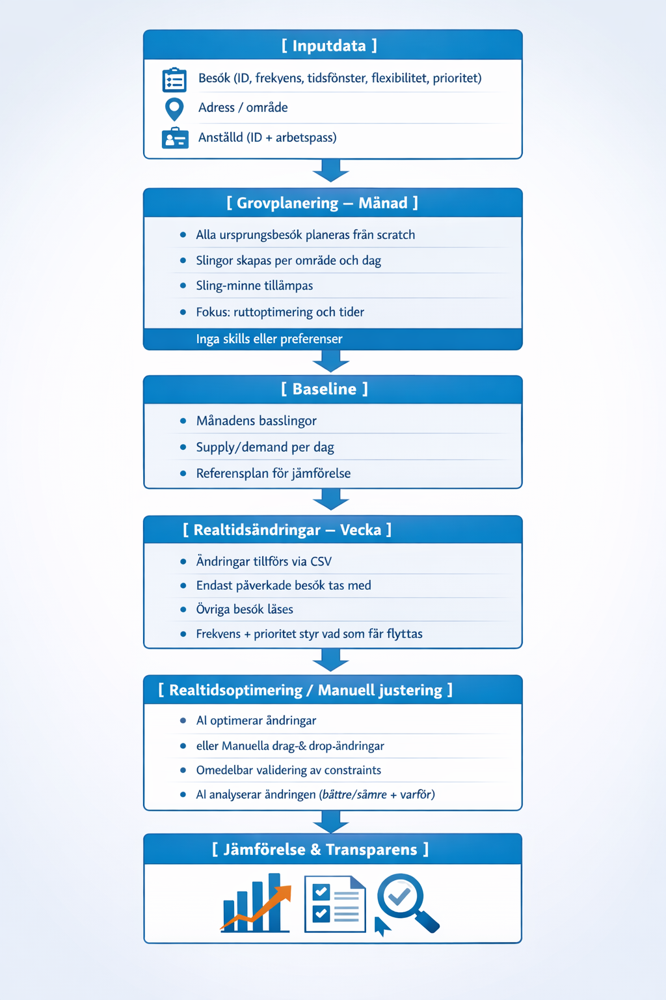
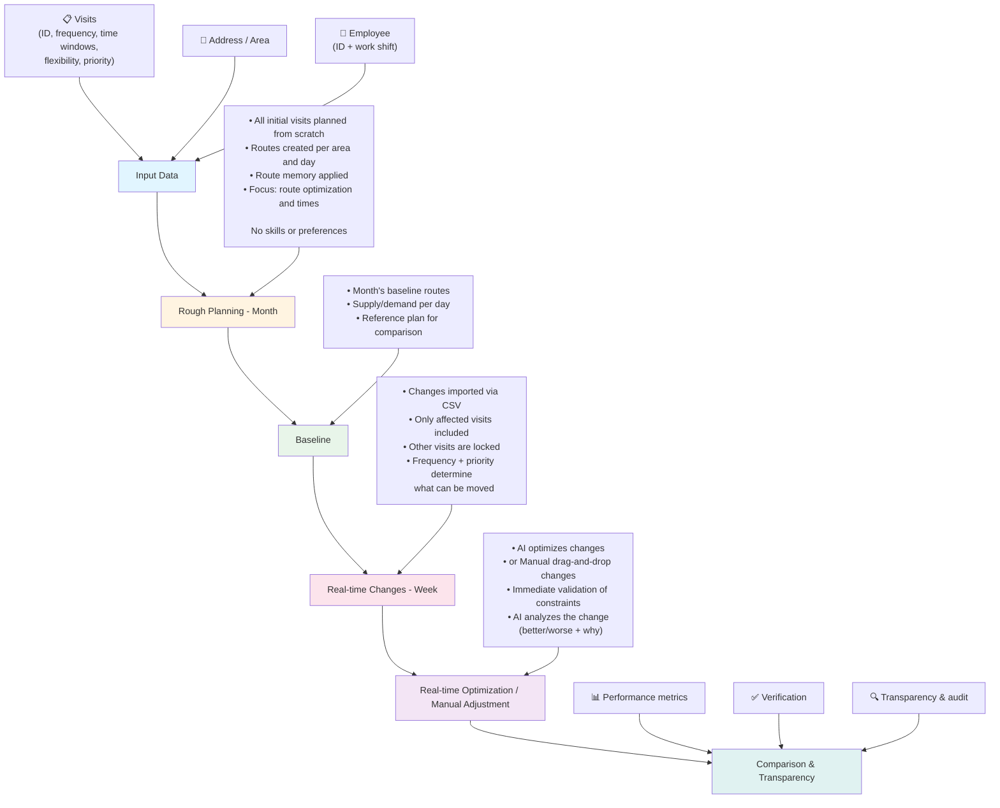

# CAIRE × Attendo – Pilot Data, Process and Optimization Flow (Phase 1)

We have reviewed the CSV data foundation and have concrete feedback on the data, so that we set the right prerequisites from the start. We have also compiled how we view the pilot's data requirements, planning logic, and optimization process, to ensure we get a setup that is:

- Operationally realistic for home care
- Measurable against Attendo's current way of working
- Transparent in why a schedule becomes better or worse

Below we describe the whole: data → rough planning → real-time → comparison.

---

## 1. Data Foundation – What We Need in the Pilot

### 1.1 Mandatory Data (Minimum Level, Time-Related Requirements Only)

**Purpose:**
Provide the minimum possible amount of information to enable correct scheduling of:

- Raw data/input decisions for monthly rough planning of routes
- Real-time changes
- Demand & supply handling – without dependencies on long-term or aggregated data points
- As well as corresponding planned schedules for routes and real-time changes on the same data (route/day/visit/employee)

To be able to roughly plan routes over a month and then handle real-time changes, each visit needs to have:

**Visits:**

| Field                   | Description                                                                            |
| ----------------------- | -------------------------------------------------------------------------------------- |
| ObjectID                | Unique visit ID (same ID throughout the lifecycle: rough plan → real-time → completed) |
| Address / geocoordinate | Visit location                                                                         |
| Duration                | Visit length                                                                           |
| Time window             | Start time (duration and flexibility are sufficient)                                   |
| Flexibility             | ± minutes                                                                              |
| Double staffing         | Whether the visit requires two employees                                               |
| Frequency               | Daily, weekly, bi-weekly, monthly                                                      |
| Priority                | Optional - frequency may be sufficient                                                 |

**Employee:**

| Field         | Description                                                                                        |
| ------------- | -------------------------------------------------------------------------------------------------- |
| EmployeeID    | Unique ID for the resource                                                                         |
| Work shift    | Time interval when the employee is available. Example: 07:00–16:00, 15:00–22:00                    |
| Breaks        | Optional per individual. One or more breaks linked to the work shift: start, duration, flexibility |
| Contract type | Permanent employee or hourly employee                                                              |

**Geography:**

- Start and end address per employee is assumed to be the area's office
- One area per CSV file

### Intentionally Out of Scope in Phase 1

The following are not used in phase 1 and are completely ignored by the optimization:

- Skills / competencies
- Preferences
- Continuity (who has performed the visit previously)
- Unused hours
- Contact persons
- All data points that require summation or analysis over time

**Consequence:**
The optimization only takes into account:

- Working hours, breaks, and costs for employees
- Addresses, frequencies, time windows, and flexibility in visits
- Routes for simplified continuity
- _Not_ history or long-term goals

**Important limitation (design principle):**
In phase 1, CAIRE optimizes within a given time horizon, not over time. This makes the model fast, deterministic, and fully suitable for real-time changes.

### 1.2 Why Frequency is Necessary

Frequency is required to be able to roughly plan routes over an entire month and create a realistic baseline schedule.

**Examples:**

- Weekly cleaning → Thursday 13:00–14:00, flexibility ±30 min
- Toilet visits 4 times/day → every day 07, 12, 17, 22, flexibility ±5 min

Frequency is used to:

- Place visits correctly over time
- Distinguish locked daily visits from moveable weekly/monthly visits
- Analyze supply/demand per day, week, and month

### 1.3 Schedule Import – Three States

To enable complete comparison and analysis, the pilot needs to support import of three schedule states per day/area:

| Schedule Type | Description                           | Usage                        |
| ------------- | ------------------------------------- | ---------------------------- |
| **Unplanned** | Visits without assigned employee/time | Baseline for optimization    |
| **Planned**   | Manual schedule from eCare            | Comparison against optimized |
| **Completed** | Actually executed schedule            | Verification and analysis    |

**CSV format:** One file per area/day with column for schedule type (unplanned/planned/actual).

**Data flow:**

1. Import unplanned → Run optimization → Compare with planned
2. Import completed → Compare with optimized → Identify deviations

> **NOTE:** All schedules (including completed) are imported via CSV from eCare. Phoniro/GPS is NOT relevant for Attendo.

### 1.4 Transport Mode (Phase 1 Simplification)

**Only car (DRIVING) in phase 1** – no differentiation of transport mode.

**Rationale:**

- **Walking routes:** Short distances → travel time difference car vs walking is minimal (a few minutes)
- **Car routes:** Long distances → always car regardless

**Consequence:** Timefold uses `transportMode: DRIVING` for all vehicles/employees in phase 1.

### 1.5 Time Horizon (Phase 1 Simplification)

**Only 1 month time horizon in phase 1** – no optimization over longer periods.

**Rationale:**

- Rough planning occurs per month from scratch
- Real-time optimization occurs per week
- Cross-area optimization and longer time horizons require history and analysis over time

**Consequence:** Phase 1 focuses on monthly rough planning and weekly real-time optimization within one area.

---

## 2. Route Memory – Built-in Continuity in Phase 1

For the pilot to reflect real home care planning, we take route memory into account:

**A route = area + day + work shift** (e.g. 07–16)

Each route has:

- An EmployeeID
- An ordered list of ObjectID (1, 2, 3, 4…)

This means that:

- The same employee performs all visits in the route's baseline plan
- Basic continuity is built-in
- We avoid introducing full contact person/preference logic in phase 1

**Route memory over time (testable in the pilot):**

- **Level A – daily continuity (base):** Each day's route has the same employee
- **Level B – weekly continuity (extended):** The same routes recur on the same weekdays over the month horizon

---

## 3. Process – Rough Planning, Real-time and Comparison

Overview flow:

### Process Flow Diagram (English)

---

## 4. Rough Planning – Month (Baseline)

In this step:

- All visits are planned from scratch
- Routes are optimized geographically and temporally
- Route memory is applied
- The result becomes a stable reference schedule

---

## 5. Real-time Changes – Simulation in Pilot

Real-time changes are simulated in the pilot via CSV file and/or directly in the schedule view. Examples of changes that can occur:

- Sick employee
- Cancellation of visit
- New visit
- Changed start time or duration

Each change has an ID that can be linked to:

- Relevant visit (e.g. ObjectID or corresponding identifier)
- Affected route and/or employee

This makes it possible to track changes and compare manual and optimized versions.

### Basic Principles for Real-time Optimization

**Time horizon:**

- Real-time optimization runs with weekly time horizon to maintain context around moveable visits based on frequency
- Monthly horizon is not used in real-time, for both performance and time aspect reasons

**Limited re-optimization:**

- Only changed or affected objects are included in new run
- Rough-planned and unaffected visits/routes are locked

**Move logic:**

- Daily visits are moved as a last resort
- Weekly and monthly visits can be moved between days according to their frequency
- Routes are only broken when rules and needs require it

### Supply and Demand in Real-time

Real-time changes can affect both demand (visits) and supply (employees). The optimization should therefore be able to adjust both dimensions.

**Demand – visits:**

- Move visits between days
- Add or remove visits
- Change start time or duration
- Change number of visit hours (preparation for utilized-hours pool in later phase)

**Supply – employees (primarily hourly employees):**

- Add extra employee and new route when need increases
- Change employee for route in case of e.g. illness
- Remove employee/route when cancellations occur
- Change shift or availability

Hourly employees function here as a flexible resource pool to handle variations without disturbing the baseline planning.

### Manual Handling and AI Support (Same Schedule View)

The system should at real-time changes always offer two parallel ways of working, in the same schedule view:

**Manual:**

- Add / remove visits
- Move visits in time or between days
- Add / remove hourly employee
- Change employee for route

All manual changes:

- Are validated directly against rules and constraints
- Are visualized clearly in the schedule

**AI-supported:**
The user can ask AI to:

- Check and analyze a manual change (better/worse, why)
- Suggest an optimized solution based on the change

The schedule view is AI-agnostic: it should always be clear what has changed, regardless of whether the change was made manually or by AI.

### Costs, Breaks and Contract Distribution (Settings)

To keep phase 1 simple, the following are handled as global settings, not per individual in CSV:

- Cost permanent employee
- Cost hourly employee
- Standard breaks (default)
- Desired distribution between permanent and hourly employees in rough planning (e.g. 80% permanent / 20% hourly → with 10 routes = 8 permanent, 2 hourly)

These settings can:

- Be specified at new rough planning, or
- Be adjusted as an override at replanning

---

## 6. Manual Planning + AI (Equally Important)

### Manual

- Drag & drop in schedule view
- Only allowed moves are possible
- Immediate visual validation (color, icon, blocking)

### AI Support

AI analyzes manual changes without re-optimizing.

Shows:

- Whether the change improves or worsens the schedule
- Which goals/constraints are affected
- KPIs

---

## 7. Travel Time Analysis with Map View

### 7.1 Purpose

Visualize and validate travel times through geographic map view:

- Compare manual (planned) travel times with optimized
- Identify unrealistic travel time estimates
- Verify geographic logic in routes

### 7.2 Functions in Phase 1

- **Map view per route/day:** Show visit order with route line
- **Travel time comparison:** Manual vs Timefold estimate vs actual (from completed schedule)
- **Deviation marking:** Flag large differences (>20%)

### 7.3 KPI Impact

| Metric                | Source Manual | Source Optimized   | Source Completed    |
| --------------------- | ------------- | ------------------ | ------------------- |
| Travel time per visit | eCare CSV     | Timefold output    | eCare CSV (actuals) |
| Total travel time/day | Summation     | Timefold KPI       | Actual from CSV     |
| Travel time deviation | -             | Optimized - manual | Completed - planned |

---

## 8. Comparison Against Manual Schedules (Attendo's Requirement)

The pilot enables comparison on several levels:

### 8.1 KPI Comparison

- Efficiency (visit time/work time)
- Work time
- Visit time
- Travel time
- Waiting time
- Assigned / unassigned visits (count + time)
- Financial: costs, revenue and margin (optional - broken down at individual level)
- _(Preparation for unused hours pool in phase 2)_

### 8.2 Transparency & Explainability (At Least Equally Important)

CAIRE always shows:

- What has changed
- Why it has changed
- Which constraints/goals are affected

This is crucial when:

- A manual schedule shows better KPIs
- But at the same time violates rules or goals

Then we can:

- Verify that the manual schedule is invalid, or
- Adjust constraints so that CAIRE can consciously ignore them

👉 **Transparency is Key – not just numbers.**

### 8.3 Completed Schedule (Actuals)

Import of completed schedules (via CSV from eCare) enables:

- **Validation of optimization:** How well does the optimized schedule match reality?
- **Deviation analysis:** Identify systematic deviations
- **Learning:** Adjust constraints based on actual outcome

**Data points from completed schedule (CSV):**

- Actual start time vs planned
- Actual duration vs planned
- Actual travel time (calculated from times in CSV)
- Cancellations and additions
- Employee who performed the visit

**Connection to future optimization:**
Completed schedules feed back into the system for:

- Better travel time estimates
- Realistic duration estimates
- Continuity history

---

## 9. Scope Limitation – What is in Phase 2

Phase 2 adds functions that **require history and analysis over time**.

### 9.1 Advanced Constraints

- Skills/competency matching
- Preferences (client ↔ caregiver)
- Contact person logic

### 9.2 Continuity Analysis

- Full continuity logic (who has performed the visit previously)
- Continuity KPI (number of different caregivers)
- Contact person percentage

### 9.3 Supply/Demand Over Time

- Unused hours pool (100% flexibility)
- Demand analyses over time (geographic, competency)
- Capacity histograms and dashboards

### 9.4 Cross-Area Optimization

- Optimization across multiple areas simultaneously
- Suggestions for client move to better fitting area

### 9.5 Route/Template Scope – Instance vs Template (Out of Scope Phase 1)

**Limitation:** In phase 1, we only support instance-level updates, not template level.

**Comparison with recurring meetings:**
Like recurring calendar events where you can choose "update only this occurrence" or "update all future occurrences", routes and visits could have the same choice. In phase 1, we only support instance level.

**Example scenarios:**

- **Instance level (supported in phase 1):**
  - Visit canceled → only this visit is affected
  - Employee sick → only this day/route is affected
  - Change of visit time → only this occurrence is changed

- **Template level (not supported in phase 1):**
  - Client deceased → would require updating route template for all future occurrences
  - Permanent change of visit time → would require updating all future occurrences
  - Change of frequency → would require updating template for all future visits

**Consequence:**

- Only instance-level updates are saved
- New CSV import will overwrite instance changes
- CSV data would need to support new template for all occurrences, but this is not supported in phase 1
- User cannot choose between "only this occurrence" or "all future occurrences"

### 9.6 Movable Visits Scope – Instance vs Template (Out of Scope Phase 1)

**Limitation:** For movable visits, we only support instance-level updates, not template level.

**Same principle as routes:**

- User cannot choose between "update only this movable visit instance" or "update all future movable visits"
- Only the instance is saved
- New CSV import will overwrite instance changes
- CSV data would need to support new template for all occurrences, but this is not supported in phase 1

**Consequence:**
Movable visits are treated the same way as routes – only instance-level updates are supported in phase 1.

### 9.7 WebSocket (Optional)

- Real-time updates during optimization
- Polling works in phase 1

### 9.8 Bryntum UI Phase 2

Additions beyond phase 1:

- Skills/competency filtering
- Preference display
- Contact person logic
- Unused hours pool
- Analyses over time
- Cross-area view

---

## Closing Alignment Question

If we have alignment around this approximate flow – rough planning of routes over a month from scratch, route memory, weekly real-time optimization as well as full comparability and transparency against manual schedules – we see this as sufficient to fairly and measurably evaluate how CAIRE improves scheduling compared to Attendo's current way of working, both at baseline planning and at real-time changes.
