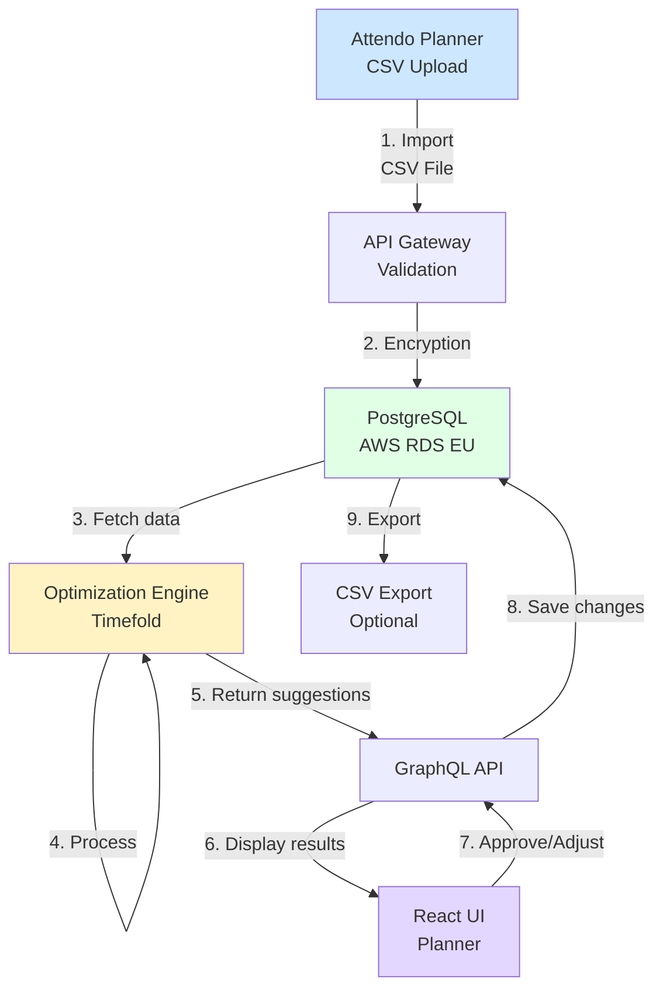

# Caire Platform - System Description

**Document:** Technical and Organizational Overview  
**Version:** 1.0  
**Date:** 2025-12-08  
**Purpose:** Basis for DPIA with Attendo

---

## 1. System Overview

Caire is an AI-driven platform for automated scheduling in home care. The platform optimizes staff schedules to maximize care time, minimize travel time, and ensure continuity for care recipients.

### Business Value

- **50%+** less manual planning work
- **75-80%** care time of working hours
- **Up to 20%** shorter travel time and distance
- **+1-2%** margin increase

### Production Status

**Caire** (documented here) is production-ready and will be used for the pilot and production rollout.

---

## 2. System Architecture (High-Level)

```
┌─────────────────────────────────────────────────────────────────┐
│                    Caire Platform                                │
├─────────────────────────────────────────────────────────────────┤
│                                                                   │
│  ┌─────────────────┐         ┌─────────────────┐                │
│  │  React UI       │         │  GraphQL API    │                │
│  │  (Vite/Next.js) │◄───────►│  (Express)      │                │
│  │                 │         │                 │                │
│  │  - Bryntum      │         │  - Apollo       │                │
│  │  - shadcn/ui    │         │  - Resolvers    │                │
│  └─────────────────┘         └────────┬────────┘                │
│                                        │                          │
│                              ┌─────────▼────────┐                │
│                              │  Prisma ORM      │                │
│                              │  - Type-safe     │                │
│                              │  - Migrations    │                │
│                              └─────────┬────────┘                │
│                                        │                          │
│                              ┌─────────▼────────┐                │
│                              │  PostgreSQL      │                │
│                              │  (AWS RDS)       │                │
│                              │  EU-Stockholm    │                │
│                              └──────────────────┘                │
│                                                                   │
│  External Integrations:                                          │
│  ├─ Timefold (AI optimization, temporary processing)             │
│  ├─ CSV Upload (Schedule data import)                           │
│  ├─ Clerk (Authentication, MFA, SSO)                            │
│  └─ AWS CloudWatch/Sentry (Monitoring, logging)                │
│                                                                   │
└─────────────────────────────────────────────────────────────────┘
```

---

## 3. Data Flow



### Data Flow Description

1. **Import (Data Collection)**
   - Staff logs in via Clerk (MFA/SSO)
   - Schedules are imported via **CSV file upload** through secure web interface
   - CSV files contain: employee data, visit data, schedule information
   - **NO external system integrations** - Attendo does not use Carefox/Phoniro
   - **NO PDF uploads** - avoids sensitive health data in pilot
   - Validation of data format and business rules

2. **Storage**
   - All data encrypted with TLS 1.3 during transport
   - Stored in AWS RDS PostgreSQL (Stockholm, EU)
   - AES-256 encryption at rest
   - Tenant-isolation via organization_id on all queries

3. **Processing**
   - GraphQL API fetches data via Prisma ORM
   - Sends to Timefold for optimization
   - **NO persistent storage at Timefold** - only temporary processing
   - Results returned and stored in AWS RDS

4. **Presentation**
   - Optimized schedules displayed in React UI
   - Planners review and adjust suggestions
   - Real-time updates via GraphQL subscriptions

5. **Export (Optional)**
   - Approved schedules can be exported as CSV
   - Encrypted transfer
   - Can be imported back into Attendo's systems

---

## 4. Technical Stack

### Frontend

| Component                 | Version | Purpose                      |
| ------------------------- | ------- | ---------------------------- |
| **React**                 | 19      | UI framework                 |
| **Vite/Next.js**          | 15      | Build tool and routing       |
| **Bryntum Scheduler Pro** | Latest  | Calendar view and scheduling |
| **shadcn/ui**             | Latest  | UI components                |
| **Tailwind CSS**          | 3.x     | Styling                      |
| **Apollo Client**         | 3.x     | GraphQL client               |

### Backend

| Component         | Version | Purpose                     |
| ----------------- | ------- | --------------------------- |
| **Node.js**       | 20 LTS  | Runtime                     |
| **Express**       | 4.x     | Web server                  |
| **Apollo Server** | 4.x     | GraphQL API                 |
| **Prisma**        | 5.x     | ORM and database migrations |
| **PostgreSQL**    | 15      | Primary database            |
| **Redis**         | 7.x     | Cache and sessions          |

### Infrastructure

| Component              | Location               | Purpose                            |
| ---------------------- | ---------------------- | ---------------------------------- |
| **AWS RDS PostgreSQL** | Stockholm (eu-north-1) | Database                           |
| **AWS EC2**            | Stockholm (eu-north-1) | App servers                        |
| **AWS S3**             | Stockholm (eu-north-1) | File storage (backups, exports)    |
| **AWS CloudWatch**     | Stockholm              | Logging and monitoring             |
| **Clerk**              | EU-region              | Authentication and user management |

### Security & DevOps

| Component          | Purpose                         |
| ------------------ | ------------------------------- |
| **Clerk v6**       | SSO, MFA, RBAC, JWT-tokens      |
| **GitHub Actions** | CI/CD pipeline                  |
| **PM2**            | Process manager with clustering |
| **Sentry**         | Error tracking and APM          |
| **SSL/TLS 1.3**    | Encryption in transit           |
| **AES-256**        | Encryption at rest              |

---

## 5. Security Measures (ISO 27001-inspired)

### 5.1 Encryption

**In transit (Transport):**

- TLS 1.3 for all HTTP communication
- HTTPS enforced (HSTS headers)
- Secure WebSocket connections (WSS) for real-time updates

**At rest (Storage):**

- AES-256 encryption on AWS RDS
- Encrypted EBS volumes on EC2 instances
- Encrypted S3 buckets for backups

### 5.2 Authentication & Authorization

**Clerk Authentication:**

```typescript
// JWT-token validation on every request
async function verifyClerkToken(req: Request): Promise<User | null> {
  const token = req.headers.authorization?.replace("Bearer ", "");
  const session = await clerkClient.verifyToken(token);

  return {
    id: session.sub,
    organizationId: session.org_id,
    role: session.org_role,
  };
}
```

**Role-Based Access Control (RBAC):**

| Role          | Permissions                                                |
| ------------- | ---------------------------------------------------------- |
| **Admin**     | Full access to organization, can manage users and settings |
| **Scheduler** | Can create/edit schedules, import data, run optimization   |
| **Viewer**    | Can only view schedules and reports                        |

**Tenant Isolation:**

```typescript
// Automatic tenant-filtering on all queries
const employees = await prisma.employees.findMany({
  where: {
    organization_id: user.organizationId, // Auto-injected
    deleted_at: null, // Soft-delete filter
  },
});
```

### 5.3 Access Logging

**Audit Trail:**

- All CRUD operations logged with user, timestamp, and action
- Retention: 90 days in production
- Stored in separate audit tables

```sql
-- audit_logs table
CREATE TABLE audit_logs (
  id UUID PRIMARY KEY,
  organization_id UUID NOT NULL,
  user_id UUID NOT NULL,
  action VARCHAR(50),      -- CREATE, READ, UPDATE, DELETE
  entity_type VARCHAR(50), -- schedules, employees, etc.
  entity_id UUID,
  changes JSONB,           -- Before/after data
  ip_address INET,
  created_at TIMESTAMP DEFAULT NOW()
);
```

### 5.4 Backup & Disaster Recovery

**Automated Backups:**

- Daily automated backups via AWS RDS
- Point-in-time recovery up to 7 days
- Cross-region backup replication (Stockholm → Frankfurt)

**Backup Retention:**

- Daily backups: 7 days
- Weekly backups: 4 weeks
- Monthly backups: 12 months

**Recovery Time Objective (RTO):** < 4 hours  
**Recovery Point Objective (RPO):** < 24 hours

### 5.5 Incident Management

**Process:**

1. **Detection:** Automatic alerts via CloudWatch/Sentry
2. **Triage:** On-call engineer assesses severity
3. **Response:** Remediate according to runbook
4. **Communication:** Update status page, notify customers
5. **Post-mortem:** Document incident and lessons learned

**SLA:**

- **Severity 1** (Data breach): < 15 min response, < 1h resolution
- **Severity 2** (Service down): < 30 min response, < 4h resolution
- **Severity 3** (Degraded): < 2h response, < 24h resolution

---

## 6. Data Model (Simplified)

### Core Entities

```
organizations (Customers - multi-tenant root)
├── organization_members (Users and roles)
├── employees (Staff to be scheduled)
├── schedules (Schedules for specific dates)
│   ├── schedule_employees (Link staff ↔ schedule)
│   ├── visits (Visits to be performed)
│   └── optimization_jobs (AI optimizations)
└── service_areas (Geographic areas)
```

### Important Data Protection Design

**Soft Deletes:**
No data is permanently deleted. Instead, rows are marked as `deleted_at`.

```typescript
// Soft deletion
await prisma.employees.update({
  where: { id: employeeId },
  data: { deleted_at: new Date() },
});

// All queries automatically filter
where: {
  deleted_at: null;
}
```

**Row-Level Security:**
All queries are automatically filtered on `organization_id` - no risk of data leakage between customers.

---

## 7. External Integrations & Sub-Processors

### 7.1 Clerk (Authentication)

**Provider:** Clerk Inc.  
**Service:** Identity & Access Management  
**Region:** EU (Frankfurt)  
**Role:** Sub-processor  
**Personal Data:** Email, name, password hash (hashed), session tokens  
**DPA:** ✅ Signed with Clerk

**Security:**

- SOC 2 Type II certified
- GDPR-compliant
- Multi-factor authentication (MFA)
- Single Sign-On (SSO) support

### 7.2 AWS (Infrastructure)

**Provider:** Amazon Web Services  
**Region:** Stockholm (eu-north-1)  
**Services:** RDS PostgreSQL, EC2, S3, CloudWatch  
**Role:** Sub-processor  
**DPA:** ✅ AWS GDPR Data Processing Addendum

**Security:**

- ISO 27001, SOC 2 certified
- EU Data Residency
- Encryption at rest and in transit

### 7.3 Timefold (AI Optimization)

**Provider:** Timefold (formerly OptaPlanner)  
**Service:** Constraint solver for schedule optimization  
**Region:** EU (can be self-hosted)  
**Role:** Sub-processor  
**Personal Data:** Anonymized schedule info (no names)  
**Storage:** ❌ **NO persistent storage** - only temporary processing

**Process:**

1. Caire sends anonymized dataset to Timefold
2. Timefold processes data in memory (< 5 min)
3. Returns optimized schedule
4. **Data deleted immediately** after processing

**Data Minimization:**

```typescript
// Only technical info sent to Timefold
{
  visits: [
    { id: "v123", duration: 60, location: {lat, lng}, skills: ["nursing"] }
    // NO customer or staff names
  ],
  employees: [
    { id: "e456", availability: [...], skills: ["nursing"] }
    // NO names, only ID and competencies
  ]
}
```

### 7.4 CSV Upload (Data Import)

**Source:** Attendo planners upload CSV files manually  
**Service:** Schedule data import  
**Role:** **Data Controller** (Attendo)  
**Integration:** CSV file upload via web interface  
**Direction:** Attendo → Caire

**CSV Format:**

- Employee data: name, email, phone, role, availability
- Visit data: customer name, address, visit times, duration
- Schedule data: dates, assignments

**Security:**

- Files uploaded via HTTPS (TLS 1.3)
- Validated before import
- No sensitive health data included (per pilot requirements)
- Files stored temporarily during import, then deleted

**Note:** Attendo does NOT use external systems like Carefox or Phoniro. All data is manually prepared and uploaded as CSV files.

---

## 8. Geographic Data Placement Map

```
┌─────────────────────────────────────────────────┐
│              EU/EES REGION                      │
│                                                 │
│  🇸🇪 Stockholm (Primary)                        │
│  ├─ AWS RDS PostgreSQL (eu-north-1)            │
│  ├─ AWS EC2 App Servers                        │
│  └─ AWS S3 Backups                             │
│                                                 │
│  🇩🇪 Frankfurt (Backup/Auth)                    │
│  ├─ Clerk Auth Service                         │
│  └─ AWS Cross-region Backup                    │
│                                                 │
│  ❌ NO data outside EU/EES                      │
│                                                 │
└─────────────────────────────────────────────────┘
```

---

## 9. Scalability & Performance

### Current Capacity (per organization)

- **Schedules:** 1000+ per month
- **Staff:** 500+ employees
- **Visits:** 50,000+ per month
- **Concurrent users:** 50+ planners

### Optimization Times

- **Daily schedule:** 30-60 seconds
- **Weekly schedule:** 2-5 minutes
- **Monthly schedule:** 10-15 minutes

### Monitoring & Alerts

- **Uptime:** 99.9% SLA
- **API Response Time:** < 200ms (p95)
- **Database Queries:** < 50ms (p95)

---

## 10. Summary for DPIA

### ✅ Strengths

- Modern, production-ready architecture with clear separation of concerns
- EU-hosting (AWS Stockholm) throughout the stack
- Robust security (MFA, RBAC, encryption, audit logs)
- Data minimization - no sensitive health data in pilot
- Tenant-isolation prevents data leakage between organizations
- Simple CSV import - no complex external integrations

### ⚠️ Note

- Sub-processors (Clerk, AWS, Timefold) - require DPA
- Real-time optimization involves temporary processing at Timefold
- Audit logs need retention policy (90 days recommended)
- CSV upload requires manual preparation by Attendo planners

### 📊 Risk Level

**LOW-MEDIUM** - With implemented security measures, the system is assessed as safe for production.

---

## Appendix: Comparison Pilot vs Production

---

**Conclusion:** The Caire platform is built with data security and GDPR compliance in focus from the ground up. The architecture enables secure multi-tenant operation with clear tenant-isolation, robust authentication, and full traceability via audit logs.
