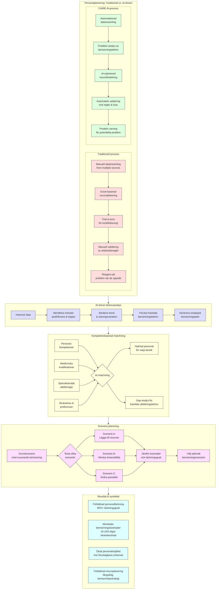
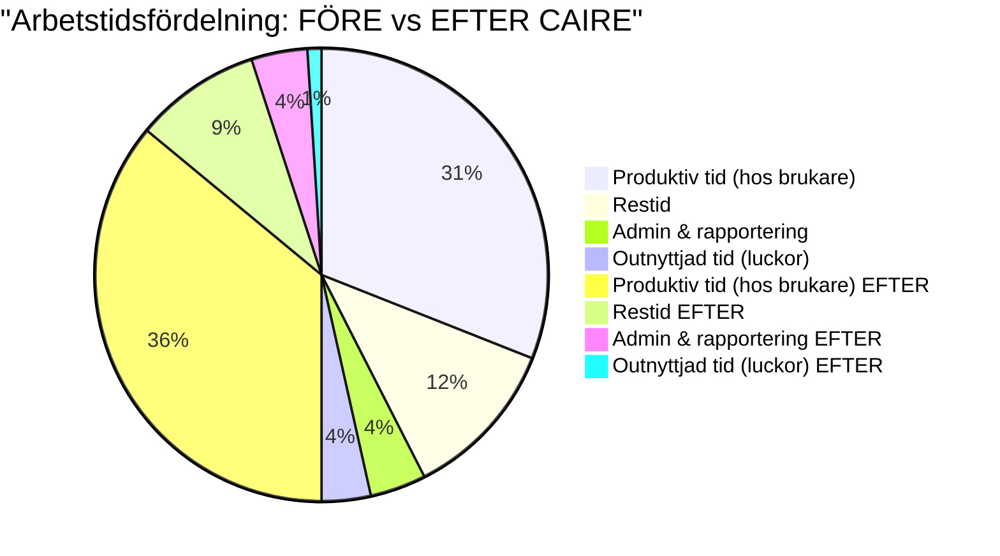

# 11 AI för personalplanering i hemtjänst {#ai-personalplanering-hemtjanst}

## AI för personalplanering i hemtjänst

**Syfte:** Visa hur CAIREs AI hjälper till med bemannings- och personalplanering, utöver dagligt schema – t.ex. att rätt person är på rätt plats vid rätt tid och att personalresurser utnyttjas optimalt.

**Målgrupp:** Verksamhetschefer, HR-ansvariga inom hemtjänst och planeringssamordnare som fokuserar på bemanning och personalresurser.

**Primära nyckelord:** personalplanering hemtjänst, AI bemanningsplanering.

**Sekundära nyckelord:** optimera bemanning hemtjänst, personalplaneringssystem, schemaoptimering personal.

**Sökintention:** Informativ/kommersiell (användaren vill veta hur AI kan förbättra personalplanering och ev. överväger ett verktyg).

**Beskrivning:** Förklarar utmaningar i personalplanering (t.ex. vakanser, övertid, kompetensmatchning) och hur AI löser dem. Innehåller exempel på att AI kan förutse bemanningsbehov, balansera arbetspass och ta hänsyn till personalens önskemål. Den lyfter fördelar som högre personaltäckning, ökad personalnöjdhet och minskade övertidskostnader. Avslutas med en CTA för att effektivisera bemanningen med CAIRE.

**Meta Title:** AI för personalplanering i hemtjänst – Bättre bemanning och schema | CAIRE

**Meta Description:** Upptäck hur AI kan förbättra personalplaneringen i hemtjänsten. CAIREs AI hjälper till med smart bemanning, färre vakanser och optimala scheman – för nöjdare personal och brukare. Läs hur AI stöder planeringsansvariga och chefer inom omsorgen.

Personalplanering är hjärtat i en välfungerande hemtjänst. Det handlar om att ha rätt antal medarbetare med rätt kompetens på plats, samtidigt som man tar hänsyn till personalens välmående och brukarnas behov. Genom att använda AI i personalplaneringen kan hemtjänstverksamheter ta ett stort kliv framåt: från reaktiv brandkårsutryckning till proaktiv och datadriven bemanningsstrategi.

## 11.1 Varför traditionell personalplanering brister {#brister-personalplanering}

Att planera personal manuellt eller i enklare system kan fungera – tills det inte gör det. Här är några vanliga brister utan AI-stöd:

- **Silo-tänk och begränsad data:** Ofta planerar man utifrån statiska scheman och erfarenhet. Det är svårt att förutse arbetstoppar eller framtida bemanningsbehov, vilket leder till antingen överbemanning (onödiga kostnader) eller underbemanning (stress, missnöjda brukare).

- **Reaktiv hantering:** Mycket tid går åt till att lösa akuta problem, som att hitta ersättare vid sjukdom samma morgon. Med begränsade verktyg blir personalplaneringen mer brandsläckning än strategisk planering.

- **Svårt att tillgodose personalens önskemål:** Manuellt är det en utmaning att balansera allas semesterönskemål, arbetstidspreferenser och samtidigt uppfylla verksamhetens krav. Det kan resultera i missnöje och högre personalomsättning om medarbetarna upplever att planeringen är orättvis.

## 11.2 Hur AI lyfter personalplaneringen {#hur-ai-lyfter}

En AI-driven lösning som CAIRE agerar som en smart assistent åt HR och planeringsansvariga:

- **Prognoser och behovsanalys:** AI kan analysera historiska data (t.ex. antal besök per dag, sjukfrånvaro-trender, säsongsvariationer) för att förutse bemanningsbehov framåt. Ni får tidiga varningar om kommande perioder där extra resurser kan behövas, eller tvärtom när schemat kan slimmras.

- **Automatisk bemanningsoptimering:** Med utgångspunkt i era befintliga scheman och inställningar föreslår AI:n den bästa fördelningen av personal. Den kan simulera olika scenarier – "Vad händer om vi lägger till en halvtidstjänst här?" eller "Hur täcker vi upp 10% ökad efterfrågan i augusti?" – på några ögonblick.

- **Matcherar kompetens och krav:** Systemet vet vilken personal som har vilka kompetenser och certifieringar, och kan säkerställa att alla pass är täckta av behörig personal. Om en viss typ av insats kräver en specifik utbildning, flaggar AI:n så att rätt person planeras in, vilket höjer kvaliteten och säkerheten i omsorgen.

- **Tar hänsyn till preferenser och rättvisa:** CAIRE kan inkludera personalens egna preferenser (t.ex. önskade arbetstider eller geografiska områden) i beräkningen. Samtidigt övervakar AI:n att ingen medarbetare blir överbelastad eller ständigt får de minst attraktiva tiderna – vilket skapar en mer rättvis fördelning av arbetspass.

## AI Personalplanering – Processen Visualiserad {#ai-personalplanering-visualiserad}

## 11.3 Effekter: Bättre bemanning, nöjdare team {#effekter-bemanning}

När AI används för personalplanering märks resultaten på flera plan:

- **Färre vakanser och övertid:** Genom att förutse behov och optimera scheman i förväg minskar paniklösningar. Ni står mer sällan utan personal en morgon, och personalen slipper lika ofta bli inkallade på övertid. Det betyder lägre kostnader och mindre slitage på personalstyrkan.

- **Högre personalnöjdhet:** När medarbetarna upplever att schemat tar hänsyn till deras liv (t.ex. lediga önskehelger, jämn fördelning av kvällspass) ökar trivseln. AI hjälper till att uppfylla så många preferenser som möjligt inom ramen för verksamhetens krav – en nästan omöjlig uppgift att göra manuellt rättvist.

- **Ökad kontinuitet för brukare:** Smart personalplanering ser till att samma vårdgivare i högre grad kan följa en brukare över tid. Det sker genom att AI:n väger in kontinuitet som en faktor när det är möjligt, vilket ger bättre kontinuerlig omsorg och nöjdare kunder.

- **Tidsvinst för chefer och HR:** Istället för att gräva i detaljerade scheman kan verksamhetschefer och HR fokusera på övergripande strategier. AI genererar förslag, och ni kan lägga tid på kvalitetsarbete och coachning av personal istället för admin.

## Jämförelse: Traditionell vs. AI-driven personalplanering {#jamforelse-traditionell-ai}

```mermaid
gantt
    title Personalplaneringens tidslinje över en månad
    dateFormat  DD
    axisFormat Dag %d

    section Traditionell Planering
    Datainsamling & grundschema      :a1, 01, 5d
    Hantera personalönskemål         :a2, after a1, 4d
    Manuell schemaläggning           :a3, after a2, 7d
    Justera för konflikter           :a4, after a3, 3d
    Publicera schema                 :milestone, m1, after a4, 0d
    Daglig krishantering             :a5, after a4, 10d

    section CAIRE AI-Planering
    Automatisk dataimport            :b1, 01, 1d
    AI-baserad prognos               :b2, after b1, 1d
    Schemaoptimeringar               :b3, after b2, 2d
    Scenarioplanering                :b4, after b3, 1d
    Publicera schema                 :milestone, m2, after b4, 0d
    Proaktiv bemanningsjustering     :b5, after b4, 3d
    Strategisk planeringstid         :b6, after b5, 7d
```

## 11.4 Från kaos till kontroll – ett exempel {#exempel-personalplanering}

**Före:** Hos Äldra Omsorg AB satt planeringsansvarig varje månadsslut med ett virrvarr av post-it-lappar och Excelark för att rodda nästa månads schema. Trots timmar av arbete blev resultatet att någon alltid blev missnöjd: antingen blev det hål i täckningen eller så kände personalen att deras önskemål ignorerades.

**Efter:** Med CAIREs AI kopplat till deras system fick de automatiska förslag på månadsplaneringen. AI:n identifierade t.ex. att v.32 behövdes extra resurser p.g.a. många planerade semestrar – långt i förväg. Lösningen blev att omfördela timmar och erbjuda deltidare extra pass den veckan. Personalens semestrar optimerades också så att önskemål kunde tillgodoses i 90% av fallen. Resultatet? Schemat gick ut i god tid, alla pass var täckta, och både personal och ledning kände större lugn.

## Personalresursanalys med CAIRE – Visualisering {#resursanalys-visualisering}

Att införa AI i personalplaneringen är inte att ta bort den mänskliga faktorn – det är att ge er bästa möjliga underlag för beslut. Ni har fortfarande kontrollen, men slipper gissa och hoppas; istället planerar ni med fakta och smarta algoritmer i ryggen.

**CTA:** Vill ni också gå från reaktiv till proaktiv personalplanering? Kontakta oss för att se hur CAIREs AI kan anpassas till er hemtjänsts bemanningsbehov. Låt oss hjälpa er skapa ett hållbart och flexibelt schema för både personal och brukare.

**Intern länkning:**

- [AI-schemaläggning med Carefox](SEO-content-pages/features/ai-schemalaggning-carefox.md) – läs hur den dagliga schemaplaneringen optimeras med AI i praktiken.
- [Effektiv personalplanering – guide för hemtjänst](#) – fördjupa dig i fler tips och metoder att kombinera med AI-verktyget.
