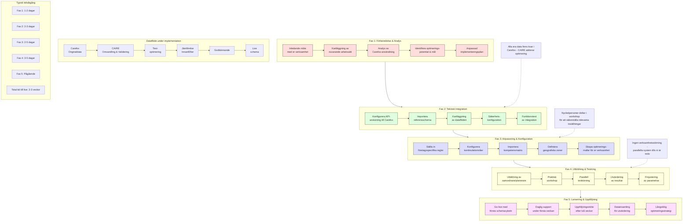
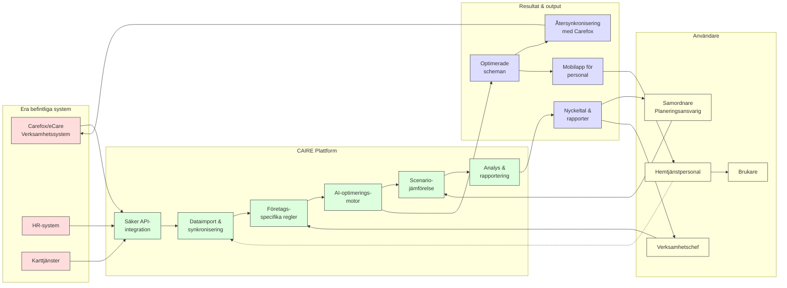

# 14 Snabb onboarding av CAIRE – AI-integration med Carefox {#onboarding-caire-carefox}

## Onboarding och implementering

**Syfte:** Övertyga besökare att det är enkelt att komma igång med CAIRE. Beskriver stödet vid implementering och utbildning för att integrera AI-verktyget i verksamheten.

**Målgrupp:** Företagsledare och chefer som överväger CAIRE men är oroliga för förändringsprocessen, IT-ansvariga som vill veta hur integration sker.

**Primära nyckelord:** implementera AI hemtjänst, onboarding CAIRE hemtjänst.

**Sekundära nyckelord:** utbildning hemtjänst IT-system, införa nytt planeringssystem, förändringsledning hemtjänst.

**Sökintention:** Kommersiell (användaren utvärderar lösningen och vill veta att införandet är tryggt).

**Beskrivning:** Redogör för hur CAIRE-teamet stödjer nya kunder: från integration med befintliga system (t.ex. Carefox) till personalutbildning och support. Innehåller en steg-för-steg-plan för onboarding, exempel på hur snabbt man kan se resultat efter implementering, samt kundcitat om en smidig övergång. CTA att boka en genomgång/demon för att påbörja processen.

**Meta Title:** "Snabb onboarding av CAIRE – AI-integration med Carefox"

**Meta Description:** "Implementera enkelt CAIRE som AI-komplement till Carefox för optimerad hemtjänst schemaläggning. Snabb onboarding utan att ersätta era system – kom igång inom veckor med dedikerat stöd."

## 14.1 Introduktion {#introduktion}

Att införa AI i hemtjänstens schemaläggning behöver inte vara komplicerat. CAIRE är utformat för att enkelt integreras hos privata hemtjänstföretag utan att störa den dagliga verksamheten. Använder ni Carefox för planering idag? Ingen fara – CAIRE fungerar som ett AI-komplement snarare än ett ersättande system. Det kopplas ihop med era befintliga verktyg via en smidig API-integration och optimerar ert schema i bakgrunden. Resultatet blir att ni kan dra nytta av AI-schemaläggning för att optimera hemtjänstens schemaläggning och frigöra mer tid åt omsorg, samtidigt som ni behåller era invanda arbetssätt.

## 14.2 Integration med Carefox {#integration-carefox}

CAIRE erbjuder en sömlös Carefox AI-integration som gör att ni slipper byta system. Via moderna API:er synkroniseras all relevant data (personal, brukare, besökstider m.m.) mellan Carefox och CAIRE i realtid. Det innebär att AI-motorn i CAIRE kan analysera ert aktuella planeringsläge och generera optimerade schemaläggningsförslag direkt i Carefox. Ni fortsätter arbeta i Carefox-gränssnittet precis som vanligt – men nu med intelligent automatisering i ryggen. Schemaläggning i hemtjänsten blir enklare när CAIRE tar hänsyn till alla relevanta parametrar (t.ex. kompetens, tillgänglighet, restid) för att skapa det mest effektiva schemat. Kort sagt fungerar CAIRE som ett smart lager ovanpå Carefox som hjälper er att optimera hemtjänstens schema utan dubbelarbete eller onödiga manuella justeringar.

## 14.3 Optimeringsmallar och scenarier {#optimeringsmallar-scenarier}

Med CAIRE får ni tillgång till färdiga optimeringsmallar som låter er komma igång snabbt. Dessa mallar är förinställda för vanliga mål inom hemtjänstplanering – till exempel att minimera restid, öka kontinuitet (så att samma personal möter samma brukare oftare) eller förbättra personalens arbetsmiljö genom jämnare fördelning av arbetspass. Ni kan välja en mall som passar ert fokus, samtidigt som CAIRE tar hänsyn till era unika verksamhetsregler.

Ert team kan dessutom utföra scenarioanalyser för att testa "tänk om"-situationer innan ni gör skarpa förändringar. CAIRE kan simulera effekten av olika förändringar – till exempel hur två nyanställningar eller 20% färre timanställda påverkar nyckeltal som total arbetstid, restid och kontinuitet. På så vis får ni beslutsunderlag baserade på fakta i stället för magkänsla.

## 14.4 Onboardingsteg {#onboardingsteg}

### Onboardingprocessen Visualiserad {#onboarding-visualiserad}

Att komma igång med CAIRE är enkelt och smidigt. Plattformen är molnbaserad, vilket innebär att ni slipper installation och snabbt kan börja fokusera på schemat:

- **Import av befintliga scheman:** CAIRE kan integreras med era nuvarande verksamhetssystem, till exempel **Carefox** eller liknande planeringsverktyg. Med ett par klick kan ni importera era existerande scheman, inklusive all data om brukare, personal, tider och besök. Om direktintegration inte är möjlig stödjer CAIRE även import via fil (t.ex. CSV-exporter från Carefox).

- **Snabb igångsättning:** Under onboarding-guiden får ni ställa in relevanta parametrar – såsom geografiska områden, arbetstidsregler, kompetenser och önskemål om kontinuitet. CAIREs gränssnitt vägleder er steg för steg. Inom kort har ni ert första **baseline-schema** uppladdat och redo.

- **Single source of truth:** Genom integrationen med ert befintliga system fungerar CAIRE som en förlängning av det system ni redan använder. Ert originalschema i t.ex. Carefox förblir den officiella planen **tills ni väljer att uppdatera det** med en optimerad version. Det innebär att ni kan utvärdera CAIREs förslag i lugn och ro – inget ändras i era operativa system förrän ni själva trycker på "publicera" eller exporterar det optimerade schemat tillbaka. Denna **sömlösa övergång** från manuellt schema till AI-schema gör att ni kan prova, jämföra och successivt införa förbättringarna utan risk eller avbrott i verksamheten.

- **Datasäkerhet och sekretess:** Varje organisations data hålls avskild i CAIRE. Ni äger er information – CAIRE behandlar den bara för er räkning. Alla inloggningar och behörigheter hanteras säkert (t.ex. via ert befintliga autentiseringssystem om så önskas). Onboardingprocessen ser även till att endast behöriga hos er får tillgång till planeringsverktyget.

## 14.5 Support och resultat {#support-resultat}

### Systemarkitektur & Dataflöde {#systemarkitektur}

Efter driftsättning får ni fortsatt tillgång till vårt supportteam som svarar på frågor, hjälper till med finjusteringar och ser till att ni får ut maximal nytta av CAIRE. Varje kund har en utsedd kontaktperson som känner er verksamhet – behöver ni hjälp eller har frågor finns den bara ett telefonsamtal eller mejl bort.

Våra kunder ser tydliga resultat. Schemaläggningen effektiviseras markant – till exempel kan restiden för personal minska med upp till 25%, vilket frigör mer tid till omsorg. Kontinuiteten för brukarna ökar och personalens arbetsmiljö förbättras tack vare jämnare, mer rättvisa scheman. Vi hjälper er att följa upp viktiga nyckeltal före och efter införandet, så att ni tydligt kan se förbättringarna. Med CAIRE får ni inte bara ett kraftfullt verktyg, utan även en partner som stöttar er mot en effektivare och mer datadriven planering.

## 14.6 Kom igång – Boka en demo {#cta}

Är ni nyfikna på hur CAIRE kan förbättra er planering? Boka en demo med oss idag så går vi tillsammans igenom hur lösningen fungerar med just er verksamhet och ert planeringssystem. Ta första steget mot en smartare schemaläggning och upptäck skillnaden AI kan göra i hemtjänsten!
