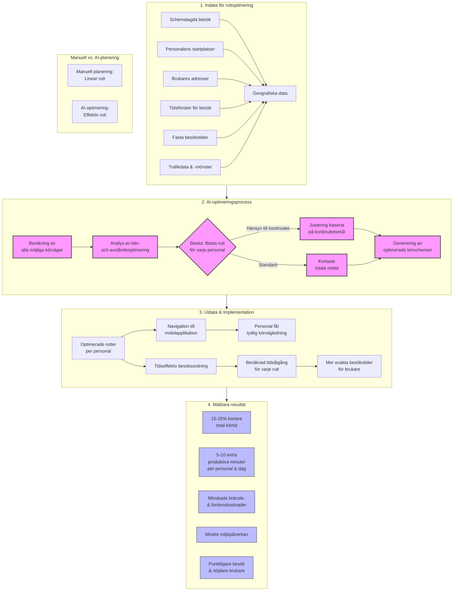

# 13 Ruttoptimering i hemtjänsten med AI {#ruttoptimering-hemtjanst}

## Ruttoptimering i hemtjänsten med AI

**Syfte:** Belysa fördelen med AI-baserad ruttplanering som en del av CAIREs erbjudande, dvs. hur man minskar restider och ökar effektiviteten i hemtjänsten.

**Målgrupp:** Verksamhetschefer och planerare som vill minska onödig restid och kostnader i hemtjänstens dagliga arbete.

**Primära nyckelord:** ruttoptimering hemtjänst, optimera hemtjänstrutter AI.

**Sekundära nyckelord:** minska restid hemtjänst, effektiv ruttplanering, körrutter hemtjänst.

**Sökintention:** Informativ/kommersiell (besökare söker information om ruttoptimering och en lösning att implementera).

**Beskrivning:** Fokus på problemet med långa restider i hemtjänsten och hur AI-lösningen beräknar optimala rutter. Sidan beskriver hur CAIRE automatiskt planerar körordningar för personal, minskar körtid med upp till ~20% och ger mer tid åt brukarna. Innehåller förklarande grafik över en optimerad rutt, fördelar för personal (mindre stress, lägre bränslekostnader) samt en uppmaning att kontakta för att införa ruttoptimering.

**Meta Title:** Ruttoptimering i hemtjänsten med AI – Minska restiden & öka tiden hos brukare | CAIRE

**Meta Description:** Slöseriet med restid i hemtjänsten är över. Med AI-driven ruttoptimering planerar CAIRE smarta körscheman som minskar körtid och kostnader. Upptäck hur AI kan ge personalen mer tid för omsorg och mindre tid i bilen.

I hemtjänsten kan en betydande del av arbetsdagen gå åt till att förflytta sig mellan brukare. Ruttoptimering med AI är nyckeln till att bryta den trenden. Genom att automatiskt planera smartare körvägar och besöksordningar ser CAIREs AI till att er personal spenderar mer tid hos brukarna och mindre tid på vägarna. Resultatet? Lägre kostnader, mindre stress och gladare personal – samt mer omsorgstid som kommer de äldre till godo.

## 13.1 Restid – en dold tidstjuv {#restid-problem}

Tänk er en vanlig dag: en undersköterska ska utföra 10 hembesök. Om ruttplaneringen är suboptimal kanske hen lägger totalt 3 timmar i bilen, varav en stor del består av onödiga omvägar eller backtracking över samma område flera gånger. Många hemtjänstverksamheter har vant sig vid att "det blir en del åkande", men den totala effekten är slående: varje extra minut i bil multipliceras med antalet medarbetare och dagar – vilket blir dyrbara timmar av potentiell omsorg som går förlorade varje vecka.

Problemen med traditionell (manuell) ruttplanering inkluderar:

- **Begränsad överblick:** Svårt att manuellt se den optimala turordningen för besök när många parametrar spelar in (geografi, trafik, tidsfönster för besök).

- **Statiska områdesindelningar:** Ofta delar man in personal efter områden, vilket är bra, men utan finjustering kan två personal köra parallellt i samma kvarter ovetandes.

- **Missad trafikinfo:** Människor kan inte räkna in levande trafikdata eller predictive trafikmönster för olika tider på dagen. En rutt som ser kort ut på morgonen kan vara olämplig vid rusningstrafik.

## 13.2 Så fungerar AI-baserad ruttoptimering {#hur-fungerar-ruttoptimering}

CAIREs AI använder avancerade algoritmer (samma teknik som används för transportplanering i logistik) för att optimera hemtjänstrutter:

- **Datainsamling:** Systemet hämtar all relevant data – adresser för dagens besök, vilken personal som jobbar, start- och sluttid för deras pass, samt eventuella fasta tider vissa besök måste ske (t.ex. medicindos klockan 8).

- **Beräknar bästa rutter:** AI:n testar tusentals kombinationer av besöksordningar på några ögonblick. Den tar hänsyn till kartdata och kan väga in trafikmönster. Målet är att minimera total körtid per personal samtidigt som alla besök sker inom sina givna tidsfönster.

- **Optimerar för flera mål:** Förutom kortaste vägen beaktar AI även andra mål – t.ex. om en brukare helst ska ha samma personal som dagen innan (kontinuitet) eller att man undviker att en anställd får en orimligt lång körsträcka jämfört med andra (rättvisa/balans).

- **Presenterar ruttförslag:** På ett par minuter levererar systemet ett optimerat schema där besöken för varje medarbetare ligger i smartaste ordning. T.ex. kan den föreslå att Anna tar alla besök i Norrby området innan lunch medan Kalle täcker Sörby, för att sedan byta till närliggande områden på eftermiddagen när trafiken lättat.

Om något ändras under dagen – säg att ett extra besök tillkommer – kan systemet reoptimera berörda personers rutter och ge förslag på uppdaterade körordningar i realtid.

## 13.3 Vinsterna med optimerade rutter {#vinster-rutter}

Effekterna av AI-driven ruttoptimering märks direkt i verksamheten:

- **Kortare körtid:** Många användare ser en minskning av total restid med 15–25%. Det betyder att om er personal tidigare körde 100 mil i veckan totalt, kanske det sjunker till 75–85 mil – en enorm besparing i tid.

- **Lägre kostnader och miljöpåverkan:** Mindre körning ger direkt utslag i bränslekostnader (och slitage på fordon). Dessutom minskar koldioxidutsläppen – bra för miljön och något som allt fler kommuner och uppdragsgivare värdesätter.

- **Mer tid för omsorg:** Den kanske viktigaste vinsten – tiden som frigörs kan läggas på brukarna. Färre minuter i bilen innebär att personalen kan spendera några extra minuter hos varje brukare eller hinna med fler besök med bibehållen kvalitet.

- **Minskad stress:** Att köra mot klockan är påfrestande. Med smart planerade rutter minskar risken att personalen behöver stressa mellan besök. De får mer luft i schemat och trygghet i att en optimerad rutt håller tidsplanen bättre.

- **Enklare introduktion av ny personal:** Optimerade rutter kan underlätta för vikarier eller nyanställda – rutten är tydligt definierad och logisk, så även den som inte är jättebekant med området kan följa en strukturerad plan (särskilt om ruttförslagen kombineras med kartstöd i mobilen).

## AI-driven Ruttoptimering – En visuell förklaring {#visuell-ruttoptimering}

## 13.4 Implementering: från teori till praktik {#implementering-ruttoptimering}

Att införa AI-ruttoptimering i hemtjänsten är enklare än det låter. Om ni använder ett digitalt system idag (som Carefox eller liknande) kan CAIRE integreras för att börja optimera scheman i bakgrunden. Planeringsansvariga behåller kontrollen – de kan granska AI:ns förslag och justera om något mänskligt avvägande behövs. Ofta lär man sig lita på systemet när man ser hur väl det stämmer med verkligheten.

För personalen ute på fältet förändras egentligen bara en sak: deras schema blir smidigare. De märker att körsträckorna krymper och att arbetsdagen flyter på bättre. En viktig del av implementeringen är att kommunicera syftet: betona för teamet att detta inte är för att "övervaka" dem utan för att underlätta deras arbete (mindre stress, mer tid hos varje brukare).

Många bäckar små: Kanske sparar en optimerad rutt bara 5 minuter på ett pass jämfört med en icke-optimal plan. Men multiplicera det med 20 pass om dagen – det är 100 minuter, över 1,5 timme, av ökad omsorgstid dagligen! På en månad blir det över 30 extra timmar att lägga på era brukare eller att avlasta personalen.

## Före och Efter: Hemtjänstrutt Visualisering {#fore-efter-visualisering}

```mermaid
graph TB
    %% Före AI-optimering
    subgraph FÖRE["Före CAIRE: Ineffektiv rutt"]
        A1((Start)) --> A2((Brukare A))
        A2 --> A3((Brukare B))
        A3 --> A7((Brukare G))
        A7 --> A4((Brukare D))
        A4 --> A5((Brukare E))
        A5 --> A6((Brukare C))
        A6 --> A8((Brukare F))
        A8 --> A9((Slut))

        %% Restider
        A1 -. "15 min" .-> A2
        A2 -. "25 min" .-> A3
        A3 -. "30 min" .-> A7
        A7 -. "20 min" .-> A4
        A4 -. "10 min" .-> A5
        A5 -. "25 min" .-> A6
        A6 -. "15 min" .-> A8
        A8 -. "20 min" .-> A9
    end

    %% Efter AI-optimering
    subgraph EFTER["Efter CAIRE: Optimerad rutt"]
        B1((Start)) --> B2((Brukare A))
        B2 --> B6((Brukare C))
        B6 --> B3((Brukare B))
        B3 --> B4((Brukare D))
        B4 --> B5((Brukare E))
        B5 --> B8((Brukare F))
        B8 --> B7((Brukare G))
        B7 --> B9((Slut))

        %% Restider
        B1 -. "15 min" .-> B2
        B2 -. "10 min" .-> B6
        B6 -. "5 min" .-> B3
        B3 -. "15 min" .-> B4
        B4 -. "10 min" .-> B5
        B5 -. "5 min" .-> B8
        B8 -. "20 min" .-> B7
        B7 -. "10 min" .-> B9
    end

    %% Totaler
    T1["FÖRE: Total restid 160 minuter"] -->|Optimering| T2["EFTER: Total restid 90 minuter"]
    T3["Tidsvinst: 70 minuter = 44% effektivare"]

    %% Styling
    classDef föreNode fill:#ffdddd,stroke:#ff0000,stroke-width:2px;
    classDef efterNode fill:#ddffdd,stroke:#00cc00,stroke-width:2px;
    classDef resultNode fill:#ddddff,stroke:#0000ff,stroke-width:2px;

    class A1,A2,A3,A4,A5,A6,A7,A8,A9 föreNode;
    class B1,B2,B3,B4,B5,B6,B7,B8,B9 efterNode;
    class T1,T2,T3 resultNode;
```

**CTA:** Är ni redo att ta kontroll över körtiderna? Kontakta oss för att höra mer om hur CAIREs ruttoptimering kopplas till ert planeringssystem. Vi visar konkret hur många timmar ni kan spara i er hemtjänst med AI – och hur de timmarna kan användas bättre.

**Intern länkning:**

- [AI-schemaläggning med Carefox](SEO-content-pages/features/ai-schemalaggning-carefox.md) – se helhetsbilden av hur ruttoptimering ingår i ett smart schema.
- [Excel vs AI: Schemaläggning](#) – förstå varför manuellt ruttplaneringsarbete inte kan matcha AI:ns effektivitet.
- [För planeringsansvarig](#) – läs hur dessa verktyg underlättar din roll som ansvarig för att planera både scheman och rutter.
