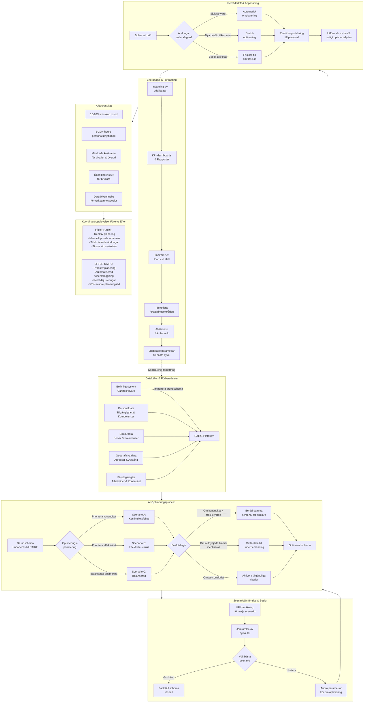

# CAIRE – AI-baserad optimering av schemaläggning inom hemtjänsten

**CAIRE** är en plattform som använder artificiell intelligens för att göra schemaläggningen inom hemtjänst **smartare, snabbare och mer effektiv**. Med CAIRE kan hemtjänstorganisationer automatisera sitt planeringsarbete – från onboarding och import av existerande scheman, till AI-driven optimering i realtid och djupgående analys av resultat. Plattformen är utformad för verksamhetschefer, samordnare och marknadsteam som vill förstå och kommunicera nyttan med nästa generations planeringsverktyg. Inga kodkunskaper krävs; fokus ligger på användarvänlighet, affärsvärde och hur CAIRE samarbetar sömlöst med era befintliga system (såsom **Carefox**) för att leverera **bättre scheman** med mindre ansträngning.

**Scenario:** Anna arbetar som planeringssamordnare på en hemtjänstorganisation. Varje vecka spenderar hon oräkneliga timmar med att manuellt pussla ihop scheman för tiotals undersköterskor och brukare. Hon jonglerar _önskemål om kontinuitet_ (brukare som vill ha samma personal), _begränsade resurser_, _långa avstånd_ och plötsliga förändringar som sjukfrånvaro. Resultatet blir ofta stress, övertid och suboptimala turer. **Med CAIRE** får Anna en hjälpande hand – plattformen genererar automatiskt ett optimalt schemaförslag som uppfyller alla krav, minskar resvägarna och balanserar personalens arbetsbörda. Anna kan på några minuter uppnå det som tidigare tog en hel dag, med färre misstag och mindre stress.

## Utmaningen i hemtjänstplanering

Att schemalägga hemtjänst är komplext. **Typiska utmaningar** inkluderar:

- **Många rörliga delar:** Varje dag ska ett stort antal hembesök fördelas mellan många anställda. Varje brukare har specifika tider för sina besök, och varje anställd har begränsade arbetstider och kompetenser.
- **Geografi och restid:** Personal ska ta sig mellan brukare – ineffektiva rutter leder till onödig restid, vilket minskar tiden som kan läggas på omsorg. Samordnaren måste försöka optimera rutter manuellt, en nästintill omöjlig uppgift i större skala.
- **Kontinuitetskrav:** Kvaliteten i omsorgen ökar om samma brukare får träffa samma vårdgivare så ofta som möjligt. Att hålla reda på sådana preferenser och ändå få ihop schemat är en stor utmaning.
- **Oväntade förändringar:** Sjukfrånvaro, akuta insatser eller ändrade besökstider kan komma med kort varsel. En enda ändring kan kräva omplanering av flera personers schema, ofta med _mycket kort varsel_.
- **Begränsad tid och höga kostnader:** Samordnare arbetar under tidspress. Felaktiga scheman kan leda till övertidstimmar, outnyttjade (betalda men oanvända) arbetstimmar eller behov att anlita dyr extrapersonal. Allt detta påverkar verksamhetens marginal negativt.

Utan hjälpmedel blir planeringen lätt ett **pussel med höga insatser**, där mänskliga planerare gör så gott de kan men begränsas av tid och överblick. Konsekvensen kan bli stressade medarbetare, ökade kostnader och mindre nöjda brukare.

## Lösningen: AI-optimerad planering med CAIRE

**CAIRE-plattformen** är utformad för att hantera just dessa utmaningar. Genom AI och smart programvara kan CAIRE:

- **Automatisera schemaläggningen:** Istället för att manuellt lägga pusslet importerar ni ert **originalschema** (ert befintliga planeringsunderlag) till CAIRE. Därifrån tar AI över grovjobbet och genererar ett optimerat schemaförslag åt er.
- **Optimera effektivitet och spara tid:** CAIRE's AI-motor tar hänsyn till alla restriktioner och mål samtidigt – den minimerar restider genom **inbyggd ruttoptimering**, undviker schemakrockar och fyller ut luckor. Resultatet är ett schema där mer av varje arbetstimme används produktivt och mindre tid går förlorad i bilen.
- **Minska kostnader:** Genom smartare planering reduceras övertid och behovet av vikarier. Bränslekostnader sjunker när onödiga reskilometer försvinner ur schemat. Samtidigt frigörs samordnarnas tid från administrativt rutinarbete till mer värdeskapande uppgifter.
- **Förbättra omsorgskvaliteten:** CAIRE prioriterar **kontinuitet i omsorgen** – systemet matchar så långt det är möjligt varje brukare med deras _förturspersonal_ eller favoritundersköterska. Det tar också hänsyn till kompetenser och preferenser, så att rätt person kommer till rätt brukare vid rätt tid. Detta ökar tryggheten och nöjdheten hos brukarna.
- **Ge datadrivna insikter:** Varje schema, både original och optimerat, kommer med detaljerade **nyckeltal (KPI:er)**. CAIRE kalkylerar t.ex. total restid, antal besök per anställd, personaltäckning (utnyttjandegrad), uppskattade personalkostnader, med mera. Detta ger beslutsfattare en tydlig bild av hur ändringar i schemat påverkar verksamheten och möjliggör **scenario-jämförelser** för att fatta underbyggda beslut.

Kort sagt, CAIRE fungerar som en **intelligent medplanerare** som alltid föreslår det bästa upplägget. Mänskliga samordnare behåller kontrollen – men de får ett kraftfullt verktyg som lyfter bort rutinarbetet och säkerställer att alla beslut baseras på helhetsbild och data.

## Enkel onboarding och integration med era system

Att komma igång med CAIRE är enkelt och smidigt. Plattformen är molnbaserad, vilket innebär att ni slipper installation och snabbt kan börja fokusera på schemat:

- **Import av befintliga scheman:** CAIRE kan integreras med era nuvarande verksamhetssystem, till exempel **Carefox** eller liknande planeringsverktyg. Med ett par klick kan ni importera era existerande scheman, inklusive all data om brukare, personal, tider och besök. Om direktintegration inte är möjlig stödjer CAIRE även import via fil (t.ex. CSV-exporter från Carefox).
- **Snabb igångsättning:** Under onboarding-guiden får ni ställa in relevanta parametrar – såsom geografiska områden, arbetstidsregler, kompetenser och önskemål om kontinuitet. CAIREs gränssnitt vägleder er steg för steg. Inom kort har ni ert första **baseline-schema** uppladdat och redo.
- **Single source of truth:** Genom integrationen med ert befintliga system fungerar CAIRE som en förlängning av det system ni redan använder. Ert originalschema i t.ex. Carefox förblir den officiella planen **tills ni väljer att uppdatera det** med en optimerad version. Det innebär att ni kan utvärdera CAIREs förslag i lugn och ro – inget ändras i era operativa system förrän ni själva trycker på "publicera" eller exporterar det optimerade schemat tillbaka. Denna **sömlösa övergång** från manuellt schema till AI-schema gör att ni kan prova, jämföra och successivt införa förbättringarna utan risk eller avbrott i verksamheten.
- **Datasäkerhet och sekretess:** Varje organisations data hålls avskild i CAIRE. Ni äger er information – CAIRE behandlar den bara för er räkning. Alla inloggningar och behörigheter hanteras säkert (t.ex. via ert befintliga autentiseringssystem om så önskas). Onboardingprocessen ser även till att endast behöriga hos er får tillgång till planeringsverktyget.

**Snabbfakta:** CAIRE integreras redan idag med Carefox/eCare – ni kan exempelvis importera er **veckoplanering för hemtjänsten** direkt och få en optimerad version på några minuter. Originalschemat sparas orört som referens, och ni kan när som helst exportera eller synka tillbaka ändringarna när ni är redo.

## Automatiserad schemagenerering med AI

När ert baseline-schema väl finns i CAIRE kan den riktiga magin börja. **Automatiserad schemagenerering** innebär att CAIRE tar ert ursprungliga planeringsunderlag och räknar ut ett förbättrat schema utifrån era mål:

1. **Initiera optimering:** Via ett enkelt klick i gränssnittet (t.ex. "Optimera schema") startar ni AI-motorn. CAIRE samlar ihop all relevant data – besök, personal, tider, avstånd, regler och önskemål – som underlag för optimeringen. _(Inga kodkommandon eller tekniska kunskaper krävs; allt sköts via ett användarvänligt interface.)_
2. **AI-driven beräkning:** I bakgrunden använder CAIRE en avancerad optimeringsmotor för att analysera miljontals möjliga kombinationer och fördelningar. Denna motor beaktar **hårda constraint** (måsten, t.ex. att alla besök måste få en personal, ingen får dubbelbokas, lagstadgade arbetstidsregler) och **mjuka constraint** (önskemål, t.ex. att minimera restid, öka kontinuitet, undvika övertid). Resultatet blir en lösning som uppfyller alla krav och förbättrar schema enligt de valda optimeringsmålen.
3. **Optimalt schemaförslag:** CAIRE presenterar ett **optimerat schema** som anger vilken personal som ska till vilken brukare vid vilka tider, inklusive eventuella justerade start- och sluttider för att effektivisera dagen. Alla ändringar från originalschemat är tydligt markerade. Oftast kommer förslaget att innebära **kortare färdsträckor, färre luckor och jämnare fördelning** av besöken per personal.
4. **Kontroll och finjustering:** Ni kan granska det optimerade schemat i en visuell vy – exempelvis en kalender- eller tidslinjeöversikt – för att säkerställa att allt ser bra ut. Om det finns delar ni vill justera manuellt (kanske ni har kunskap utanför systemets data, som att en viss brukare bör undvika en viss personal), kan ni enkelt justera i CAIREs gränssnitt. Systemet varnar om någon ändring skapar en konflikt med övriga constraint, så att ni inte av misstag försämrar optimeringen.
5. **Godkännande:** När ni är nöjda kan det optimerade schemat **antas som nytt arbetsschema**. Antingen använder ni CAIRE som primärt schemaverktyg eller exporterar ändringarna tillbaka till ert ursprungssystem (t.ex. laddar ner en fil för import i Carefox, eller via en direkt integration). Som nämnt ändras inget i era produktionssystem förrän ni godkänner det – CAIRE assisterar er, men _beslutet ligger alltid i era händer_.

Denna automatik gör att en process som tidigare kunde ta många timmar nu är löst på några minuter. Med ett AI-verktyg som oupphörligen söker den bästa lösningen kan ni vara säkra på att inget förbises – varje möjlighet till en förbättring i schemat identifieras. Ett manuellt schema kan ofta förbättras avsevärt: **CAIRE minskar i praktiken den totala restiden med cirka 15–20%**, och ser till att en större andel av varje arbetsdag läggs på faktiska besök. Personalens **utnyttjandegrad** (andelen av arbetstiden som spenderas hos brukare istället för i transport eller väntan) kan öka från kanske ~65% till över 70% tack vare den smarta omfördelningen. För en hemtjänstorganisation innebär detta att mer omsorg levereras **utan att öka personalstyrkan** – man får ut mer värde av varje arbetad timme.

## Realtidsoptimering och proaktiv schemastyrning

Verkligheten i hemtjänsten är föränderlig. Därför är CAIRE inte bara ett statiskt planeringsverktyg, utan också en **dynamisk assistent** som hjälper er att hantera förändringar löpande:

- **Anpassning vid förändringar:** Om förutsättningarna ändras – exempelvis att en anställd sjukskriver sig med kort varsel, eller att en ny akut brukare måste klämmas in – kan CAIRE reagera snabbt. Ni kan när som helst initiera en **re-optimering i realtid** på det aktuella schemat. AI-motorn räknar då om schemat med de nya premisserna och föreslår hur ni bäst ska täcka upp för bortfallet eller det nya besöket. Detta proaktiva förhållningssätt gör att ni kan undvika paniklösningar; systemet ger er direkt en plan B som fortfarande är **optimerad och hållbar**.
- **Hantering av sjukfrånvaro och vakanser:** CAIRE tar hänsyn till tillgängliga vikarier, timanställda eller andra resurser när ordinarie personal faller bort. Plattformen kan exempelvis föreslå att en delad tur omfördelas, att en utnyttjad timanställd täcker ett visst pass, eller att mindre akuta besök flyttas om möjligt. Allt detta sker utifrån de regler ni ställt in – t.ex. max antal timmar per person, kompetenskrav hos vikarier etc.
- **Outnyttjade timmar tillgängliggörs:** Systemet identifierar också om det finns **outnyttjade timmar** – t.ex. om någon personal har stora luckor i sin dag där de faktiskt skulle kunna ta fler besök. Genom att belysa detta kan CAIRE proaktivt föreslå hur ni kan öka täckningen, antingen genom att omfördela uppdrag till den personen eller kanske planera in fortbildning/andra uppgifter i de tomma slotten. På så vis maximeras varje arbetstimme.
- **Notiser och varningar:** CAIRE kan konfigureras att skicka notiser om nyckelhändelser. Om ett optimerat schema _ändå_ riskerar att spricka (kanske p.g.a. en plötslig ändring utanför systemet), kan plattformen flagga det för ansvariga. Ni får då en chans att agera **proaktivt** – t.ex. kalla in en extra resurs eller justera schemat – innan problemet växer. Denna proaktiva schemastyrning minimerar störningar och övertidskriser.

Tillsammans möjliggör ovan funktioner en **realtidsoptimering** av verksamheten. CAIRE ser inte schemat som "färdigt" bara för att det är lagt, utan som något levande som kan justeras kontinuerligt för bästa resultat. För samordnaren innebär det en trygghet: oavsett vad som händer under veckan har ni alltid ett uppdaterat, optimerat schema att följa.

## Scenario-jämförelser och analys

En av CAIREs mest kraftfulla aspekter är förmågan att låta er utforska _"tänk om"_-scenarier och få konkreta siffror på effekterna. Med **scenario-jämförelser** och inbyggd analys kan ni:

- **Köra flera scenarier parallellt:** Ni kan skapa olika optimerade scheman baserat på samma originalschema – till exempel Scenario A med vissa inställningar eller prioriteringar, och Scenario B med andra. Kanske vill ni jämföra ett schema **med** mot **utan** tillåtna övertidstimmar, eller simulera utfallet om ni hade en extra personal tillgänglig. CAIRE låter er ställa upp dessa alternativ _utan risk_, som separata optimeringskörningar.
- **Jämföra nyckeltal sida vid sida:** När flera scenarios har körts presenterar CAIRE resultaten överskådligt. Ni kan tydligt se skillnaderna mellan originalschemat och de optimerade förslagen, eller mellan olika optimeringar. Exempelvis kan en jämförelse visa: _Total restid: Baseline 100 timmar, Scenario A 82 timmar, Scenario B 75 timmar_; _Övertid: Baseline 10 timmar, Scenario A 4 timmar, Scenario B 0 timmar_; _Kontinuitet: Baseline 60% av brukare med sin favoritpersonal, Scenario A 85%, Scenario B 80%_, etc. Dessa **data-drivna insikter** gör det enkelt att identifiera vilket scenario som bäst uppfyller era mål.
- **Visualisering och rapporter:** CAIRE erbjuder visualiseringsverktyg och dashboards för era scheman. Diagram kan visa t.ex. kostnadsfördelning, restid per område, utnyttjandegrad per anställd, eller kontinuitet per brukare. Det finns även rapportfunktioner för att extrahera PDF- eller Excel-rapporter på resultaten – utmärkt för att dela internt med ledning eller för uppföljning över tid.
- **Lärande över tid:** Genom att spara alla historiska scheman och optimeringsresultat kan CAIRE hjälpa er att lära över tid. Ni kan gå tillbaka och jämföra tidigare perioder och se hur mycket ni förbättrat nyckeltalen. På sikt kan plattformen utnyttja dessa historiska data för att föreslå parametrar och lyfta fram mönster (t.ex. att vissa tider på året behövs extra resurser, eller att en viss optimeringsstrategi alltid ger bäst utfall). All analys är samlad på ett ställe, vilket gör det lätt att bedriva ett **ständigt förbättringsarbete** inom er planering.

Sammanfattningsvis ger scenario-jämförelserna er **beslutsstöd**. Istället för att gissa vilken planeringsstrategi som är bäst kan ni testa och veta – med siffror på exakt hur mycket tid eller pengar ni sparar och hur kvaliteten påverkas.

## Viktiga funktioner i CAIRE i korthet

För att sammanfatta erbjuder CAIRE en rad **nyckelfunktioner** som tillsammans revolutionerar schemaläggningen:

- **Realtidsoptimering:** Snabb omplanering vid förändringar. Systemet justerar schemat i realtid när förutsättningar ändras, så att ni alltid har en aktuell plan.
- **Automatiserad schemagenerering:** Kompletta arbetsscheman skapas automatiskt av AI-motorn utifrån era inmatade data och regler – från tomt ark eller importerad fil till färdigt schemaförslag.
- **Scenario-jämförelser:** Möjlighet att skapa flera alternativa scheman och jämföra dem sida vid sida med avseende på KPI:er. Underlättar _"vad händer om"_-analyser och strategiska beslut.
- **Ruttoptimering:** Inbyggd optimering av körvägar minimerar total restid och körsträcka för personalen. Mer tid kan läggas på omsorg istället för transport.
- **Kontinuitet:** Systemet tar hänsyn till kontinuitet i omsorgen – det vill säga att samma personal besöker samma brukare konsekvent – vilket ökar kvaliteten och tryggheten för brukarna.
- **Finansiella KPI:er:** CAIRE beräknar viktiga ekonomiska nyckeltal för varje schema, som personalkostnad, rese- och bränslekostnad, samt bruttomarginal. Ni får tydlig insyn i hur schemat påverkar ekonomin.
- **Proaktiv schemastyrning:** Plattformen bevakar schemastatus och kan varna eller föreslå justeringar innan problem uppstår (t.ex. om en kommande dag ser underbemannad ut). Ni ligger steget före istället för att släcka bränder.
- **Flexibel resurshantering:** Hantering av **sjukfrånvaro, timanställda och outnyttjade timmar** är inbyggd. CAIRE kan snabbt lägga om schemat när någon blir sjuk, ta med timanställdas tillgänglighet i planeringen, och se till att varje arbetstimme används optimalt.

## Resultat och affärsnytta med CAIRE

Implementeringen av CAIRE ger konkreta resultat och fördelar för verksamheten:

- **Kortare restid:** Intelligenta ruttval och optimerad geografisk planering ger typiskt _15–20% kortare_ körtid totalt för personalen. Detta sparar bränsle, fordonsslitage och – viktigast av allt – frigör tid som personalen istället kan tillbringa hos brukarna.
- **Minskade kostnader:** Med färre övertidstimmar och högre effektivitet sjunker de totala personalkostnaderna. Dessutom minskar behovet av att ta in dyr extrapersonal eller konsulter, eftersom befintlig personalstyrka utnyttjas bättre. Sammantaget sjunker de operativa kostnaderna och **marginalen förbättras**.
- **Högre personalutnyttjande:** Genom att balansera arbetsfördelningen ökar andelen av varje anställds arbetstid som läggs på betald vårdinsats. Till exempel kan andelen **produktiva timmar per skift öka från ~65% till över 70%** med CAIRE. Detta innebär mer intäkter och mer vård levererad per anställd, utan att de behöver arbeta längre dagar.
- **Kontinuitet och kvalitet i omsorgen:** Brukarna får i högre grad träffa _känd personal_ som de känner sig trygga med, eftersom CAIRE aktivt matchar och planerar för kontinuitet. En mer sammanhållen omsorg skapar nöjdare brukare och potentiellt bättre vårdresultat. Det stärker också ert rykte och kan leda till fler rekommendationer.
- **Nöjdare personal:** När schemat är optimerat slipper personalen onödig stress som långa omvägar eller orimlig övertid. CAIRE bidrar till att alla får ett rättvisare och mer förutsägbart schema. Detta ökar trivseln, minskar risken för utbrändhet och kan förbättra personalomsättningen då anställda stannar längre i en välfungerande arbetsmiljö.
- **Transparens genom nyckeltal:** Chefer och samordnare får full insyn i planeringen via CAIREs **dashboards och rapporter**. Nyckeltal som total restid, antal ej tillsatta besök, kostnader per timme och utnyttjandegrad finns alltid till hands. Denna transparens gör det lätt att _bevisa effekten_ av optimeringarna för ledning eller uppdragsgivare – till exempel genom att visa upp konkreta siffror på sparade timmar eller kronor – vilket underlättar vidare investeringsbeslut och kvalitetsuppföljning.

Sammanfattningsvis leder CAIRE till en **mer lönsam, hållbar och kvalitativ hemtjänstverksamhet**. Genom att automatisera och optimera schemaläggningen uppnår ni kontinuitet för brukarna, bättre arbetsvillkor för personalen och en effektivare verksamhet som sparar tid och pengar. Alla vinner på ett smartare schema – och CAIRE gör det möjligt.

## För användning i marknadsföring och vidare presentation

Detta dokument ger en **heltäckande men lättläst** översikt av hur CAIRE fungerar och vilken nytta det ger. Innehållet kan användas som underlag för olika marknadsförings- och säljinsatser, till exempel:

- **Infografik:** Visualisera flödet från onboarding till optimerat schema, eller lyft fram viktiga siffror (15–20% kortare restid, >70% utnyttjandegrad, etc.) i grafisk form.
- **Hero-video:** Använd scenariot med Anna eller liknande berättelser för att skapa en engagerande video som demonstrerar utmaningen och lösningen CAIRE erbjuder, kompletterat med animerade exempel på optimerade rutter och dashboards.
- **SEO-optimerade webbsidor:** Inkludera rubrikerna och nyckeltermerna (AI-schemaläggning, realtidsoptimering, kontinuitet i hemtjänst, etc.) på er webbplats för att attrahera beslutsfattare som söker lösningar på personal- och planeringsproblem inom vård och omsorg.
- **Whitepapers:** Utvidga innehållet med eventuella kundcase eller pilotstudier och skapa ett fördjupande whitepaper. Ni kan använda strukturen från detta dokument – utmaning, lösning, funktioner, resultat – för att övertyga läsare om affärsvärdet.
- **Demo-skript:** För sälj- eller produktdemonstrationer kan ni utgå från texten här. Följ användarresan från onboarding ("så här importerar vi ert schema från Carefox...") genom optimering ("med ett klick får vi detta förslag...") till analys ("så här ser vi nyckeltalen och jämför scenarier...").

Med CAIRE kan ni alltså både internt och externt **beskriva, demonstrera och sälja in** en modern lösning på ett gammalt problem. Oavsett om målgruppen är kollegor, högre chefer, kunder eller partners, ger denna sammanfattning en klar bild av värdet CAIRE tillför – utan att fastna i tekniska detaljer. Fokus ligger hela tiden på _hur det fungerar i praktiken_ och _vilken nytta det ger_ för alla inblandade.

_CAIRE tar hemtjänstens schemaläggning in i framtiden – en framtid där AI hjälper oss att arbeta smartare, inte hårdare._

## CAIRE Schemaläggnings- & Optimeringsflöde

### Helikoptervy – Hela Planeringscykeln

En schemaperiod (t.ex. en hemtjänstdag) planeras och optimeras i flera faser, före, under och efter själva schemadagen:

1. **Planeringsfas (Före schemadagen):** Insamling av all data och förberedelse av ett grundschema. Personal, brukare och besök registreras och valideras.
2. **Optimeringsfas (Inför schemadagen):** AI-motorn genererar ett eller flera optimerade schemaförslag utifrån grundschemat. Systemet balanserar **regler och mål** (ex. kontinuitet vs. restid) och skapar scenarios som kan jämföras.
3. **Operativ drift (Under schemadagen):** Det valda optimerade schemat genomförs i fält. Personalen följer den planerade rutten, och koordinatorer hanterar eventuella avvikelser (t.ex. sjukfrånvaro eller akuta ändringar) i realtid.
4. **Efteranalys (Efter schemadagen):** Utfallet analyseras via KPI:er och jämförelser. Man utvärderar hur optimeringen påverkade nyckeltal (t.ex. restid, kontinuitet, kostnader) och tar med lärdomar till nästa planeringscykel.

### Planeringsfas (Före schemadagen)

**Data & Förberedelse:** Innan en schemadag startar samlas all nödvändig information in. Ett **grundschema** skapas eller importeras från befintligt system (t.ex. eCare/Carefox) med alla **brukare**, **besök** (tider, insatser) och **personal** (arbetstider, kompetenser). Administratören granskar och justerar eventuella uppgifter – säkerställer att personalens tillgänglighet, kompetenser och kundpreferenser är korrekt inlagda. Denna fas lägger grunden genom att definiera **hårda villkor** (t.ex. ingen dubbelbokning, varje besök inom tidsfönster, rätt kompetens) och **önskemål** (t.ex. minimera restid, maximera kontinuitet) som ska beaktas i optimeringen.

### Optimeringsfas (Inför schemadagen)

**AI-optimering & Scenarios:** När grundschemat är på plats startar CAIRE's optimeringsmotor. Algoritmen bearbetar schemat och **försöker uppfylla alla krav så effektivt som möjligt**. Användaren kan justera prioriteringar (t.ex. ge högre vikt åt kontinuitet eller restidsminimering) innan körning. Systemet kan generera **flera scenarios** på samma data – exempelvis ett scenario A som prioriterar **kontinuitet** (brukare får helst sina vanliga vårdgivare) och ett scenario B som prioriterar **effektivitet** (kortast möjliga resväg och hög personalutnyttjande). Varje scenario räknar fram nyckeltal så att man **kan jämföra alternativen** sida vid sida innan beslut.

**Regelbaserade beslut:** Optimeringsfasen använder beslutslogik med tröskelvärden för att balansera kvalitet och effektivitet. Till exempel:

- _Om en brukares kontinuitet redan är hög_ (närstående personal har utfört många av senaste besöken) _→ behåll samma personal i schemat om möjligt._
- _Om brukare X har kontinuitetstal 6 (dvs. 6 olika vårdgivare hittills) och tröskelvärdet är 10_ → systemet **tillåter effektivare matchning** (kan sätta in en ny personal för detta besök om det minskar restid), eftersom 6 < 10 innebär att kontinuitetsmålet inte överskrids.

Efter optimeringen presenteras resultatet: varje **optimerat schema** visar t.ex. total restid, antal personalbyten per brukare, täckningsgrad etc. Nu kan planeraren välja bästa scenariot (eller justera inställningar och köra igen) innan schemat **fastställs** för drift.

### Operativ drift (Under schemadagen)

**Tidig morgon:** Innan dagens turer börjar säkerställs att all planerad personal är tillgänglig. **Beslutslogik i realtid** hjälper koordinatorn hantera morgonändringar:

- _Om sjukfrånvaro upptäcks:_ Kontrollera om en **timanställd vikarie** finns tillgänglig → **ja:** schemalägg vikarien på de berörda besöken; **nej:** **omfördela** besöken till befintlig personal (om möjligt) eller **avboka** hos brukaren vid behov.
- _Om en brukare ställer in sitt besök med kort varsel:_ → Ta bort besöket och eventuellt frigjord tid kan utnyttjas för andra uppgifter eller paus.

**Under dagen:** Personal i hemtjänsten följer det optimerade schemat via sina mobilappar eller utskrivna listor. CAIRE:s plan ser till att varje medarbetare vet **vilka besök som ska utföras, i vilken ordning och när**. Tack vare optimeringen är rutterna geografiskt smarta (minimerar körsträcka) och schemat följer alla tidsfönster och regler. Om oväntade händelser sker under dagen (t.ex. akut nya besök eller förseningar) kan koordinatorn justera planen manuellt i systemet – **"what-if"**-funktioner kan simulera omplanering innan ändringen beslutas. Systemet hjälper till att föreslå bästa omfördelning, t.ex. om ett extra besök måste in kan CAIRE indikera vilken medarbetare som ligger närmast geografiskt eller har luckor.

**Kväll (dagens slut):** När alla besök är genomförda avslutas schemadagen. Personalen rapporterar avvikelser och utförda tider (om integrerat), annars antas planen följts. Eventuella _avvikelser_ (missade eller försenade besök, extra insatser) registreras för uppföljning. Det optimerade schemat som kördes denna dag finns sparat för analys och för att jämföras med ursprungsplanen.

### Efteranalys (Efter schemadagen)

**Utvärdera & Lärdomar:** Efter dagens slut analyseras resultatet av optimeringen. CAIRE genererar automatiskt **KPI-rapporter** som jämför **Originalplan vs. Utförd optimerad plan** (alternativt vs. andra scenarios som testades). I **dashboarden** kan man tydligt se nyckeltal som: total restid, antal utförda besök per personal, antal olika personal per brukare (kontinuitet), personalutnyttjandegrad, samt kostnadsestimat (t.ex. lönekostnader, bränsle). Denna efteranalysfas ger insikt i **hur mycket optimeringen förbättrade verksamheten** och identifierar förbättringsmöjligheter:

- **Scenario-jämförelse:** Om flera optimeringsscenarios togs fram före dagen kan dessa nu jämföras med utfallet. Man ser t.ex. _"Scenario B sparade 18 % restid men gav något lägre kontinuitet än Scenario A."_ Sådana insikter hjälper beslutsfattare att finjustera inställningar inför nästa planeringsomgång (t.ex. justera kontinuitets-tröskelvärden eller bemanning för bättre balans).
- **Feedbackloop:** Lärdomar från dagen förs tillbaka in i planeringen. Om analysen visar avvikelser eller att vissa mål inte nåddes, kan man i nästa **Planeringsfas** ändra parametrar eller lägga in extra resurser. På så vis förbättras schemakvaliteten kontinuerligt över tid med hjälp av data.

### Resultat & KPI-påverkan

Optimeringsflödet i CAIRE har bevisat stor effekt på hemtjänstplaneringen. Typiska utfall efter införandet av AI-optimering visas i KPI:erna:

- **Kortare restider:** Total körtid per dag minskar _upp till_ ~20 %, vilket frigör tid som istället kan läggas på omsorg.
- **Högre personalutnyttjande:** Andelen av arbetstiden som är produktiv (hos kund) ökar _i genomsnitt_ 5–10 %, då schemat fyller ut luckor och minskar väntetid.
- **Kostnadsbesparingar:** Bättre ruttplanering minskar bränslekostnader och övertid. Personalplaneringen blir så effektiv att behovet av vikarier eller mertid sjunker (lägre personalkostnad _per utförd timme_).
- **Förbättrad kontinuitet:** När kontinuitet prioriteras ser brukare samma ansikten oftare. CAIRE kan hålla sig inom kontinuitetsmål (t.ex. max antal olika personal) samtidigt som den optimerar resor – vilket höjer kvaliteten utan att ge avkall på effektivitet.
- **Datadriven insikt:** Genom tydlig efteranalys kan chefer se effekten av varje schemajustering. Till exempel visas svart på vitt hur många timmar som sparats eller hur mycket kvaliteten (kontinuitet, punktlighet) förbättrats, vilket underbygger beslut med fakta och stärker verksamhetens ROI.

## CAIRE Schemaoptimering – Visuell Process

_CAIRE tar hemtjänstens schemaläggning in i framtiden – en framtid där AI hjälper oss att arbeta smartare, inte hårdare._
