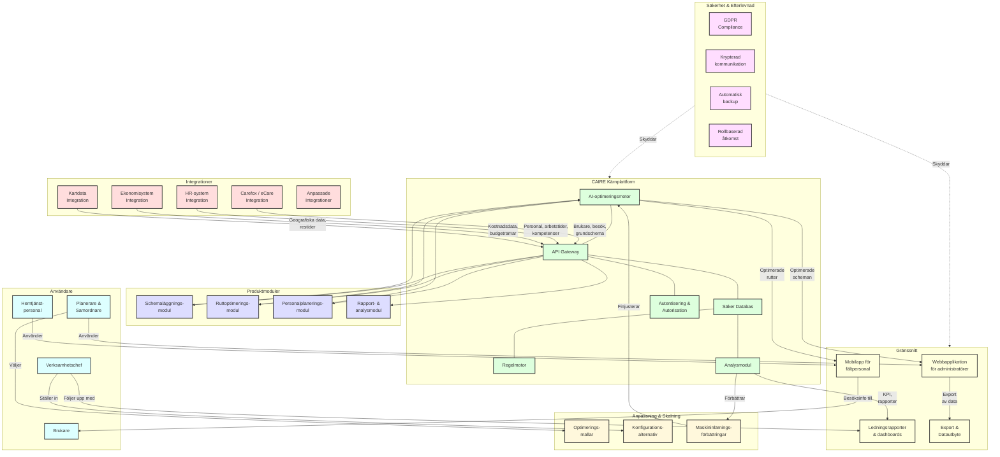
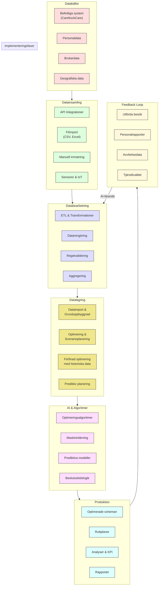

# Produkter

**Meta Title:** Produkter | Caire – AI-plattform för schemaläggning

**Meta Description:** Utforska Caires produkter: en AI-driven plattform med moduler för schemaläggning, ruttoptimering, administration och analys. Vår teknik effektiviserar planeringen i er hemtjänst.

## Caire-plattformen och produktmoduler

### Innehållsstruktur:

- **AI-motorn för schemaläggning**
- **Modul för ruttoptimering**
- **Administrationsverktyg och dokumentation**
- **Analysmodul för data & nyckeltal**
- **Integrationer och säkerhet**

### Target Keywords:

- AI-plattform hemtjänst
- Schemaläggningssystem med AI
- Produktmoduler schemaplanering
- Ruttoptimeringsverktyg
- Integrering hemtjänst system
- Dataskydd molnbaserad hemtjänst

### Image Alt Texts:

- "Skärmbild av Caires plattform som visar användargränssnittet för schemaläggning."
- "Illustration av Caires systemarkitektur med olika produktmoduler som samverkar."

---

Caires produktportfölj kretsar kring vår kraftfulla, molnbaserade plattform. Plattformen består av olika moduler – var och en skräddarsydd för ett viktigt område i planeringen av hemtjänst. Tillsammans bildar de ett sömlöst system. Här presenterar vi våra viktigaste produktkomponenter och hur de samverkar för att effektivisera er verksamhet.

## AI-motorn för schemaläggning

Hjärtat i Caires produkt är AI-schemaläggningsmotorn. Detta är den intelligenta kärnan som automatiskt genererar optimerade scheman. AI-motorn tar in mängder av data: personalens arbetstider och kompetenser, brukarnas beviljade insatser, geografiska avstånd, restriktioner enligt kollektivavtal med mera. Genom att väga in alla dessa faktorer skapar motorn ett schemaförslag som uppfyller behov och regler på bästa sätt.

Tekniskt sett bygger motorn på moderna algoritmer inom maskininlärning och optimering. Den lär sig av historisk data – till exempel vilka schemabyten som brukar behövas – och blir smartare över tid. AI-motorn är också självanpassande: om förutsättningarna ändras (nya brukare tillkommer, personal slutar eller byter availabilitet) justerar systemet förslagen. Resultatet är en dynamisk schemaläggningsmotor som alltid hittar lösningar, även när pusslet är komplext.

## Modul för ruttoptimering

Caires ruttoptimeringsmodul är en fristående produktkomponent som fokuserar på geografisk effektivitet. Den integreras med schemamotorn men kan även användas separat för planering av körvägar. Modulen använder geodata och trafikinfo för att beräkna de snabbaste och mest logiska rutterna för varje medarbetares besök.

Rent praktiskt fungerar det så att när schemat lagts, räknar ruttmodulen ut en optimal sekvens för besöken och föreslår navigering. Om schemat ändras under dagens lopp (t.ex. ett akutbesök skjuts in) kan modulen direkt räkna om rutten. Denna produkt sparar restid och bränsle, och ser till att personalen slipper stressa mellan besöken. För verksamheten innebär det lägre resekostnader och mer tid till omsorg.

## Administrationsverktyg och dokumentation

En annan central produkt är Caires administrationsverktyg, som utgör plattformens användargränssnitt för planering och uppföljning. Det är här som samordnare och chefer kan interagera med systemet. Verktyget har ett intuitivt webbgränssnitt där man kan:

- Överblicka dagens schema och kommande veckor via en visuell planeringskalender.
- Göra manuella justeringar vid behov – t.ex. flytta en insats från en personal till en annan via drag-and-drop.
- Hantera dokumentation: läsa och signera rapporter från personalens utförda besök, kontrollera att alla insatser loggats korrekt.

All data i administrationsverktyget uppdateras i realtid i takt med att personalen rapporterar in via mobilappen. Dessutom finns funktioner för notifieringar – om en insats riskerar att utebli (t.ex. personal inte checkat in hos brukare inom viss tid) kan systemet varna samordnaren så att åtgärd kan tas omedelbart. Administrationsverktyget är, kort sagt, kontrollcentralen för er hemtjänstplanering.

## Analysmodul för data & nyckeltal

Caire inkluderar en analysmodul som produkt, vilken ger er förmågan att omvandla rådata till användbara insikter. Denna modul samlar in data från schemamotorn, ruttoptimeringen och administrationsverktyget och presenterar det i form av interaktiva dashboards och rapporter.

Ni kan enkelt se nyckeltal som:

- Genomsnittlig tid som varje brukare får per vecka.
- Utnyttjandegrad per medarbetare (hur stor andel av arbetstiden som är utförd tid vs restid).
- Antal schemaändringar per månad (en indikator på stabilitet i planeringen).

Analysmodulen låter er filtrera och dyka ner i datan – till exempel kan ni jämföra olika geografiska områden eller tidsperioder. Alla rapporter kan exporteras för att delas med ledning eller myndigheter vid behov. Med denna produktmodul får ni stenkoll på verksamhetens effektivitet och kvalitet, och kan sätta in förbättringsåtgärder baserat på fakta.

## Integrationer och säkerhet

För att Caire ska passa in i just er IT-miljö erbjuder vi omfattande integrationer som en del av plattformen. Våra produkter kan kopplas samman med era befintliga verksamhetssystem: från personalsystem och lönesystem till existerande journalföringssystem. Vi använder moderna API:er för att se till att information flödar sömlöst mellan Caire och andra verktyg ni använder. Det innebär exempelvis att personalens frånvaro som registreras i HR-systemet automatiskt uppdaterar schemaläggningen i Caire, eller att utförda insatser kan skickas tillbaka till journalsystemet utan dubbelregistrering.

Parallellt har vi högsta fokus på datasäkerhet i alla delar av plattformen. Caire är en molnbaserad lösning som driftas i en säker miljö inom EU. All kommunikation är krypterad, och vi följer branschstandarder för skydd av känslig persondata (t.ex. i enlighet med GDPR). Åtkomst till olika moduler styrs med rollbaserade behörigheter, så att personal bara ser den information de behöver. Ni kan tryggt använda Caires produkter i vetskap om att säkerheten och integriteten för era uppgifter är prioriterad.

## CAIRE Plattformsöversikt – Arkitektur & Dataflöde

Caires produkter utgör tillsammans en komplett plattform för modern hemtjänstplanering. Varje modul är kraftfull var för sig, men det är när de används ihop som den verkliga magin sker. AI-motorn skapar scheman, ruttmodulen finjusterar logistiken, administrationsverktyget ger kontroll och analysmodulen ger insikt. Allt detta integrerat och säkert. Genom att använda Caires produktplattform tar ni ett helhetsgrepp om er verksamhet – med teknik som främjar effektivitet, kvalitet och arbetsglädje.

## Teknisk Arkitektur – Dataflöde

