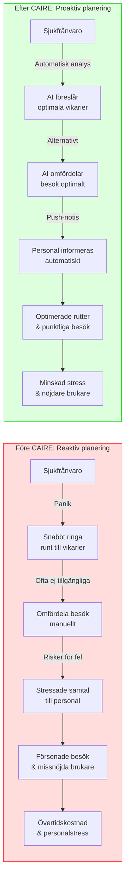
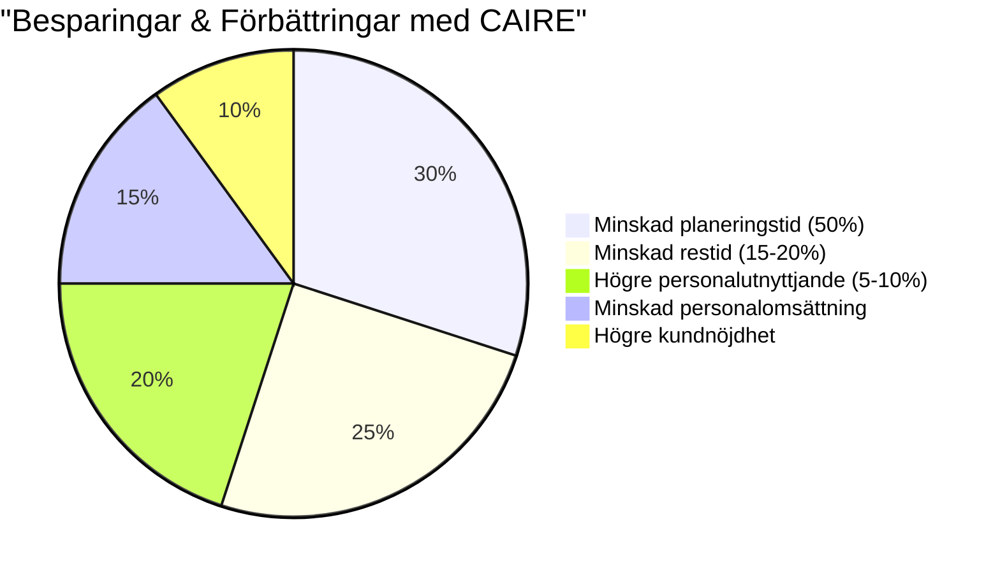

# För planeringsansvarig (Samordnare)

**Syfte:** Tala direkt till den person som dagligen gör scheman i hemtjänsten, med fokus på hur CAIRE underlättar deras arbete och löser deras smärtpunkter.

**Målgrupp:** Planeringssamordnare, schemaläggare och liknande roller som har operativt ansvar för att sätta scheman och hantera dagliga ändringar.

**Primära nyckelord:** schemaläggning hemtjänst utmaningar, verktyg för planeringsansvarig.

**Sekundära nyckelord:** minska stress schemaändringar, smart planeringsverktyg hemtjänst, stöd för samordnare hemtjänst.

**Sökintention:** Kommersiell (användaren kan söka lösningar för att förenkla sitt arbete).

**Beskrivning:** Innehållet adresserar direkta problem för planeringsansvariga: t.ex. tidsödande manuellt pusslande, stress vid sjukfrånvaro och snabba ändringar, svårighet att hålla koll på personalens kompetenser och önskemål. Beskriver hur CAIRE ger "en extra kollega" i form av AI som automatiskt föreslår lösningar, uppdaterar scheman i realtid och minskar administration. Tonen är empatisk ("Vi förstår att det är ett tufft jobb att..."). Sidan lyfter konkreta fördelar: sparar tid (t.ex. 8–10 timmar/vecka), minskar fel och ger trygghet att inget missas. Inkluderar eventuellt ett kort kundcase eller citat från en samordnare som använder CAIRE. Avslutas med en CTA att prova verktyget eller se en demo specifikt anpassad för planeringsansvariga.

**Meta Title:** Verktyg för samordnare i hemtjänst – digital schemaläggning

**Meta Description:** CAIRE är ett AI-drivet planeringsverktyg för hemtjänstens samordnare. Hanterar sena ändringar, halverar planeringstiden och ger lugnare morgnar.

# Verktyg för samordnare inom hemtjänsten {#verktyg-samordnare-hemtjanst}

**Digital schemaläggning för hemtjänsten – mindre kaos, mer kontroll.** Varje morgon står du som **samordnare** eller **planeringsansvarig** inför samma utmaning: sjukanmälningar i sista stund, kunder som ändrar sina behov och ständiga telefonsamtal från personal och kunder. Det är en stressig start på dagen som ofta känns som _kaos_. Planeringen måste snabbt göras om, vikarier ringas in och alla scheman justeras – innan dagens besök kan börja. Vi förstår precis hur högt det mentala trycket kan bli och hur det påverkar både dig och kvaliteten på omsorgen.

## Utmaningen i hemtjänstens planering {#utmaning-hemtjanst-planering}

Att sköta **schemaläggning** i hemtjänsten är som ett komplicerat pussel. Du måste matcha rätt personal till varje brukare, ta hänsyn till restider, kompetenser och önskemål – allt inom ramarna för arbetstidsregler och kollektivavtal. När oförutsedda ändringar inträffar (och det gör de dagligen) ställs allt på sin spets. Resultatet blir ofta att man **släcker akuta bränder** i stunden i stället för att jobba proaktivt. Detta leder till dubbelbokningar, bortglömda besök eller ineffektiva rutter för personalen. På lång sikt är både personal och kunder mindre nöjda.

## Lösningen: AI-driven schemaläggning med CAIRE {#losning-ai-schemalaggning}

Med **CAIRE** får du ett smart, digitalt **verktyg för samordnare** inom hemtjänsten som tar din planering till nästa nivå. Plattformen använder AI för att automatiskt generera och justera scheman i realtid. I stället för morgonkaos kan du lita på att systemet hanterar sena ändringar åt dig – om en medarbetare sjukanmäler sig föreslår CAIRE automatiskt ersättare baserat på kompetens, tillgänglighet och jämn arbetsfördelning. Samtidigt informeras berörda kollegor och brukare om ändringen utan fördröjning.

### Proaktiv planering och lärande från data {#proaktiv-planering}

CAIREs AI lär känna mönstren i er verksamhet. Den identifierar t.ex. om vissa kunder regelbundet inte utnyttjar hela sin beviljade tid varje vecka. Genom att upptäcka sådana **outnyttjade timmar** kan systemet ge förslag på hur ni kan [optimera](/optimering) resursfördelningen – kanske genom att erbjuda extra hjälp till andra kunder eller anpassa personalens scheman. Planeringen blir mer **proaktiv**, vilket betyder att ni kan ligga steget före i stället för att bara reagera på problem. Med hjälp av dataanalys och maskininlärning förbättras systemet kontinuerligt, så schemakvaliteten höjs över tid.

### 50% mindre planeringstid – mer tid för kvalitet {#mindre-planeringstid}

En av de största vinsterna med CAIRE är den enorma tidsbesparingen. Våra användare rapporterar att de lägger upp till **50% mindre tid på planering** och administration. Tänk dig vad du kan göra med halva tiden frigjord från schemaläggningspusslet: mer fokus på personalledning, kvalitetssäkring eller kanske en lugnare start på morgonen. Dessutom minskar risken för fel och dubbelbokningar när AI\:n sköter beräkningar och kontrollerar att inget glöms bort.

**Bildidé:** En samordnare som lugnt planerar schemat på datorn med hjälp av ett digitalt verktyg.
**Alt-text:** Samordnare inom hemtjänsten planerar schema digitalt i verktyget CAIRE.

## Effekt: mindre stress, nöjdare personal och kunder {#effekt-mindre-stress}

När planeringen flyter på med hjälp av CAIRE minskar den dagliga stressen för dig som samordnare. Personalen får tydliga, förutsägbara scheman med jämn arbetsbelastning, vilket gör dem mer nöjda och mindre benägna att sjukskriva sig. Kunderna märker av bättre kontinuitet (fler kända ansikten som kommer på besök) och att tiderna hålls enligt överenskommelse. **Digital schemaläggning för hemtjänsten** via CAIRE innebär i praktiken högre kvalitet på omsorgen utan onödig stress för dig. Allt är spårbart och transparent, så du kan i efterhand gå tillbaka och se historik vid behov.

## Visualisering: Samordnarens arbetsdag med och utan CAIRE {#visualisering-arbetsdag}

```mermaid
gantt
    title Samordnarens Morgon: Före vs Efter CAIRE
    dateFormat  HH:mm
    axisFormat %H:%M

    section Före CAIRE
    Kontrollera sjukfrånvaro      :06:30, 30min
    Ringa vikarier                :07:00, 45min
    Göra om schemat manuellt      :07:45, 60min
    Hantera klagomål              :08:45, 30min
    Informera personal om ändringar:09:15, 30min
    Lösa akuta problem            :09:45, 45min

    section Med CAIRE
    Granska AI:s förslag          :06:30, 15min
    Godkänna optimerat schema     :06:45, 10min
    Övervaka automatiska uppdateringar:06:55, 15min
    Strategiskt planeringsarbete  :07:10, 60min
    Personalcoachning             :08:10, 40min
    Kvalitetsutveckling           :08:50, 60min
```

## En samordnares före/efter-upplevelse {#fore-efter-upplevelse}



## Ägarens Perspektiv: ROI med CAIRE {#agarens-perspektiv}



## Smidig onboarding och stöd hela vägen {#onboarding-stod}

Trots den avancerade tekniken är CAIRE lätt att komma igång med. Vår [smidiga onboarding](/funktioner/onboarding) säkerställer att din verksamhet snabbt kan börja dra nytta av systemet utan avbrott. Vi hjälper till med att importera era befintliga scheman, utbilda personal och finnas till hands när frågor uppstår. Dessutom integreras CAIRE enkelt med era befintliga system för dokumentation och tidrapportering, så ni slipper dubbelarbete.

**Få ordning på planeringen redan idag – [boka en kostnadsfri demo](#) av CAIRE och upplev skillnaden för din hemtjänst.**

---
