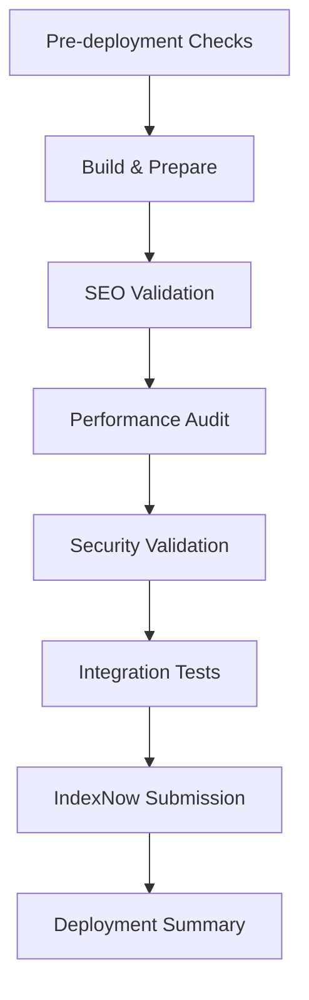

# IndexNow & Web Vitals Integration Guide

## Overview

This guide covers the integration of **IndexNow** for faster search engine indexing and **Web Vitals** tracking for SEO performance monitoring in your production deployment workflow.

## 🎯 Current Status

### ✅ Web Vitals - PRODUCTION READY

- **Status**: Fully implemented and active
- **Location**: `src/lib/web-vitals.ts`
- **Integration**: Initialized in `App.tsx`, integrated with Google Analytics
- **Tracking**: LCP, FID, CLS, FCP, TTFB metrics
- **Workflow**: Included in GitHub Actions for performance validation

### 🔧 IndexNow - READY FOR CONFIGURATION

- **Status**: Implemented but needs API key configuration
- **Location**: `src/lib/indexNow.ts`
- **Integration**: Added to GitHub Actions workflow
- **Purpose**: Faster search engine indexing for Bing, Yandex, and others

## 🚀 IndexNow Setup Instructions

### Step 1: Generate API Key and Key File

Run the setup script to generate your IndexNow API key:

```bash
npm run indexnow:setup
```

This will:

- Generate a unique 32-character hexadecimal API key
- Create a key file in `public/[key].txt`
- Display setup instructions

### Step 2: Configure Environment Variables

Add the API key to your environment:

**Local Development (.env):**

```env
INDEX_NOW_API_KEY=your_generated_key_here
```

**GitHub Actions:**

1. Go to your repository settings
2. Navigate to "Secrets and variables" > "Actions"
3. Add a new repository secret:
   - Name: `INDEX_NOW_API_KEY`
   - Value: Your generated API key

### Step 3: Deploy and Verify

1. **Deploy the key file**: Ensure `public/[key].txt` is accessible at `https://www.caire.se/[key].txt`
2. **Test the integration**:
   ```bash
   npm run indexnow:test
   ```

### Step 4: Monitor Indexing

After deployment, your workflow will automatically:

- Submit key pages to IndexNow after successful deployment
- Log submission results in GitHub Actions
- Skip submission if API key is not configured (graceful fallback)

## 📊 Web Vitals Monitoring

### Current Implementation

Web Vitals are automatically tracked on every page load:

```typescript
// Automatically initialized in App.tsx
useEffect(() => {
  initGA();
  trackWebVitals(); // ← Web Vitals tracking starts here
}, []);
```

### Tracked Metrics

| Metric   | Description              | Target  | Current Tracking |
| -------- | ------------------------ | ------- | ---------------- |
| **LCP**  | Largest Contentful Paint | < 2.5s  | ✅ Active        |
| **FID**  | First Input Delay        | < 100ms | ✅ Active        |
| **CLS**  | Cumulative Layout Shift  | < 0.1   | ✅ Active        |
| **FCP**  | First Contentful Paint   | < 1.8s  | ✅ Active        |
| **TTFB** | Time to First Byte       | < 600ms | ✅ Active        |

### Analytics Integration

Web Vitals data is sent to Google Analytics via:

```typescript
trackSeoPerformanceMetrics({
  lcp: window.__LCP_VALUE,
  fid: window.__FID_VALUE,
  cls: window.__CLS_VALUE,
  fcp: window.__FCP_VALUE,
  ttfb: window.__TTFB_VALUE,
  pageUrl: window.location.href,
});
```

## 🔄 Production Workflow Integration

### GitHub Actions Workflow

The production deployment workflow now includes:

1. **Web Vitals Validation** (existing):
   - Lighthouse performance audit
   - Core Web Vitals threshold checking
   - Performance regression detection

2. **IndexNow Submission** (new):
   - Automatic submission of key pages after successful deployment
   - Batch submission for efficiency
   - Graceful fallback if API key not configured

### Workflow Sequence



### Key Pages Submitted to IndexNow

The workflow automatically submits these critical pages:

- Homepage: `/`
- Contact: `/kontakt`
- Features: `/funktioner`
- About: `/om-oss`
- Resources: `/resurser`
- Feature pages: `/funktioner/*`
- Resource articles: `/resurser/*`
- English pages: `/en/*`

## 📈 Benefits

### IndexNow Benefits

- **Faster Indexing**: Pages indexed within minutes instead of days
- **Better SEO**: Improved search engine discovery
- **Multi-Engine Support**: Works with Bing, Yandex, and others
- **Automated**: No manual submission required

### Web Vitals Benefits

- **Performance Monitoring**: Real-time Core Web Vitals tracking
- **SEO Optimization**: Data for improving search rankings
- **User Experience**: Insights into actual user performance
- **Regression Detection**: Automated performance threshold checking

## 🛠 Maintenance

### Regular Tasks

1. **Monitor IndexNow Submissions**:
   - Check GitHub Actions logs for submission status
   - Verify key file accessibility
   - Monitor search engine indexing speed

2. **Review Web Vitals Data**:
   - Check Google Analytics for performance trends
   - Monitor Core Web Vitals in Search Console
   - Address performance regressions

3. **Update Key Pages List**:
   - Add new important pages to IndexNow submission list
   - Remove deprecated pages
   - Adjust submission frequency if needed

### Troubleshooting

**IndexNow Issues:**

- Verify key file is accessible at `https://www.caire.se/[key].txt`
- Check API key is correctly set in GitHub secrets
- Ensure domain matches in IndexNow configuration

**Web Vitals Issues:**

- Check browser console for tracking errors
- Verify Google Analytics is receiving data
- Monitor for JavaScript errors affecting measurement

## 🔒 Security Considerations

### IndexNow Security

- API key is stored securely in GitHub secrets
- Key file contains only the public key (safe to expose)
- No sensitive data transmitted to IndexNow API

### Web Vitals Privacy

- Data is anonymized before sending to Google Analytics
- GDPR-compliant with user consent management
- No personally identifiable information collected

## 📚 Additional Resources

- [IndexNow Protocol Documentation](https://www.indexnow.org/)
- [Web Vitals Guide](https://web.dev/vitals/)
- [Core Web Vitals SEO Impact](https://developers.google.com/search/docs/appearance/core-web-vitals)
- [Google Analytics 4 Performance Tracking](https://support.google.com/analytics/answer/9267735)

## 🎯 Recommendations

### Immediate Actions

1. ✅ **Keep Web Vitals as-is** - Already optimally implemented
2. 🔧 **Set up IndexNow** - Run `npm run indexnow:setup` and configure API key
3. 📊 **Monitor both systems** - Set up regular review of performance data

### Future Enhancements

- Consider adding more pages to IndexNow submission list
- Implement Web Vitals alerting for performance regressions
- Add custom performance metrics tracking
- Integrate with additional search engines as they adopt IndexNow
