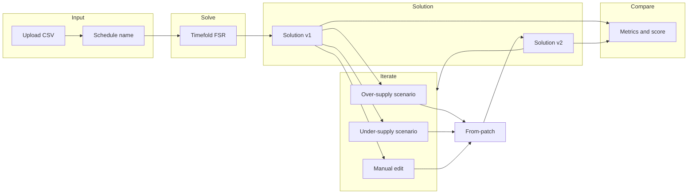
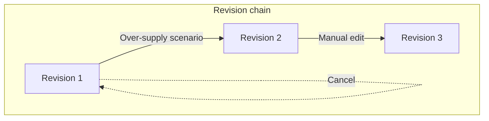
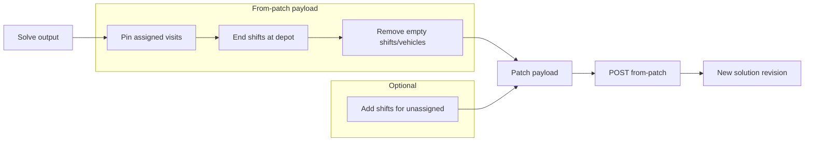

# Scheduling System: Developer Guide

Primary developer handoff for the scheduling system. Describes the end-to-end workflow: **input → solve → solution → iterate (scenarios / from-patch) → compare metrics**. The system is **agnostic** to the type of schedule (recurring visits, daily schedules, or any supply/demand scheduling problem). Concrete examples use the Nova recurring-visits pipeline.

**Related:** [RECURRING_CSV_DB_HANDOFF.md](RECURRING_CSV_DB_HANDOFF.md) (CSV column mapping, DB mapping), [nova/README.md](nova/README.md) (Nova pipeline), [huddinge-package/docs/PRIORITIES.md](huddinge-package/docs/PRIORITIES.md) (efficiency targets).

---

## 1. System Overview

### Core loop

- **Input** (CSV or API) defines visits and placeholder employees/shifts. Homecare is demand-first; the engine is supply-first, so placeholders are used to hopefully assign all visits.
- **Solve** sends the model to Timefold FSR. Multi-day; all visits are mandatory; many visits have movable (multi-day) time windows.
- **Solution** is stored as a revision: metrics, assigned visits, Timefold score. Every solution goes through Timefold so we always have comparable data.
- **Iterate** via scenarios (over-supply: remove idle shifts; under-supply: add shifts for unassigned) or manual edits. Each change produces a **new revision**.
- **Compare** metrics and scores across revisions.

### Principles

- **Every solution is a revision.** User must explicitly save or run optimization; cancel = nothing saved. Revisions are immutable.
- **Every solution goes through Timefold.** Even manual-only changes use from-patch so we get metrics, assigned visits, and TF score (verification or re-solve).
- **From-patch is the single path for new revisions.** Pin assigned visits, remove empty shifts or add shifts; the system abstracts the change type.

---

## 2. Step-by-Step Workflow

### Step 1: Upload CSV

- User uploads a CSV containing **visits** and **placeholder employees/shifts** (demand-first data; engine is supply-first).
- Placeholders should be enough to assign all visits when possible (see Step 3).
- User can add a **schedule name**.
- User can choose **Solve now** or trigger solve later.

**Column mapping:** See [RECURRING_CSV_DB_HANDOFF.md](RECURRING_CSV_DB_HANDOFF.md) sections 2 and 3 for Huddinge vs Nova column names and DB mapping.

**Example:** Nova source CSV: `nova/source/Nova_Final_Verified_geocoded.csv` (867 visits). After expansion: `nova/expanded/nova_4wk_expanded.csv` (2,740 visits).

---

### Step 2: Solve

- Send input to **Timefold FSR** (fresh solve).
- Multi-day; no planning-window needed for this flow. All visits are mandatory; many have movable (multi-day) time windows.
- Script: `huddinge-package/scripts/submit_to_timefold.py solve <input.json> --wait --save <output.json>`.

**Example:** Nova input JSON: `nova/solve/tf-15feb-1115/export-field-service-routing-v1-595776f0-3417-4119-8472-fb374dbfcba2-input.json`.

---

### Step 3: Solution available

When the solution is ready:

1. **Store in DB:** Schedules, visits, employees/shifts, and metrics (see Data model below).
2. **Show in UI:**
   - **Multi-day schedule view** (all days in the solution window).
   - **Filter/labels** for visits and for shifts/employees.

**Metrics structure:** See `nova/solve/tf-15feb-1115/metrics/metrics_20260215_102054_c8e1708c.json` and `metrics_report_c8e1708c.txt` for the JSON and report format (route_plan_id, score, total_visits_assigned, unassigned_visits, shift_time_h, costs, efficiency_pct, etc.).

---

### Step 4: Demand–supply scenarios

Depending on the solution:

- **Over-supply (idle capacity):** Use a scenario to **remove idle shifts/employees** (no itineraries; business logic decides which to remove). Save as new version: `schedule-name + scenario-name`.
- **Under-supply (unassigned visits):** Use a scenario to **add shifts** for unassigned visits (business logic estimates where/when). Save as new version: `schedule-name + scenario-name`.
- **Manual edits:** User can add/remove employees or visits, change visit times, etc. Save as new version.

All paths produce a **new solution revision** (Step 5).

---

### Step 5: Revision model

- **Every change = new revision.** No in-place overwrite of a solution.
- User must **save** or **run optimization** to persist. **Cancel = nothing saved.**
- Revisions form an immutable chain so you can compare any two versions.

---

### Step 6: Every solution through Timefold

- Even **manual-only** changes must go through Timefold (via **from-patch**) so we get:
  - Metrics (time breakdown, cost, efficiency)
  - Assigned visits (itineraries)
  - Timefold score
- **From-patch with optimization** = re-solve from the patched model.
- **From-patch without optimization** = verify manual change and get score/metrics only.

---

### Step 7: From-patch mechanics

From-patch is the **single process** for all new solution revisions:

1. **Pin** all assigned visits to their shifts (lock assignments).
2. **End shifts at depot** (remove idle time after last visit).
3. **Remove** empty shifts; **remove** empty vehicles. (Over-supply scenario.)
4. Optionally **add** shifts/vehicles (under-supply scenario).

The platform abstracts these as “scenario” or “manual” actions; underneath, the same from-patch pipeline runs.

**Script:** `huddinge-package/scripts/build_from_patch.py` (builds payload). **Submit:** `submit_to_timefold.py from-patch <payload.json> --route-plan-id <id> --wait --save <output.json>`.

**Example:** Nova patch request: `nova/solve/tf-15feb-1115/export-field-service-routing-v1-c8e1708c-a797-499e-ab4e-4c2c25d2a193-patch-request.json` (JSON Patch: pin visits, set maxEndTime, remove empty shifts/vehicles).

---

### Step 8: Receive solution, compare

- When a new solution (revision) is received, **store metrics** and **assigned visits** as for Step 3.
- **Compare** metrics and scores across revisions (e.g. side-by-side table: efficiency, cost, margin, unassigned count, TF score).

---

## 3. Timefold FSR API Reference

| Action          | Method | Endpoint / usage                                                                      |
| --------------- | ------ | ------------------------------------------------------------------------------------- |
| **Fresh solve** | POST   | Submit `modelInput` JSON; returns route plan ID.                                      |
| **From-patch**  | POST   | `POST /v1/route-plans/{id}/from-patch` with patch payload; returns new route plan ID. |
| **Poll**        | GET    | `GET /v1/route-plans/{id}` until `solverStatus` is terminal (e.g. SOLVING_COMPLETED). |

**Score format:** `{hard}/{medium}/{soft}` (e.g. `0hard/0medium/-417811soft`). Lower soft = better.

**Script reference:** [huddinge-package/scripts/submit_to_timefold.py](huddinge-package/scripts/submit_to_timefold.py).

---

## 4. Data Model: CSV → DB and Timefold Output → DB

### 4.1 CSV column mapping (Huddinge vs Nova)

**Huddinge source:** Delimiter `;`. Key columns:

| Huddinge Column                                 | Purpose                                      |
| ----------------------------------------------- | -------------------------------------------- |
| `visit_id`                                      | Row ID, weekday ordering                     |
| `recurringVisit_id`                             | Recurring pattern → VisitTemplate.externalId |
| `visitGroup_id`                                 | Double-staffing group                        |
| `recurringVisit_clientName`                     | Visit display name                           |
| `frequency`                                     | daily, weekly, biweekly, 4weekly, monthly    |
| `startTime`, `duration`                         | Preferred start, duration (min)              |
| `flex_beforeStart`, `flex_afterStart`           | Time window flex                             |
| `external_slinga_shiftName`                     | Route/shift name (vehicles)                  |
| `shift_type`, `shift_start`, `shift_end`        | Shift bounds                                 |
| `client_externalId`, `client_lat`, `client_lon` | Client and location                          |

**Nova:** Different names; mapped in `nova/scripts/expand_nova_recurring_visits.py`:

| Nova Column              | Maps To Huddinge                       |
| ------------------------ | -------------------------------------- |
| `visitid`                | `visit_id`                             |
| `movablevisitid`         | `recurringVisit_id`                    |
| `Dubbelid`               | `visitGroup_id`                        |
| `Slinga`                 | `external_slinga_shiftName`            |
| `weekday`                | `recurring_external`                   |
| `originalstarttime`      | `startTime`                            |
| `Längd`                  | `duration`                             |
| `Min före` / `Min efter` | `flex_beforeStart` / `flex_afterStart` |
| `Kundnr`                 | `client_externalId`                    |

Full tables: [RECURRING_CSV_DB_HANDOFF.md](RECURRING_CSV_DB_HANDOFF.md) sections 2 and 3.

### 4.2 CSV → CAIRE DB mapping

| CSV Concept            | Huddinge Column                        | Nova Column              | DB Model.Field                              |
| ---------------------- | -------------------------------------- | ------------------------ | ------------------------------------------- |
| Recurring pattern ID   | `recurringVisit_id`                    | `movablevisitid`         | **VisitTemplate.externalId**                |
| Concrete visit ID      | `original_visit_id` (expanded)         | —                        | **Visit.externalId**                        |
| Double-staffing group  | `visitGroup_id`                        | `Dubbelid`               | **Visit.visitGroupId**                      |
| Client ID              | `client_externalId`                    | `Kundnr`                 | **Client.externalId**                       |
| Street / Postal / City | `client_addressStreet` etc.            | `Gata`, `Postnr`, `Ort`  | **Address**                                 |
| Client lat/lon         | `client_lat` / `client_lon`            | same                     | **Address.latitude** / **longitude**        |
| Route name             | `external_slinga_shiftName`            | `Slinga`                 | Template / ScheduleEmployeeShift            |
| Duration (min)         | `duration`                             | `Längd`                  | **Visit.durationMinutes**                   |
| Time window            | `flex_beforeStart` / `flex_afterStart` | `Min före` / `Min efter` | **Visit.allowedTimeWindowStart** / **End**  |
| Shift bounds           | `shift_start` / `shift_end`            | same                     | **ScheduleEmployeeShift** startTime/endTime |

### 4.3 Timefold output → DB (solution storage)

| Timefold Output                                              | DB / Platform                                 |
| ------------------------------------------------------------ | --------------------------------------------- |
| `modelOutput.vehicles[]`                                     | Employees (and their shifts)                  |
| `vehicle.id`                                                 | Employee/vehicle identifier                   |
| `vehicle.shifts[]`                                           | ScheduleEmployeeShift (one per shift)         |
| `shift.id`                                                   | Shift identifier                              |
| `shift.startTime`, `shift.metrics.endLocationArrivalTime`    | Shift start/end                               |
| `shift.itinerary[]` (kind = VISIT)                           | Assigned visits for that shift                |
| Itinerary item `id`                                          | Visit.externalId (link to Visit)              |
| Itinerary `arrivalTime`, `startServiceTime`, `departureTime` | Visit assigned time                           |
| `metadata.id` / `run.id`                                     | Route plan / solution revision ID             |
| `metadata.score`                                             | Store for comparison                          |
| Metrics JSON (see Section 5)                                 | Store per revision (efficiency, cost, margin) |

**Revision/version model:** Each solution is stored as a revision (e.g. ScheduleRevision or SolutionVersion) with: route_plan_id, input snapshot, output snapshot, metrics JSON, TF score, created_at. Parent schedule + scenario name or “manual” identify the revision.

### 4.4 Visit groups (double-staffing)

- **visitGroup_id** = visits that need 2+ employees at the same time.
- Timefold: `visitGroups[]` with same-day visits and overlapping time windows.
- DB: **Visit.visitGroupId**, **Visit.requiredStaff** = 2 for group members.

---

## 5. Metrics

### Time equation

`shift = visit + travel + wait + break + idle`

- **Visit:** time at client (billable).
- **Travel:** between locations (from shift.metrics.totalTravelTime).
- **Wait:** early arrival, waiting for time window.
- **Break:** scheduled break.
- **Idle:** shift time with no work (e.g. after last visit until shift end, or empty shift). Removed in from-patch (end at depot, remove empty shifts).

### Efficiency definitions

- **Staffing efficiency** = visit / (shift − break). Target: high; use `--exclude-inactive` for metrics so idle is not in the denominator.
- **Field efficiency** = visit / (visit + travel). Target: **>67.5%** (manual benchmark).
- **Wait efficiency** = visit / (visit + travel + wait).

### Cost model

- **Employee cost:** 230 kr/h (175 kr/h + 30% social fees). All shift time (incl. breaks) paid at this rate.
- **Revenue:** 550 kr/h per visit hour (visit time only).
- **Margin** = visit_revenue − shift_cost; margin % = margin / visit_revenue.

Metrics script: [huddinge-package/scripts/metrics.py](huddinge-package/scripts/metrics.py). Constants: `COST_PER_HOUR = 230.0`, `REVENUE_PER_VISIT_HOUR = 550.0`.

### Metrics JSON structure (per revision)

From `metrics.py` output (e.g. `nova/solve/tf-15feb-1115/metrics/metrics_20260215_102054_c8e1708c.json`):

- `route_plan_id`, `score`, `solver_status`
- `total_visits_assigned`, `unassigned_visits`, `total_vehicles`, `empty_vehicles`, `total_shifts`, `shifts_with_visits`, `shifts_no_visits`
- `shift_time_h`, `break_time_h`, `visit_time_h`, `travel_time_h`, `wait_time_h`, `inactive_time_h`
- `shift_cost_kr`, `visit_revenue_kr`, `margin_kr`, `margin_pct`
- `efficiency_pct`, `field_efficiency_pct`, `field_incl_wait_pct`
- `cost_per_hour_kr`, `revenue_per_visit_hour_kr`

---

## 6. Example: Nova End-to-End

### Pipeline

1. **Source CSV** (867 visits) → `nova/source/Nova_Final_Verified_geocoded.csv`
2. **Expand** (Nova columns → Huddinge format, then expand to planning window) → `nova/expanded/nova_4wk_expanded.csv` (2,740 visits)
3. **Input JSON** → `csv_to_timefold_fsr.py` + `generate_employees.py` → e.g. `nova/solve/tf-15feb-1115/export-field-service-routing-v1-595776f0-...-input.json`
4. **Solve** → Timefold FSR → output JSON (e.g. `export-field-service-routing-595776f0-...-output.json`)
5. **From-patch** → `build_from_patch.py` → patch payload → `submit_to_timefold.py from-patch` → from-patch output (e.g. `export-field-service-routing-c8e1708c-...-output.json`)
6. **Metrics** → `metrics.py` with `--exclude-inactive` → `nova/solve/tf-15feb-1115/metrics/metrics_*.json` and `metrics_report_*.txt`

### Metrics comparison (before vs after from-patch)

| Metric                  | Before from-patch (595776f0)     | After from-patch (c8e1708c) |
| ----------------------- | -------------------------------- | --------------------------- |
| Shifts                  | 456 (207 with visits, 249 empty) | 207 (all with visits)       |
| Empty vehicles          | 3                                | 0                           |
| Staffing efficiency     | ~60%                             | ~92.66%                     |
| Margin (excl. inactive) | —                                | 62.86%                      |

Same visit assignment; from-patch removes empty shifts and ends shifts at depot, so cost and efficiency improve in the metrics.

### Scripts (Nova)

- **Nova expand:** `nova/scripts/expand_nova_recurring_visits.py`
- **Orchestrator:** `nova/process_nova.py` (expand + JSON)
- **Solve, from-patch, metrics:** all in `huddinge-package/scripts/` (see Section 7).

---

## 7. Reference Files to Share With Developers

### Nova example files (concrete paths)

| Artifact           | Path (relative to `docs_2.0/recurring-visits/`)                                                                    |
| ------------------ | ------------------------------------------------------------------------------------------------------------------ |
| Source CSV         | `nova/source/Nova_Final_Verified_geocoded.csv`                                                                     |
| Expanded CSV       | `nova/expanded/nova_4wk_expanded.csv`                                                                              |
| Input JSON         | `nova/solve/tf-15feb-1115/export-field-service-routing-v1-595776f0-3417-4119-8472-fb374dbfcba2-input.json`         |
| Solve output       | `nova/solve/tf-15feb-1115/export-field-service-routing-595776f0-3417-4119-8472-fb374dbfcba2-output.json`           |
| From-patch payload | `nova/solve/tf-15feb-1115/export-field-service-routing-v1-c8e1708c-a797-499e-ab4e-4c2c25d2a193-patch-request.json` |
| From-patch output  | `nova/solve/tf-15feb-1115/export-field-service-routing-c8e1708c-a797-499e-ab4e-4c2c25d2a193-output.json`           |
| Metrics JSON       | `nova/solve/tf-15feb-1115/metrics/metrics_20260215_102054_c8e1708c.json`                                           |
| Metrics report     | `nova/solve/tf-15feb-1115/metrics/metrics_report_c8e1708c.txt`                                                     |

### Script locations (all under `huddinge-package/scripts/`)

| Script                             | Purpose                                                                                                                          |
| ---------------------------------- | -------------------------------------------------------------------------------------------------------------------------------- |
| `expand_recurring_visits.py`       | Expand recurring patterns to occurrences (Huddinge format)                                                                       |
| `csv_to_timefold_fsr.py`           | Expanded CSV → Timefold input JSON                                                                                               |
| `generate_employees.py`            | Build vehicles/shifts from CSV                                                                                                   |
| `submit_to_timefold.py`            | Solve (fresh) and from-patch (incremental)                                                                                       |
| `build_from_patch.py`              | Build from-patch payload (pin visits, end at depot, remove empty)                                                                |
| `metrics.py`                       | Compute efficiency, cost, margin (230 kr/h, 550 kr/h)                                                                            |
| `solve_report.py`                  | Metrics + unassigned + empty-shifts analysis                                                                                     |
| `run_analyze_metrics_frompatch.py` | Metrics + from-patch payload in one run                                                                                          |
| `run_continuity_compare.py`        | Submit base + manual + area (+ optional first-run) to FSR in parallel; use `--first-run-output` for all 4 strategies, omit for 3 |
| `analyze_unassigned.py`            | Classify unassigned: supply vs config                                                                                            |
| `add_evening_vehicles.py`          | Add extra evening shifts to input                                                                                                |

Nova-specific: `nova/scripts/expand_nova_recurring_visits.py`, `nova/process_nova.py`.

### Further reading

- [RECURRING_CSV_DB_HANDOFF.md](RECURRING_CSV_DB_HANDOFF.md) — CSV column mapping, DB mapping, from-patch flow, script table
- [nova/README.md](nova/README.md) — Nova pipeline and folder structure
- [huddinge-package/docs/PRIORITIES.md](huddinge-package/docs/PRIORITIES.md) — Input validation, Timefold config, efficiency targets

---

_Scheduling Developer Guide — recurring-visits pipeline (Huddinge, Nova) and Caire platform integration. Feb 2026._
