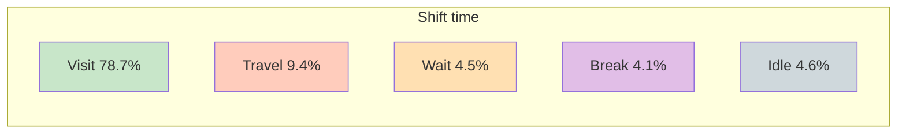
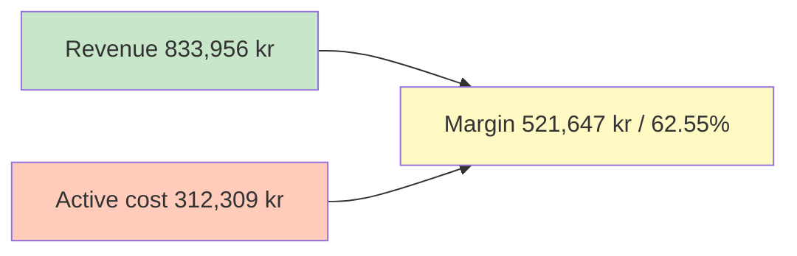
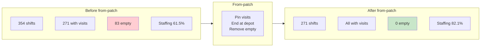
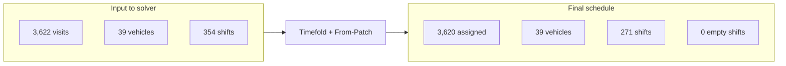
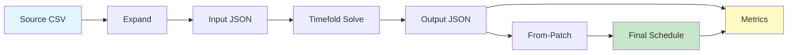
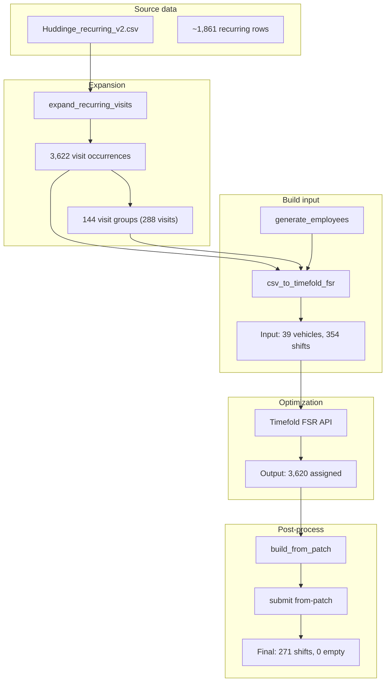

# Attendo Pilot – Huddinge E2E Schedule Report

**First pilot test: Timefold Field Service Routing on Huddinge recurring visits**

**Report date:** 15 February 2026 · **Schedule period:** 2 weeks · **Solver:** Timefold FSR

---

## 1. Executive summary

First end-to-end pilot of automated care visit scheduling for **Huddinge** with **Timefold**:

- **99.94% assignment** — 3,620 of 3,622 visits assigned to staff
- **0 empty shifts** in final schedule (271 shifts, all with visits)
- **Field efficiency 89.4%** — above 67.5% manual benchmark (Slingor)
- **Staffing efficiency 82.1%** — visit time vs paid shift time
- **Margin 62.6%** — revenue vs active cost (excluding inactive time)

Suitable for review and integration (e.g. Caire platform).

---

## 2. Assignment at a glance

| Metric | Value |
|--------|--------|
| **Visits assigned** | 3,620 / 3,622 |
| **Shifts with visits** | 271 |
| **Empty shifts** | 0 |
| **Empty vehicles** | 0 |

---

## 3. Efficiency metrics

Metrics **exclude inactive time** (idle removed by from-patch).

### Key performance indicators

| Efficiency | Result | Benchmark / note |
|------------|--------|-------------------|
| **Staffing** (visit / paid time) | **82.09%** | Share of paid time that is visit |
| **Field** (visit / visit+travel) | **89.36%** | Target >67.5% (Slingor) ✓ |
| **Wait** (visit / visit+travel+wait) | 85.02% | Includes waiting at client |
| **Idle** (visit / visit+travel+idle) | 84.89% | After removing empty shifts |

### Time breakdown — shift composition

Every shift is split into five parts:

| Category | Time (h:min) | % of shift |
|----------|--------------|------------|
| **Shift total** | 1,926h 30min | 100% |
| Visit (care delivery) | 1,516h 17min | **78.71%** |
| Travel | 180h 31min | 9.37% |
| Wait | 86h 33min | 4.49% |
| Break | 79h 30min | 4.13% |
| Idle (inactive) | 89h 23min | 4.64% |

### Cost and revenue (excluding inactive)

| Item | Amount (SEK) |
|------|----------------|
| **Revenue** (visit time × 550 kr/h) | 833,956 |
| **Active cost** (active shift × 170 kr/h) | 312,309 |
| **Margin** | **521,647 (62.55%)** |

Non-visit cost (travel, wait, break): 58,917 kr (18.86% of active cost).

---

## 4. Before vs after from-patch

Effect of removing empty shifts and ending shifts at depot:

| Metric | Before from-patch | After from-patch |
|--------|-------------------|------------------|
| Shifts | 354 (271 with visits, 83 empty) | 271 (all with visits) |
| Staffing efficiency | 61.5% | **82.1%** |
| Field efficiency | 89.4% | 89.4% |
| Idle time | 707h 23min | 89h 23min |
| Margin (excl. inactive) | 61.7% | **62.6%** |

---

## 5. From-patch comparison: 14feb-2200 vs tf-16feb-0800 (apple-to-apple)

Both runs are **from-patch** (empty shifts removed, shifts end at depot). Same dataset (3,620/3,622 assigned), same rates (170 kr/h cost, 550 kr/h revenue).

| Metric | 14feb-2200 from-patch (63d197c5) | tf-16feb-0800 from-patch (623c54b2) | Delta |
|--------|----------------------------------|-------------------------------------|-------|
| **Shifts** | 271 (0 empty) | 271 (0 empty) | — |
| **Shift time** | 1,926h 30min | 1,776h 2min | **−150h 28min** |
| **Idle time (remaining)** | 89h 23min | 0h 11min | **−89h** (tf-16feb ends at depot) |
| **Visit time** | 1,516h 17min | 1,516h 17min | — |
| **Travel time** | 180h 31min | 174h 12min | **−6h 19min** |
| **Wait time** | 86h 33min | 84h 23min | −2h 10min |
| **Break time** | 79h 30min | 79h 30min | — |
| **Staffing efficiency** | 82.09% | **89.37%** | **+7.3 pp** |
| **Field efficiency** | 89.36% | **89.70%** | +0.3 pp |
| **Revenue** | 833,956 kr | 833,956 kr | — |
| **Active cost** | 312,309 kr | **301,897 kr** | **−10,412 kr** |
| **Margin** | 521,647 kr (62.55%) | **532,059 kr (63.80%)** | **+10,412 kr (+1.25 pp)** |
| **Soft score** | -1,978,578 | **-1,902,544** | Better (fewer soft penalties) |

**Summary:** The tf-16feb-0800 solve (3h run) produces a better routing: less travel and almost no remaining idle after from-patch (shifts end at depot). That yields ~150h less paid shift time, ~10k kr lower cost, and 1.25 pp higher margin at the same revenue. Same assignment quality (2 unassigned in both).

---

## 6. Input → final schedule (overview)

---

---

# Technical details

*The following sections are for technical reference and reproducibility.*

---

## A. Pipeline overview

End-to-end flow from source data to final schedule and metrics:

| Stage | Input | Output |
|-------|--------|--------|
| **Expand** | Recurring visit definitions (CSV) | Visit occurrences for 2-week window |
| **Input JSON** | Expanded CSV + staff/shifts | Timefold FSR input |
| **Solve** | Input JSON | Optimized assignment (output JSON) |
| **From-Patch** | Output JSON | Trim empty shifts, end at depot → final schedule |
| **Metrics** | Final schedule + input | Efficiency and cost report |

---

## B. Data flow (detailed)

---

## C. Pilot scope

| Item | Description |
|------|--------------|
| **Data source** | Huddinge recurring visits (`Huddinge_recurring_v2.csv`) |
| **Planning window** | 2 weeks |
| **Solver** | Timefold Field Service Routing (cloud API) |
| **Profile** | huddinge-test-long |
| **Post-processing** | From-patch: pin visits, end shifts at depot, remove empty shifts |

---

## D. Data summary (counts)

| Stage | Count | Notes |
|-------|--------|------|
| **Source (recurring rows)** | ~1,861 | Recurring visit definitions |
| **Expanded (visit occurrences)** | 3,622 | 2-week expansion |
| **Care visits (logical)** | 3,478 | 3,334 solo + 144 double-employee (visit groups) |
| **Timefold visits** | 3,622 | 3,334 solo + 288 in 144 groups |
| **Vehicles (staff)** | 39 | All used (no empty vehicles) |
| **Shifts (input)** | 354 | Before optimization |
| **Shifts (final)** | 271 | After from-patch (empty shifts removed) |

---

## E. Reproducibility and artefacts

All outputs under `docs_2.0/recurring-visits/huddinge-package/solve/14feb-2200/`.

| Artefact | Path / ID |
|----------|-----------|
| **Initial solve** | `export-field-service-routing-bae1f9a2-*-output.json` |
| **From-patch payload** | `from-patch/payload_bae1f9a2.json` |
| **Final schedule** | `from-patch/output_bae1f9a2.json` (plan `63d197c5-...`) |
| **Metrics JSON** | `metrics/metrics_20260215_051514_63d197c5.json` |
| **Metrics report** | `metrics/metrics_report_63d197c5.txt` |

Pipeline (expand → solve → from-patch → metrics) can be re-run with scripts in `scripts/`; see package README.

---

## F. Next steps and recommendations

1. **Integration** — Use `from-patch/output_bae1f9a2.json` for import into Caire platform; see `docs/PLATFORM_UPLOAD.md`.
2. **Further optimization** — Compare Timefold profiles to improve field efficiency and balance travel/wait while keeping 0 empty shifts.
3. **Pilot handover** — This report and referenced files can be shared with Attendo as the first pilot deliverable.

---

*Report from Huddinge e2e pipeline (Caire / Timefold). Metrics definitions: Huddinge package README and `docs/PRIORITIES.md`.*
