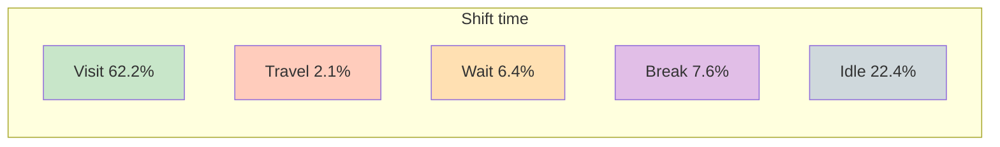
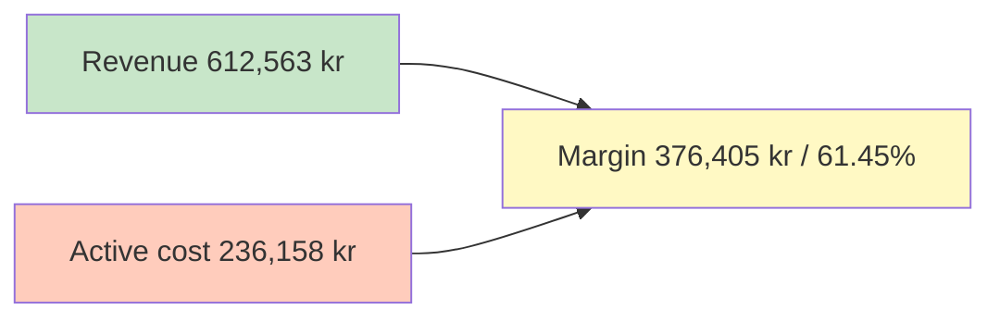
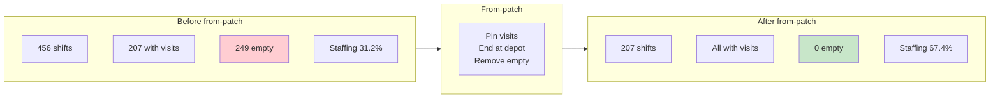
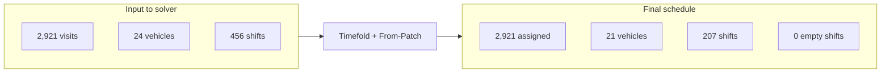
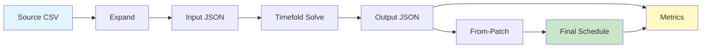

# Nova Pilot Report

**Timefold Field Service Routing on Nova recurring visits**

**Report date:** 15 February 2026 · **Schedule period:** 4 weeks · **Solver:** Timefold FSR

---

## 1. Executive summary

End-to-end pilot of automated care visit scheduling for **Nova** (real production data) with **Timefold**:

- **100% assignment** — 2,921 of 2,921 visits assigned to staff
- **0 empty shifts** in final schedule (207 shifts, all with visits)
- **Field efficiency 96.7%** — well above 67.5% manual benchmark (Slingor)
- **Staffing efficiency 67.4%** — visit time vs paid shift time (after removing empty shifts)
- **Margin 61.5%** — revenue vs active cost (excluding inactive time)

Suitable for review and integration (e.g. Caire platform).

---

## 2. Assignment at a glance

| Metric                 | Value         |
| ---------------------- | ------------- |
| **Visits assigned**    | 2,921 / 2,921 |
| **Shifts with visits** | 207           |
| **Empty shifts**       | 0             |
| **Empty vehicles**     | 0             |

---

## 3. Efficiency metrics

Metrics **exclude inactive time** (idle removed by from-patch).

### Key performance indicators

| Efficiency                           | Result     | Benchmark / note                 |
| ------------------------------------ | ---------- | -------------------------------- |
| **Staffing** (visit / paid time)     | **67.36%** | Share of paid time that is visit |
| **Field** (visit / visit+travel)     | **96.73%** | Target >67.5% (Slingor) ✓        |
| **Wait** (visit / visit+travel+wait) | 87.93%     | Includes waiting at client       |
| **Idle** (visit / visit+travel+idle) | 71.75%     | After removing empty shifts      |

### Time breakdown — shift composition

Every shift is split into five parts:



| Category              | Time (h:min) | % of shift |
| --------------------- | ------------ | ---------- |
| **Shift total**       | 1,790h 0min  | 100%       |
| Visit (care delivery) | 1,113h 45min | **62.22%** |
| Travel                | 37h 37min    | 2.10%      |
| Wait                  | 115h 12min   | 6.44%      |
| Break                 | 136h 30min   | 7.63%      |
| Idle (inactive)       | 400h 50min   | 22.39%     |

### Cost and revenue (excluding inactive)



| Item                                      | Amount (SEK)         |
| ----------------------------------------- | -------------------- |
| **Revenue** (visit time × 550 kr/h)       | 612,563              |
| **Active cost** (active shift × 170 kr/h) | 236,158              |
| **Margin**                                | **376,405 (61.45%)** |

Non-visit cost (travel, wait, break): 49,184 kr (20.83% of active cost).

---

## 4. Before vs after from-patch

Effect of removing empty shifts and ending shifts at depot:



| Metric                  | Before from-patch                | After from-patch      |
| ----------------------- | -------------------------------- | --------------------- |
| Shifts                  | 456 (207 with visits, 249 empty) | 207 (all with visits) |
| Staffing efficiency     | 31.2%                            | **67.4%**             |
| Field efficiency        | 96.7%                            | 96.7%                 |
| Idle time               | 2,313h 20min                     | 400h 50min            |
| Margin (excl. inactive) | 58.0%                            | **61.5%**             |

---

## 5. Input → final schedule (overview)



---

---

# Technical details

_The following sections are for technical reference and reproducibility._

---

## A. Pipeline overview

End-to-end flow from source data to final schedule and metrics:



| Stage          | Input                       | Output                                           |
| -------------- | --------------------------- | ------------------------------------------------ |
| **Expand**     | Nova source CSV (recurring) | Visit occurrences for 4-week window              |
| **Input JSON** | Expanded CSV + staff/shifts | Timefold FSR input                               |
| **Solve**      | Input JSON                  | Optimized assignment (output JSON)               |
| **From-Patch** | Output JSON                 | Trim empty shifts, end at depot → final schedule |
| **Metrics**    | Final schedule + input      | Efficiency and cost report                       |

---

## B. Data flow (detailed)

```mermaid
flowchart TB
    subgraph SOURCE["Source data"]
        S1[Nova source CSV]
        S2["Recurring visit definitions"]
    end

    subgraph EXPAND["Expansion"]
        E1[expand (Nova format)]
        E2["2,921 visit occurrences"]
        E3["102 visit groups (204 visits)"]
    end

    subgraph BUILD["Build input"]
        B1[csv_to_timefold_fsr]
        B2["Input: 24 vehicles, 456 shifts"]
    end

    subgraph SOLVE["Optimization"]
        T1[Timefold FSR API]
        T2["Output: 2,921 assigned"]
    end

    subgraph PATCH["Post-process"]
        P1[build_from_patch]
        P2[submit from-patch]
        P3["Final: 207 shifts, 0 empty"]
    end

    S1 --> E1
    E1 --> E2
    E2 --> E3
    E2 --> B1
    E3 --> B1
    B1 --> B2
    B2 --> T1
    T1 --> T2
    T2 --> P1
    P1 --> P2
    P2 --> P3
```

---

## C. Pilot scope

| Item                | Description                                                      |
| ------------------- | ---------------------------------------------------------------- |
| **Data source**     | Nova (real production data)                                      |
| **Planning window** | 4 weeks                                                          |
| **Solver**          | Timefold Field Service Routing (cloud API)                       |
| **Post-processing** | From-patch: pin visits, end shifts at depot, remove empty shifts |

---

## D. Data summary (counts)

| Stage                            | Count       | Notes                                           |
| -------------------------------- | ----------- | ----------------------------------------------- |
| **Source**                       | ~867 visits | With geocoding; some filtered (missing coords)  |
| **Expanded (visit occurrences)** | 2,921       | 4-week expansion                                |
| **Care visits (logical)**        | 2,819       | 2,717 solo + 102 double-employee (visit groups) |
| **Timefold visits**              | 2,921       | 2,717 solo + 204 in 102 groups                  |
| **Vehicles (input)**             | 24          | Before optimization                             |
| **Vehicles (final)**             | 21          | After from-patch (3 empty removed)              |
| **Shifts (input)**               | 456         | Before optimization                             |
| **Shifts (final)**               | 207         | After from-patch (empty shifts removed)         |

---

## E. Reproducibility and artefacts

All outputs under `docs_2.0/recurring-visits/nova/solve/tf/tf-14feb-2200/`.

| Artefact               | Path / ID                                               |
| ---------------------- | ------------------------------------------------------- |
| **Initial solve**      | `export-field-service-routing-595776f0-*-output.json`   |
| **From-patch payload** | `from-patch/payload_595776f0.json`                      |
| **Final schedule**     | `from-patch/output_595776f0.json` (plan `c8e1708c-...`) |
| **Metrics JSON**       | `metrics/metrics_20260215_053038_c8e1708c.json`         |
| **Metrics report**     | `metrics/metrics_report_c8e1708c.txt`                   |

Pipeline (expand → solve → from-patch → metrics) can be re-run with scripts in parent `../scripts/` or Huddinge package; see Nova README.

---

## F. Next steps and recommendations

1. **Integration** — Use `from-patch/output_595776f0.json` for import into Caire platform; see `docs/PLATFORM_UPLOAD.md`.
2. **Further optimization** — Compare Timefold profiles to improve staffing efficiency and balance travel/wait while keeping 0 empty shifts.
3. **Pilot handover** — This report and referenced files can be shared with Attendo as a Nova pilot deliverable.

---

_Report from Nova e2e pipeline (Caire / Timefold). Metrics definitions: Huddinge package README and `docs/PRIORITIES.md`._
